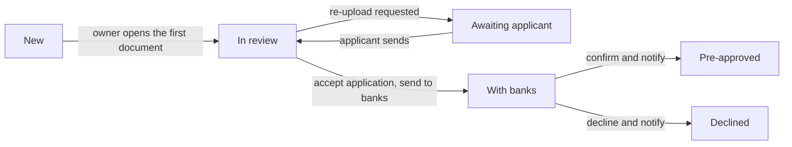
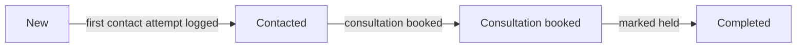

# 00 · Foundations — mortgage CMS

Build this before any CMS screen. It covers what C1–C6 share: routes, permissions, the CMS shell change, tokens, shared components, the promise clock, data and actions, formatting, accessibility and strings.

| | |
|---|---|
| Screens served | C1–C6 |
| PLAN phases | 4 (C1, C2, C6) · 5 (C3, C4) · 6 (C5) |
| Size | L |
| In this zip | `journey-map-2x.png` · `strings.shared.en.json` · `SPEC.md` · `reference/` (open `index.html` for all six screens) |


## 1. Screens and routes

| Code | Screen | Route | PLAN phase |
|---|---|---|---|
| C1 | Requests queue | `/admin/mortgages` | 4 |
| C2 | Pre-approval file | `/admin/mortgages/[reference]` (pre-approval) | 4; bank sending in 6 |
| C3 | Document viewer · accept | `/admin/mortgages/[reference]/documents/[kind]` | 5 |
| C4 | Document viewer · request re-upload | Same route as C3 | 5 |
| C5 | Decision | `/admin/mortgages/[reference]/decision` | 6 |
| C6 | Consultancy request | `/admin/mortgages/[reference]` (consultancy) | 4 |
| — | Partner banks | `/admin/mortgages/banks` | 6 · not designed |
| — | File stream | `/admin/mortgages/files/[fileId]` | 2 · no UI |

C2 and C6 share a route; the request's service decides which one renders. C3 and C4 are two states of one viewer.

### Status flow (SPEC §2.4)
Fast Pre-Approval:

Mortgage Consultancy:


## 2. Suggested file structure (Next.js App Router)
```
app/(admin)/admin/mortgages/layout.tsx                              role gate, nav count
app/(admin)/admin/mortgages/page.tsx                                C1
app/(admin)/admin/mortgages/[reference]/page.tsx                    C2 / C6
app/(admin)/admin/mortgages/[reference]/documents/[kind]/page.tsx   C3 / C4
app/(admin)/admin/mortgages/[reference]/decision/page.tsx           C5
app/(admin)/admin/mortgages/banks/page.tsx                          partner banks (not designed)
app/(admin)/admin/mortgages/files/[fileId]/route.ts                 logged file stream
components/admin/mortgage/                                          components in §6
lib/mortgage/server/queries.ts                                      loaders for each page
lib/mortgage/server/actions.ts                                      server actions (§8)
lib/mortgage/{state,sla,checklists,documents,payments}.ts           from PLAN Phase 1
messages/en/mortgage-cms.json                                       strings (§11)
```
Adapt to the repo. Phase 0's `IMPLEMENTATION.md` has the final say.

## 3. Permissions in the UI (SPEC §7)
- Only `mortgage_adviser` and `mortgage_head` see the "Mortgage requests" nav item and can load these routes. Everyone else, admins included, gets a 404. The PNGs show the generic shell user ("Mariam Al-Hashimi · Admin"); that's placeholder data, not a permission (CMS-1).
- Everyone on the mortgage team sees every request (it's a team inbox).
- Advisers act on requests they own. On other advisers' files, action buttons are disabled with a tooltip (copy not designed, CMS-13). The Head of mortgages can act on everything and reassign.
- Unassigned requests show a dashed avatar in C1. A claim action isn't designed (CMS-10).
- The server action checks every permission again. The UI only mirrors it.

## 4. CMS shell (existing `CmsShell`)
Reuse the shell from the platform build. Changes for this module:
- **Nav:** add "Mortgage requests" to the **Inbox** group after Enquiries, with a mortgage icon and a count badge (mono 10.5, padding 1×7, radius 999; accent-soft with accent text, or white at 18% on the active item). The count is the number of `new` requests.
- **Top bar** (60px, padding 0 28): breadcrumbs (11.5 muted, 2 above the title), title (18/500), global search (280 wide), bell, then the page's secondary and primary actions as small buttons.
- **Layout:** sidebar 240px; content padding 28.
- **Nav styles:** group labels 10.5/500, 0.1em, uppercase, `--bz-muted-2`; items 13px `--bz-ink-2`, padding 8×10, radius 6; hover `--bz-surface-2`; active `--bz-ink` background with `--bz-bg` text.

## 5. Tokens
Same palette as the website (`--bz-*` in `reference/styles.css`; the front-end foundations have the full table). Status tones:

| Tone | Background | Text | Used for |
|---|---|---|---|
| accent | `--bz-accent-soft` | `--bz-accent` | New |
| warn | `oklch(0.96 0.05 80)` | `oklch(0.45 0.1 60)` | In review, Contacted, To review, "pending compliance" |
| muted | `--bz-surface-2` | `--bz-ink-2` | Awaiting applicant, Awaiting reply |
| info | `oklch(0.95 0.03 240)` | `oklch(0.42 0.1 245)` | With banks, Consultation booked |
| success | `oklch(0.94 0.04 145)` | `oklch(0.35 0.08 145)` | Pre-approved, Completed, Accepted |
| danger | `oklch(0.96 0.04 28)` | `oklch(0.45 0.13 28)` | Declined, Re-upload requested |
| ink | `--bz-ink` | `--bz-bg` | Service chip on pre-approval files, selected chips |

Other colours:
- **At-risk banner:** `oklch(0.975 0.02 28)` background, `oklch(0.88 0.06 28)` border, `oklch(0.45 0.14 28)` text.
- **Clock bar:** running `--bz-accent`; at risk `oklch(0.55 0.18 28)` (label `oklch(0.48 0.16 28)`); paused `--bz-muted-2` with a 55% white diagonal hatch; met `oklch(0.55 0.12 145)`.
- **Document bar** (segments 15×6, radius 2, gap 3): accepted `oklch(0.58 0.12 145)`, to review `oklch(0.8 0.1 80)`, flagged `oklch(0.58 0.18 28)`.
- **Ticked checks and consent:** `oklch(0.55 0.12 145)`.
- **Service marker in C1:** 7×7 square, radius 2; ink for Fast Pre-Approval, accent for Mortgage Consultancy.
- **Bank marks (C5):** placeholder colours stored per bank as `brand_color` (FAB `oklch(0.42 0.06 250)`, ADCB `oklch(0.45 0.09 25)`, Mashreq `oklch(0.45 0.08 320)`). Use real logos only with permission.

**Type:** body sans; card titles 13.5/500; viewer panel title serif 26; mono for references, file names, amounts, counts and activity times.

## 6. Shared components
Reference names are from `reference/mreq-shared.jsx` and `mreq-cms-*.jsx`. The proposed names are suggestions.

| Proposed | Reference | Used on | Spec |
|---|---|---|---|
| `StatusPill` | `MrqStatus` | C1 | Pill with a dot; label and tone from the status table in §5 |
| `Pill` | `MrqPill` | all | 26px (small 22), padding 0 11 (small 0 8), radius 999, 12/500 (small 11), gap 6 |
| `PromiseClock` | `MrqClock` | C1, C2, C5 | Label 12.5/500 with a 13px clock (pause icon when paused); optional due text 11.5 muted on the right; 4px bar 7 below. Width 176 in C1, 300 on file pages |
| `DocumentBar` | `MrqDocBar` | C1, C2 | Four segments + mono 11.5 label ("2/4", or "2 of 4 accepted" on C2). Consultancy: "Not required" 12 muted |
| `OwnerAvatar` | `MrqOwner` | C1, C2 | Avatar 26; on C2 34 with name 13/500 and role 11.5 muted. Unassigned: 1.5px dashed circle, plus "Unassigned" when named |
| `Card` | `MrqCard` | C2, C5, C6 | `.bz-card` (surface, border, radius 10). Header 14×20 with bottom border: title 13.5/500, aside on the right (12px link or muted text). Body padding 20 (0 for lists) |
| `KeyValueList` | `MrqKV` | C5, C6 | Rows with 8px vertical padding and top borders; label muted, value right-aligned; 12.5px |
| `ActivityList` | `MrqActivity` | C2, C5, C6 | Grid 40px / 12px / 1fr, column gap 10. Time mono 11 muted; 8px dot (tone colour, else `--bz-border-strong`) joined by a 1px line; text 12.5/1.45; sub 11.5 muted; 14 between items |
| `FileHeader` | `MrqFileHead` | C2, C5, C6 | Chip row (gap 8, 16 below) with a right slot for the clock or text |
| `StageRail` | `MrqStages` | C2, C5, C6 | Four equal segments, gap 6, 20 below. 38px, padding 0 14, radius 8, 12.5/500. Done: accent-soft with an accent tick. Current: ink with its number. Upcoming: surface, 1px border, muted number |
| `FileTag` | `MrqFileTag` | C2 | Inline, gap 10, padding 6 12 6 6, radius 8, border, surface, max-width 280. Thumb; name mono 11.5 with ellipsis; meta 10.5 muted |
| `DocumentIcon` | `MrqDocTile` | C2 | 40px; done, review and error states |
| `StatementCoverage` | `MrqCoverage` | C4 | 12 cells, 38px high in the panel |
| `Checkbox`, `Radio` | `MrqCheck`, `MrqRadio` | C3–C6 | Checks turn green when ticked |
| `SegmentedControl` | inline | C1, C5, C6 | Track surface-2, padding 3, radius 8, gap 2. Items 30–32px, radius 6, 12.5; selected: surface, `0 1px 2px rgba(0,0,0,.08)`, weight 500. Optional mono count 11 muted (C1) or icon (C6) |
| `ChoiceChip` | inline | C4, C6 | C4 reasons: 28px, padding 0 10, radius 999, 12; selected ink with an 11px tick. C6 day and time: 36px, padding 0 14, radius 8, 12.5; selected ink; unavailable `--bz-muted-2`, struck through |
| `ContactButtons` | `MrqContactBtns` | C2 | Three columns, gap 6: outline small Call, WhatsApp, Email |

Buttons use `.bz-btn` as on the website. Top-bar actions are small.

## 7. Promise clock (display only)
All the maths is in `sla.ts` on the server (SPEC §2.5). Pages receive `slaStatus()` output and only re-render the countdown every 60 seconds from `dueAt`.

| State | Label | Bar | Designed on |
|---|---|---|---|
| running | "{remaining} left" | accent; width = elapsed ÷ 24h | C1, C2, C5 |
| at risk (≤ 4h left) | "{remaining} left" in danger | danger | C1 banner and rows |
| paused | "Paused · {remaining} left", pause icon | hatched muted | C1 |
| met | Not designed | success | — |
| breached | Not designed | — | — (CMS-15) |

- Remaining: "17h 42m", "1h 48m", "21h 05m" (minutes always two digits).
- Due: "Due Wed 23 Sep, 10:14".
- Consultancy has no clock. C1 shows "Waiting {duration}" before first contact, then the latest contact ("Replied on WhatsApp 11:20"), then the appointment once booked ("Wed 23 Sep · 11:30").

## 8. Data and actions
- Server components load each page through `queries.ts`. C1 polls every 30 seconds (SPEC §4.3). File pages refresh on window focus and after every action.
- Every change is a server action from SPEC §4.3: authorise → validate (zod) → write in one transaction (through `transition()` when the status changes) → `mortgage_events` row → enqueue notifications. The button that triggered it shows a pending state.
- **Concurrency:** send the request's `updated_at` with each action; the server returns 409 if someone changed it. The conflict message isn't designed (CMS-14).
- **Files:** documents load only through `/admin/mortgages/files/[fileId]`, which writes `document.viewed` or `document.downloaded` before it streams (SPEC §8). Never put a storage URL in a page, and don't prefetch files: each fetch is logged as a view.

## 9. Formatting
Asia/Dubai for every time.

| What | Example |
|---|---|
| Received (C1) | `Today 10:14`; `Mon 18:20` within 7 days; older: proposal `18 Sep` |
| Day and time | `Tue 22 Sep, 10:14` |
| Short date and time (C5 tiles) | `22 Sep, 10:14` |
| Activity time | `16:21` today; older entries: proposal `Mon 18:20` |
| Duration | `1h 48m`, `9h 13m`, `12m` |
| Masked mobile (C1) | `+971 50 ••• 3321` |
| Full mobile (file pages) | `+971 50 218 4417` |
| Date of birth and age | `14 Mar 1990 · 36` |
| Masked IP (consent) | `94.203.•.•` |
| File meta | `1 page · 412 KB`, `2 pages · 1.5 MB` |
| Amount | `AED 2,150,000` (no decimals) |
| Rate | `3.99% fixed · 3 yrs` (bank rows), `3.99% fixed for 3 years` (decision) |
| Validity | `21 Nov 2026 · 60 days` |
| Statement file label | `Sep–Nov 2025`, `Dec–Feb 2026` (en dash; year of the last month) |

## 10. Accessibility
- C1 is a real `<table>` with header cells. The applicant name is a link to the file; the whole row is also clickable.
- Tabs and segmented controls use tab or radio semantics with arrow-key navigation.
- Viewer tools have labels ("Zoom out", "Zoom in", "Rotate", "Download"). Keyboard shortcuts are a proposal: `+`, `-`, `R`, and `[` / `]` for the previous and next file.
- Checks are real checkboxes, with the sub-line as their description.
- Action results go to a polite live region.
- Colour is never the only signal: the clock has text, the document bar has a count, and status pills have labels.

## 11. Strings
As on the website: `strings.shared.en.json` here, and a `strings.en.json` per screen that repeats the shared keys it uses. Merge them into `messages/en/mortgage-cms.json` with ICU MessageFormat. `<b>` marks weight 500–600. Activity lines are templates filled from `mortgage_events`.

**Shared strings** (`strings.shared.en.json`)

| Key | Text | Note |
|---|---|---|
| `nav.group` | Inbox |  |
| `nav.mortgages` | Mortgage requests | Count badge = new requests |
| `common.backToFile` | Back to file |  |
| `common.edit` | Edit |  |
| `common.cancel` | Cancel |  |
| `common.call` | Call |  |
| `common.whatsapp` | WhatsApp |  |
| `common.email` | Email |  |
| `common.notRequired` | Not required |  |
| `common.sendBy` | Send by |  |
| `service.consultancy` | Mortgage Consultancy |  |
| `service.preApproval` | Fast Pre-Approval |  |
| `residency.uaeNational` | UAE National |  |
| `residency.expat` | UAE Resident / Expat |  |
| `residency.expatShort` | Expat | Queue profile line only |
| `residency.withLtv` | `{residency} · up to {ltv}% LTV` |  |
| `employment.salaried` | Salaried |  |
| `employment.businessOwner` | Business Owner |  |
| `status.new` | New |  |
| `status.inReview` | In review |  |
| `status.awaitingApplicant` | Awaiting applicant |  |
| `status.withBanks` | With banks |  |
| `status.preApproved` | Pre-approved |  |
| `status.declined` | Declined |  |
| `status.contacted` | Contacted |  |
| `status.consultationBooked` | Consultation booked |  |
| `status.completed` | Completed |  |
| `docState.toReview` | To review |  |
| `docState.accepted` | Accepted |  |
| `docState.reuploadRequested` | Re-upload requested |  |
| `doc.emiratesId` | Emirates ID |  |
| `doc.passport` | Passport copy |  |
| `doc.salaryCertificate` | Salary certificate |  |
| `doc.bankStatements3m` | Last 3 months' bank statements |  |
| `doc.tradeLicense` | Business trade license | "license" spelling (CMS-16) |
| `doc.bankStatements12m` | Last 1 year's bank statements |  |
| `docHint.emiratesId` | Front and back · PDF, JPG, PNG · max 10 MB |  |
| `docHint.passport` | Photo page · PDF, JPG, PNG · max 10 MB |  |
| `docHint.salaryCertificate` | Addressed to the bank · PDF · max 10 MB |  |
| `docHint.bankStatements3m` | Several files · PDF · max 25 MB total |  |
| `docHint.tradeLicense` | Valid / current · PDF, JPG, PNG · max 10 MB |  |
| `docHint.bankStatements12m` | Several files · PDF · max 40 MB total |  |
| `clock.left` | `{remaining} left` | {remaining} as "17h 42m" |
| `clock.paused` | `Paused · {remaining} left` |  |
| `clock.due` | `Due {dueAt}` |  |
| `owner.unassigned` | Unassigned |  |
| `role.head` | Head of mortgages |  |
| `role.adviser` | Mortgage adviser |  |
| `card.applicant` | Applicant |  |
| `card.activity` | Activity |  |
| `field.fullName` | Full name |  |
| `field.dateOfBirth` | Date of birth |  |
| `field.mobile` | Mobile |  |
| `field.email` | Email |  |
| `field.startedFrom` | Started from |  |
| `field.dobAge` | `{date} · {age}` | e.g. "14 Mar 1990 · 36" |
| `entry.calculatorPreapproval` | Mortgage calculator |  |
| `entry.calculatorAdvisor` | Mortgage calculator · Talk to advisor | Other entry points not designed (CMS-8) |
| `viewer.breadcrumbs` | `Mortgage requests › {reference} · {applicant} › Documents` |  |
| `viewer.fileMeta` | `{name} · {pages} · {size}` |  |
| `viewer.pages` | `{count, plural, one {# page} other {# pages}}` |  |
| `viewer.zoom` | `{percent}%` |  |
| `viewer.download` | Download |  |
| `viewer.page` | `Page {page} of {total}` |  |
| `viewer.fileAndPage` | `File {file} of {files} · page {page} of {total}` | Multi-file documents |
| `viewer.eyebrow` | `Reviewing · {index} of {total}` |  |
| `viewer.checks` | Checks |  |
| `viewer.requestReupload` | Request re-upload |  |
| `activity.opened` | `{actor} opened {document}` | {actor} is the first name |
| `activity.accepted` | `{actor} accepted {document}` |  |
| `activity.assigned` | `Assigned to {owner}` |  |
| `activity.assigned.roundRobin` | Round-robin · mortgage team |  |
| `activity.submitted` | Submitted from the website |  |
| `activity.submitted.sub` | Confirmation shown · email sent |  |
| `activity.bankPreApproved` | `{bank} pre-approved up to {amount}` |  |
| `activity.bankPreApproved.sub` | `Letter attached · {fileName}` |  |
| `activity.packageSent` | `Package sent to {banks}` |  |
| `activity.packageSent.sub` | `{count} documents · structured summary` |  |
| `activity.whatsappIn` | `<b>{firstName} replied on WhatsApp</b>` | Inbound, from the WhatsApp webhook |
| `activity.whatsappOut` | `{actor} sent a WhatsApp` |  |
| `activity.callNoAnswer` | `{actor} called · no answer` |  |
| `activity.call.sub` | `{mobile} · {duration}` |  |
| `activity.consultReceived` | Request received from the website |  |
| `activity.consultReceived.sub` | Mortgage Consultancy · no documents |  |
| `activity.quote` | `“{text}”` | Curly quotes around message text |


## 12. Screen size
The CMS is desktop only, designed at 1440px. Support 1280px and up; below that, C1's table scrolls sideways and the viewer's review panel keeps its 372px width.

## 13. Not designed yet

| Item | Needed on | Phase |
|---|---|---|
| Choose banks and send, after "Accept application" | C2 | 6 |
| Record a bank response: amount, rate, fixed years, valid until, letter | C5 | 6 |
| Decline mode: reasons and message (SPEC §9 #8) | C5 | 6 |
| Partner banks admin page | banks | 6 |
| Statement period entry for each file | C4 | 5 |
| "Request documents" document picker | C2 | 5 |
| Accepted and read-only states of the review panel | C3 | 5 |
| Reassign and claim | C1, C2 | 4 |
| Edit applicant | C2 | 4 |
| Mark a consultation held, no-show or cancelled; end states for unreachable or withdrawn requests (SPEC §9 #9) | C6 | 4 |
| Closed tab, empty, loading and error states | C1 | 4 |
| Met and breached clock states | C1, C2 | 4 |
| Full activity log ("View all 9") | C2 | 4 |
| Checks for Emirates ID, passport, trade licence and 3-month statements (SPEC §9 #7) | C3 | 5 |

## 14. Open questions (CMS)

| # | Question | Affects |
|---|---|---|
| CMS-1 | The PNGs show an Admin in the shell. Confirm admins without a mortgage role can't open this module (SPEC §7) | all |
| CMS-2 | Designs for the items in §13 | as listed |
| CMS-3 | Check sub-lines such as "First Abu Dhabi Bank" and "14 Sep 2026 · 8 days ago": typed by the reviewer or derived? "Issued within the last 30 days" needs an issue-date field | C3 |
| CMS-4 | C4's pause note ("His three accepted documents…") and C6's invite card ("His details…, he'll only see…") assume gender, which Bazar doesn't collect. Neutral copy needed | C4, C6 |
| CMS-5 | Where staff enter each statement's period | C4 |
| CMS-6 | Default text for the decision message; the one in the design is a sample | C5 |
| CMS-7 | The time-slot filter implied by "before 12:00, as Ahmed asked" | C6 |
| CMS-8 | "Started from" labels for entry points other than the two shown | C2, C6 |
| CMS-9 | Owner filter options and other sort orders | C1 |
| CMS-10 | Claiming unassigned requests (SPEC §2.7, §9 #6) | C1, C2 |
| CMS-11 | The at-risk banner drops "left" after the second name; list formatting repeats it. Confirm which | C1 |
| CMS-12 | Stage rail for Awaiting applicant and Declined | C2, C5 |
| CMS-13 | Tooltip copy for disabled actions on files you don't own | C2–C6 |
| CMS-14 | Message when someone else changed the file (409) | C2–C6 |
| CMS-15 | How a breached promise looks in the queue and on the file | C1, C2 |
| CMS-16 | "licence" vs "license" (SPEC §9 #12): C4's check says "trade licence", the tab says "Business trade license" | C4 |
| CMS-17 | WhatsApp template rule (SPEC §6): should C4 and C5 warn when the free-text message will go only by email? | C4, C5 |

## 15. Build steps
1. Role gate, the nav item with its new-request count, and route skeletons.
2. The shared components in §6, with stories for each state.
3. Loaders for the queue, file, viewer and decision pages, each returning `slaStatus()` with the request.
4. A server-action wrapper: authorise, validate, concurrency check, `transition()`, event, notifications.
5. Formatting helpers (§9) with unit tests.
6. Strings merged into the message files.

## 16. Claude Code prompt
```
Build the mortgage CMS foundations from docs/mortgage/cms/00-foundations/README.md.
Also read docs/mortgage/SPEC.md §2.4, §2.5, §3, §4.3, §7 and §8, and docs/mortgage/IMPLEMENTATION.md for where things go in this repo.
The files in reference/ are a design prototype. Rebuild them inside the existing CMS shell with this repo's components and tokens; don't copy the JSX.
Plan first. Then do build steps 1–6 in §15. Give every component in §6 a story for each state in the designs, using the Phase 1 seed data.
Unit-test the formatters (examples in §9) and the server-action wrapper (permission denied, validation error, 409 conflict, success writes an event).
Don't build any screens yet. Update docs/mortgage/PROGRESS.md.
```
