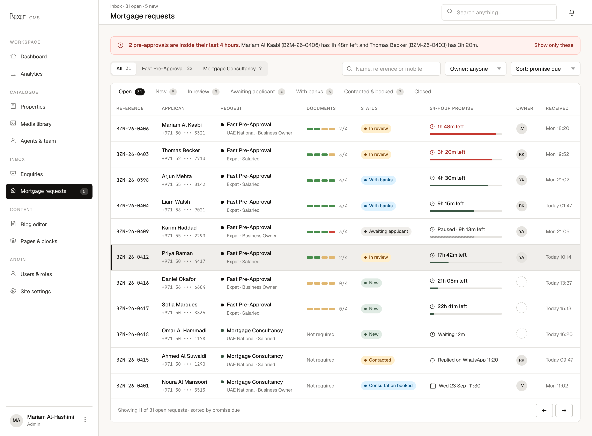

# C1 · Requests queue

| | |
|---|---|
| Route | `/admin/mortgages` |
| Used by | Mortgage advisers, Head of mortgages |
| Design | `C1-requests-queue-2x.png` (1440 × 1060 at 2×) · `MrqQueue` in `reference/mreq-cms-1.jsx` |
| PLAN phase | 4 |
| Depends on | 00-foundations |
| Size | M |



## Purpose
One inbox for both services, ordered by what's due first. The team sees what's new, which pre-approvals are close to missing the 24-hour promise, and who owns each request.

## Layout
- Shell: title "Mortgage requests", breadcrumbs "Inbox · {open} open · {new} new", nav item active.
- Content column, gap 16:
  1. **At-risk banner**, only when at least one running pre-approval has 4 hours or less left. Padding 12×16, radius 10, danger tint. Clock icon; a 600-weight sentence and the detail in ink-2 (13px); "Show only these" (12.5/500) on the right.
  2. **Filter bar** (row, gap 10): service segmented control with counts (All, Fast Pre-Approval, Mortgage Consultancy); spacer; search (240 wide, 34 high, icon inset 10, placeholder "Name, reference or mobile"); owner select (150); sort select (170).
  3. **Table card:** tabs (padding 0 18, gap 22, 13px) with count badges (mono 10.5, padding 1×6, radius 99; ink on the active tab, surface-3 with muted text otherwise; Closed has no count). The table. A footer (padding 12×18, top border, 12 muted) with the "Showing…" line and previous/next outline small icon buttons.

### Table
Header cells 10.5px, padding 10×14 (uppercase, 0.06em, muted, from `.bz-table th`). Body cells padding 12×14, vertically centred.

| Column | Content |
|---|---|
| Reference | Mono 12 |
| Applicant | Name 500, no wrap; masked mobile mono 11 muted, 2 below |
| Request | 7×7 service square, then the service name 500; profile 11.5 muted, indented 15: "{residency} · {employment}" (residency short form: "UAE National" or "Expat") |
| Documents | `DocumentBar` with "{accepted}/{total}"; consultancy shows "Not required" |
| Status | Small `StatusPill` |
| 24-hour promise | `PromiseClock` at 176 wide; consultancy shows an icon and 12px ink-2 text (see Behaviour) |
| Owner | Avatar 26, or the dashed circle when unassigned |
| Received | 12 muted, no wrap |

When you come back from a file, its row is highlighted: `--bz-surface-2` background and a 3px ink bar on the left edge (inset shadow on the first cell).

## Components
`StatusPill`, `PromiseClock`, `DocumentBar`, `OwnerAvatar`, `SegmentedControl`, `.bz-tabs`, `.bz-table`, `.bz-field` inputs and selects, small outline buttons.

## Copy
Verbatim from the design. `{braces}` are runtime values; `<b>` marks bold (00-foundations §11). The same keys are in `strings.en.json`.

**This screen**

| Key | Text | Note |
|---|---|---|
| `c1.title` | Mortgage requests |  |
| `c1.breadcrumbs` | `Inbox · {open} open · {new} new` |  |
| `c1.risk.title` | `{count, plural, one {# pre-approval is inside its last 4 hours.} other {# pre-approvals are inside their last 4 hours.}}` | Designed: the plural form |
| `c1.risk.item` | `{name} ({reference}) has {remaining} left` | Joined with "and"; the design drops the second "left" (CMS-11) |
| `c1.risk.showOnly` | Show only these |  |
| `c1.filter.all` | All |  |
| `c1.search.placeholder` | Name, reference or mobile |  |
| `c1.owner.anyone` | Owner: anyone | Other options not designed (CMS-9) |
| `c1.sort.promiseDue` | Sort: promise due | Other sorts not designed (CMS-9) |
| `c1.tab.open` | Open |  |
| `c1.tab.new` | New |  |
| `c1.tab.inReview` | In review |  |
| `c1.tab.awaiting` | Awaiting applicant |  |
| `c1.tab.withBanks` | With banks |  |
| `c1.tab.contactedBooked` | Contacted & booked |  |
| `c1.tab.closed` | Closed |  |
| `c1.col.reference` | Reference |  |
| `c1.col.applicant` | Applicant |  |
| `c1.col.request` | Request |  |
| `c1.col.documents` | Documents |  |
| `c1.col.status` | Status |  |
| `c1.col.promise` | 24-hour promise |  |
| `c1.col.owner` | Owner |  |
| `c1.col.received` | Received |  |
| `c1.profile` | `{residency} · {employment}` |  |
| `c1.docs.count` | `{accepted}/{total}` |  |
| `c1.consult.waiting` | `Waiting {duration}` |  |
| `c1.consult.repliedWhatsapp` | `Replied on WhatsApp {time}` | Other latest-contact lines not designed |
| `c1.consult.booked` | `{date} · {time}` | e.g. "Wed 23 Sep · 11:30" |
| `c1.received.today` | `Today {time}` | Within 7 days use the weekday, e.g. "Mon 18:20" |
| `c1.footer` | `Showing {shown} of {total} open requests · sorted by promise due` | "open" and the sort follow the current tab and sort |

**Shared strings used here**

| Key | Text | Note |
|---|---|---|
| `nav.group` | Inbox |  |
| `nav.mortgages` | Mortgage requests | Count badge = new requests |
| `common.notRequired` | Not required |  |
| `service.consultancy` | Mortgage Consultancy |  |
| `service.preApproval` | Fast Pre-Approval |  |
| `residency.uaeNational` | UAE National |  |
| `residency.expatShort` | Expat | Queue profile line only |
| `employment.salaried` | Salaried |  |
| `employment.businessOwner` | Business Owner |  |
| `status.new` | New |  |
| `status.inReview` | In review |  |
| `status.awaitingApplicant` | Awaiting applicant |  |
| `status.withBanks` | With banks |  |
| `status.preApproved` | Pre-approved |  |
| `status.declined` | Declined |  |
| `status.contacted` | Contacted |  |
| `status.consultationBooked` | Consultation booked |  |
| `status.completed` | Completed |  |
| `clock.left` | `{remaining} left` | {remaining} as "17h 42m" |
| `clock.paused` | `Paused · {remaining} left` |  |
| `clock.due` | `Due {dueAt}` |  |
| `owner.unassigned` | Unassigned |  |


## Behaviour and states

### Tabs

| Tab | Statuses |
|---|---|
| Open | Everything not closed |
| New | `new` (both services) |
| In review | `in_review` |
| Awaiting applicant | `awaiting_applicant` |
| With banks | `with_banks` |
| Contacted & booked | `contacted`, `consultation_booked` |
| Closed | `pre_approved`, `declined`, `completed` (no count) |

In the design, Open 31 = New 5 + In review 9 + Awaiting 4 + With banks 6 + Contacted & booked 7. Proposal: tab counts follow the service filter, and service counts follow the tab.

### Sort "promise due" (SPEC §4.3)
1. Pre-approvals by time remaining, soonest first. Paused files use their frozen remaining time.
2. Then consultancy: New by longest waiting, then Contacted, then Booked by appointment time.

Other sort orders aren't designed (CMS-9).

### Filters and search
- Search matches the name (contains, case-insensitive), the reference (with or without "BZM-") and the mobile (last four or more digits). Debounce 300ms.
- Keep tab, service, owner, sort and page in the URL so views can be shared. Keep the search text out of the URL, since it can be a name.
- Owner: "Owner: anyone" is designed. Proposal: also me, unassigned, and each adviser.
- "Show only these" filters to the at-risk files. Proposal: the link then reads "Show all" (copy needed).

### Consultancy rows in the promise column

| Status | Text | Icon |
|---|---|---|
| New | "Waiting {duration}" since received | Clock |
| Contacted | The latest contact, e.g. "Replied on WhatsApp 11:20" | Chat for WhatsApp; proposal: phone for calls, mail for email |
| Consultation booked | Appointment "{day date} · {time}" | Calendar |

Only "Replied on WhatsApp" is designed; other latest-contact lines need copy.

### At-risk banner
- Lists every running pre-approval with 4 hours or less left, across all pages. Proposal: name up to three, then "and {n} more" (copy needed).
- Uses `slaStatus()` from the server list, never page-local maths.

### Refresh and pagination
- Poll every 30 seconds, keeping scroll position and the highlighted row. Clock labels re-render every minute between polls.
- 25 rows per page. The footer's "open" and "sorted by promise due" follow the current tab and sort.

### Opening a request
The applicant name links to C2 (pre-approval) or C6 (consultancy); the whole row is clickable too. Cmd/ctrl-click opens a new tab.

### Not designed
Empty tab, no search results, loading and error states, the Closed tab, and breached rows (CMS-2, CMS-15).

## Data
`listRequests({ tab, service, owner, q, sort, page })` returns:
- rows: reference, full name, masked mobile, service, residency, employment type, document states in kind order, status, `slaStatus()` (pre-approval) or a contact summary `{ kind, text, at }` (consultancy), owner `{ initials, name } | null`, submitted at
- counts per tab and per service
- the at-risk list for the banner

## Permissions
Advisers and the Head of mortgages. Everyone on the team sees every request.

## Accessibility
- Table with header cells; the tabs are a tablist.
- The banner is a `status` region, so a new at-risk file is announced once.
- Clock text is readable without the bar.

## Edge cases
- A file changes status between polls: it moves tab on the next poll. If the highlighted row leaves the view, drop the highlight.
- The same person has a consultancy and a pre-approval: two rows with two references. Showing the link between them isn't designed.
- Two advisers claim the same unassigned request: the second gets a 409 (CMS-10, CMS-14).

## Acceptance criteria
- [ ] Matches the PNG at 1440px with the Phase 1 seed (these 11 rows).
- [ ] Tabs, service and owner filters, search, sort and pagination work together; everything except search survives reload.
- [ ] Sort follows SPEC §4.3, including paused files.
- [ ] The banner lists exactly the running files with 4 hours or less left.
- [ ] Clock labels update every minute; data refreshes every 30 seconds.
- [ ] Mobiles are masked.
- [ ] Staff without a mortgage role get a 404.

## Tests
- Unit: the sort comparator (remaining time including paused files; consultancy order).
- Integration: filters and counts on the seed.
- Playwright: open a row, come back, and see it highlighted; "Show only these" leaves two rows.

## Open questions
CMS-9 (owner and sort options), CMS-11 (banner wording), CMS-15 (breached), CMS-2 (empty and loading states).

## Build steps
1. Page in the shell, with the nav count.
2. `listRequests` query with filters, counts and the sort comparator.
3. Filter bar, tabs and URL state.
4. Table rows with clock, document bar and owner.
5. At-risk banner and "Show only these".
6. Polling, the minute tick and the return highlight.
7. Tests.

## Claude Code prompt
```
Build C1 · Requests queue from docs/mortgage/cms/C1-requests-queue/README.md.
Compare with C1-requests-queue-2x.png and reference/mreq-cms-1.jsx (MrqQueue). Use the CMS foundations already built and the Phase 1 seed.
Clock values come only from slaStatus(); never compute deadlines in the page. Copy comes from strings.en.json.
Plan first, then follow the build steps. Check the acceptance criteria, run the tests, and compare a 1440px screenshot with the PNG. Update docs/mortgage/PROGRESS.md.
```
