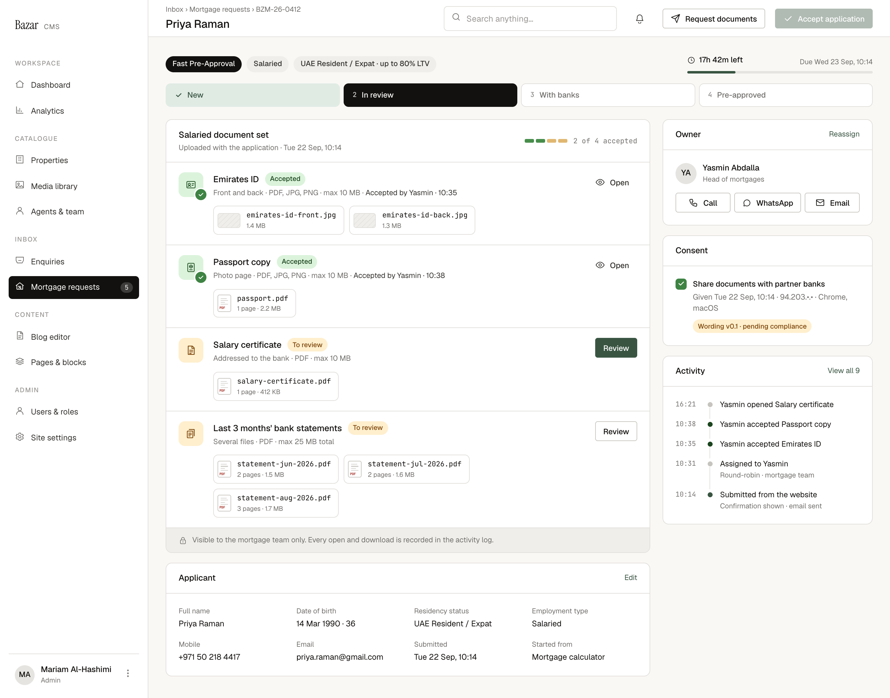

# C2 · Pre-approval file

| | |
|---|---|
| Route | `/admin/mortgages/[reference]` (service = pre-approval) |
| Used by | Mortgage advisers, Head of mortgages |
| Design | `C2-preapproval-file-2x.png` (1440 × 1130 at 2×, Salaried, in review) · `MrqFileSalaried` in `reference/mreq-cms-1.jsx` |
| PLAN phase | 4; "Request documents" in 5; "Accept application" in 6 |
| Depends on | 00-foundations, C1 |
| Size | M |



## Purpose
The home page of one Fast Pre-Approval application: where it is, how long is left, which documents are accepted, who owns it, the applicant's consent, and what has happened so far.

## Layout
- Shell: title = applicant name; breadcrumbs "Inbox › Mortgage requests › {reference}". Top-bar actions: outline small "Request documents" (send icon) and primary small "Accept application" (tick icon). In the PNG it's disabled at 40% opacity with a not-allowed cursor, because only 2 of 4 documents are accepted.
- **File header:** chips "Fast Pre-Approval" (ink), employment, and "{residency} · up to {ltv}% LTV"; on the right, `PromiseClock` at 300 wide with "Due {dueAt}".
- **Stage rail:** New · In review · With banks · Pre-approved.
- **Grid:** `minmax(0,1fr) 340px`, gap 20, top-aligned.
  - **Left, gap 16:**
    1. Document set card. Header row (padding 14×20): "{employment} document set" 14/500, "Uploaded with the application · {submittedAt}" 12 muted, and on the right `DocumentBar` "{accepted} of {total} accepted". Then one review row per document. Footer (padding 11×20, top border, surface-2, 12 muted) with a lock icon and the privacy line.
    2. Applicant card with "Edit": four-column grid, gap 16×20. Label 11.5 muted, value 13 with ellipsis.
  - **Right, gap 16:** Owner card ("Reassign" link, owner at 34px with name and role, contact buttons 14 below); Consent card; Activity card ("View all {count}").

### Review row (`MrqReviewRow`)
Grid `40px minmax(0,1fr) auto`, gap 16, padding 16×20, top border; rows with a re-upload requested get an `oklch(0.985 0.008 28)` background.
- Document icon at 40: done, review or error.
- Name 14/500 with a small state pill (Accepted, To review, Re-upload requested).
- Hint 12 muted, plus " · Accepted by {name} · {time}" in ink-2 when accepted.
- File tags, wrapping with gap 8, 12 below.
- Action on the right: ghost small "Open" (eye icon) when accepted; primary small "Review" on the first document still to review; outline small "Review" on the others.

### Consent card
Green 18px tick; "Share documents with partner banks" 12.5/500; "Given {givenAt} · {ip} · {browser}, {os}" muted; a small warn pill "Wording {version} · pending compliance", 8 below.

## Components
`FileHeader`, `PromiseClock`, `StageRail`, `Card`, `DocumentBar`, `DocumentIcon`, `FileTag`, `Pill`, `OwnerAvatar`, `ContactButtons`, `Checkbox`, `ActivityList`.

## Copy
Verbatim from the design. `{braces}` are runtime values; `<b>` marks bold (00-foundations §11). The same keys are in `strings.en.json`.

**This screen**

| Key | Text | Note |
|---|---|---|
| `c2.breadcrumbs` | `Inbox › Mortgage requests › {reference}` |  |
| `c2.action.requestDocuments` | Request documents |  |
| `c2.action.acceptApplication` | Accept application |  |
| `c2.docs.title` | `{employment} document set` | {employment} is "Salaried" or "Business Owner" |
| `c2.docs.uploaded` | `Uploaded with the application · {submittedAt}` |  |
| `c2.docs.accepted` | `{accepted} of {total} accepted` |  |
| `c2.docs.acceptedBy` | `Accepted by {name} · {time}` |  |
| `c2.docs.open` | Open |  |
| `c2.docs.review` | Review |  |
| `c2.docs.private` | Visible to the mortgage team only. Every open and download is recorded in the activity log. |  |
| `c2.applicant.residency` | Residency status |  |
| `c2.applicant.employment` | Employment type |  |
| `c2.applicant.submitted` | Submitted |  |
| `c2.owner.title` | Owner |  |
| `c2.owner.reassign` | Reassign |  |
| `c2.consent.title` | Consent |  |
| `c2.consent.name` | Share documents with partner banks |  |
| `c2.consent.given` | `Given {givenAt} · {ip} · {browser}, {os}` | {ip} masked, e.g. "94.203.•.•" |
| `c2.consent.pending` | `Wording {version} · pending compliance` | Drop "pending compliance" after sign-off |
| `c2.activity.viewAll` | `View all {count}` |  |

**Shared strings used here**

| Key | Text | Note |
|---|---|---|
| `nav.group` | Inbox |  |
| `nav.mortgages` | Mortgage requests | Count badge = new requests |
| `common.edit` | Edit |  |
| `common.call` | Call |  |
| `common.whatsapp` | WhatsApp |  |
| `common.email` | Email |  |
| `service.preApproval` | Fast Pre-Approval |  |
| `residency.uaeNational` | UAE National |  |
| `residency.expat` | UAE Resident / Expat |  |
| `residency.withLtv` | `{residency} · up to {ltv}% LTV` |  |
| `employment.salaried` | Salaried |  |
| `employment.businessOwner` | Business Owner |  |
| `status.new` | New |  |
| `status.inReview` | In review |  |
| `status.withBanks` | With banks |  |
| `status.preApproved` | Pre-approved |  |
| `docState.toReview` | To review |  |
| `docState.accepted` | Accepted |  |
| `docState.reuploadRequested` | Re-upload requested |  |
| `doc.emiratesId` | Emirates ID |  |
| `doc.passport` | Passport copy |  |
| `doc.salaryCertificate` | Salary certificate |  |
| `doc.bankStatements3m` | Last 3 months' bank statements |  |
| `doc.tradeLicense` | Business trade license | "license" spelling (CMS-16) |
| `doc.bankStatements12m` | Last 1 year's bank statements |  |
| `docHint.emiratesId` | Front and back · PDF, JPG, PNG · max 10 MB |  |
| `docHint.passport` | Photo page · PDF, JPG, PNG · max 10 MB |  |
| `docHint.salaryCertificate` | Addressed to the bank · PDF · max 10 MB |  |
| `docHint.bankStatements3m` | Several files · PDF · max 25 MB total |  |
| `docHint.tradeLicense` | Valid / current · PDF, JPG, PNG · max 10 MB |  |
| `docHint.bankStatements12m` | Several files · PDF · max 40 MB total |  |
| `clock.left` | `{remaining} left` | {remaining} as "17h 42m" |
| `clock.paused` | `Paused · {remaining} left` |  |
| `clock.due` | `Due {dueAt}` |  |
| `role.head` | Head of mortgages |  |
| `role.adviser` | Mortgage adviser |  |
| `card.applicant` | Applicant |  |
| `card.activity` | Activity |  |
| `field.fullName` | Full name |  |
| `field.dateOfBirth` | Date of birth |  |
| `field.mobile` | Mobile |  |
| `field.email` | Email |  |
| `field.startedFrom` | Started from |  |
| `field.dobAge` | `{date} · {age}` | e.g. "14 Mar 1990 · 36" |
| `entry.calculatorPreapproval` | Mortgage calculator |  |
| `entry.calculatorAdvisor` | Mortgage calculator · Talk to advisor | Other entry points not designed (CMS-8) |
| `activity.opened` | `{actor} opened {document}` | {actor} is the first name |
| `activity.accepted` | `{actor} accepted {document}` |  |
| `activity.assigned` | `Assigned to {owner}` |  |
| `activity.assigned.roundRobin` | Round-robin · mortgage team |  |
| `activity.submitted` | Submitted from the website |  |
| `activity.submitted.sub` | Confirmation shown · email sent |  |


## Behaviour and states
- **Review / Open** goes to the viewer for that document (C3/C4). Clicking a file tag opens the viewer on that file.
- **Stage rail** follows the status: New, In review, With banks, Pre-approved. Awaiting applicant and Declined aren't designed (CMS-12). Proposal: In review stays current while awaiting, and the status pill in the header says "Awaiting applicant".
- **Accept application** is enabled when all four documents are accepted. It opens the bank selection step, which isn't designed (Phase 6). Consent must be on file.
- **Request documents** opens a document picker and then the re-upload form from C4. The picker isn't designed (Phase 5).
- **Reassign** is for the Head of mortgages; the dialog isn't designed. **Edit** on the applicant card isn't designed. Employment type stays read-only after submission (SPEC §3).
- **Contact buttons:** Call is a `tel:` link, WhatsApp opens the team's WhatsApp tool, Email is a `mailto:`. Logging these for pre-approvals isn't designed.
- **Activity** shows the latest five events. "View all" opens the full log, which isn't designed.
- After a re-upload, the new files appear on the document's row. Marking which files are new isn't designed; proposal: a small "New" pill on files from the latest round.
- The first time the owner opens a document, the server moves the request from New to In review.

## Data and actions
- `getFile(reference)` → request, `slaStatus()`, documents (state, files, accepted by and at), consent, owner, the latest five events and the event count.
- Actions: `reassignOwner` (head), `editApplicant`, `requestReupload` (Phase 5), `acceptApplicationAndSend(bankIds)` (Phase 6).
- Activity lines are templates filled from `mortgage_events` (see the copy deck).

## Permissions
Owners and the Head of mortgages can act. Other advisers see the page with actions disabled (tooltip copy needed, CMS-13).

## Accessibility
- The document list is a list; each row's action is labelled with the document name ("Review Salary certificate").
- The disabled "Accept application" explains why in its description ("2 of 4 accepted").

## Edge cases
- A file with an unscanned upload: the file tag shows a scanning state, and opening it is blocked (not designed).
- Consent withdrawn (DSR): "Accept application" stays disabled. Copy needed.
- Someone else accepts a document while you're on the page: it updates on focus or after your next action.

## Acceptance criteria
- [ ] Matches the PNG at 1440px with Priya's seeded file (BZM-26-0412).
- [ ] "Accept application" is enabled only at 4 of 4 accepted, with consent on file.
- [ ] "Review" and "Open" open the right document in the viewer.
- [ ] Consent shows the wording version, masked IP and browser.
- [ ] Every document open from this page writes an event before the file streams.
- [ ] A non-owner adviser can't act; the server rejects forced requests.

## Tests
- Integration: `getFile` shape; permissions for owner, other adviser and head.
- Playwright: open Priya's file, review the salary certificate, come back and see "3 of 4 accepted".

## Open questions
CMS-12 (stage rail), CMS-13 (tooltips), CMS-8 ("Started from" labels), CMS-2 (reassign, edit, picker, bank selection).

## Build steps
1. Route that switches between C2 and C6 by service.
2. File header, clock and stage rail.
3. Document set card and review rows.
4. Applicant, owner, consent and activity cards.
5. Top-bar actions with their enabled rules; stubs for the undesigned dialogs.
6. Permissions and tests.

## Claude Code prompt
```
Build C2 · Pre-approval file from docs/mortgage/cms/C2-preapproval-file/README.md.
Compare with C2-preapproval-file-2x.png and reference/mreq-cms-1.jsx (MrqFileSalaried). Use the CMS foundations already built and Priya's seeded file.
The route is shared with C6; render by service. For dialogs the README marks as not designed, add a stub and list it in PROGRESS.md.
Plan first, then follow the build steps. Check the acceptance criteria, run the tests, and compare a 1440px screenshot with the PNG. Update docs/mortgage/PROGRESS.md.
```
