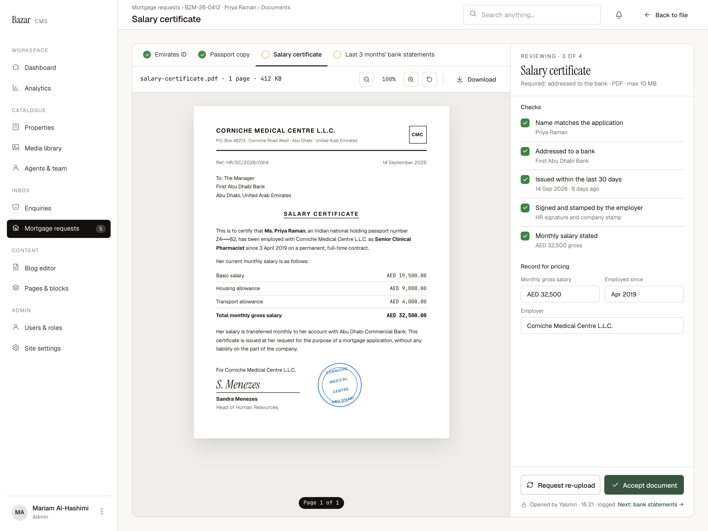

# C3 · Document viewer · Accept

| | |
|---|---|
| Route | `/admin/mortgages/[reference]/documents/[kind]` (optional `?file=<id>`) |
| Used by | Mortgage advisers, Head of mortgages |
| Design | `C3-document-viewer-accept-2x.png` (1440 × 1080 at 2×, salary certificate) · `MrqViewSalary` and `MrqViewer` in `reference/mreq-cms-2.jsx` |
| PLAN phase | 5 |
| Depends on | 00-foundations, C2, the file endpoint (Phase 2) |
| Size | L |



## Purpose
The reviewer reads a document next to its checklist, records the figures banks need for pricing, and accepts the document or asks for a new one. C4 is the same viewer in its re-upload state.

## Layout
- Shell: title = document name; breadcrumbs "Mortgage requests › {reference} · {applicant} › Documents"; secondary ghost small "Back to file" (← icon).
- **Viewer** fills the content area: grid `minmax(0,1fr) 372px`, 1px border, radius 12, surface.
- **Left column** (right border):
  - **Document tabs** (padding 0 10, bottom border): 46px items, padding 0 12, 12.5; active 500 with a 2px ink underline. Each has a 16px state dot: accepted = green with a tick; flagged = red with "!"; to review = hollow 1.5px `oklch(0.78 0.1 80)` ring.
  - **Toolbar** (padding 10×16, bottom border, gap 8): the file line in mono 12 ("{name} · {pages} · {size}"), or file chips for multi-file documents (see C4). Spacer. 30×30 bordered tools, radius 6: zoom out, zoom % (mono 11.5, 44 wide), zoom in, rotate; a divider; ghost small "Download".
  - **Stage** (surface-2, padding 28 0): the page centred with a paper shadow; a page pill at the bottom centre (mono 11, ink, radius 99): "Page {page} of {total}".
- **Review panel** (column):
  - Head (padding 18 20 16, bottom border): eyebrow "Reviewing · {index} of {total}", serif 26 document name, 12 muted "Required: …".
  - Body (padding 14×20): "Checks" (12/500 ink-2), the checklist, then "Record for pricing" and a two-column grid of fields (gap 10; label 11 muted; 34px fields at 12.5; Employer spans both columns).
  - Footer (padding 16×20, top border): outline "Request re-upload" (refresh icon) and primary "Accept document" (tick icon), equal width. Under them (12 above, 11.5 muted): lock icon and "Opened by {name} · {time} · logged" on the left; "Next: {document} →" link on the right.

### Checklist row (`MrqChecks`)
Padding 10 0, top border between rows. Checkbox 18 (green when ticked); label 13; sub-line 11.5, muted when ticked and danger when not.

## Components
Viewer frame, document tabs, toolbar, PDF/image stage, `Checkbox`, `.bz-field`, buttons. Render PDFs with pdf.js (or the repo's viewer) from the file endpoint.

## Copy
Verbatim from the design. `{braces}` are runtime values; `<b>` marks bold (00-foundations §11). The same keys are in `strings.en.json`.

**This screen**

| Key | Text | Note |
|---|---|---|
| `c3.required.salaryCertificate` | Required: addressed to the bank · PDF · max 10 MB | Other kinds follow the same pattern |
| `c3.check.salary.name` | Name matches the application |  |
| `c3.check.salary.addressed` | Addressed to a bank |  |
| `c3.check.salary.recent` | Issued within the last 30 days |  |
| `c3.check.salary.signed` | Signed and stamped by the employer |  |
| `c3.check.salary.stated` | Monthly salary stated |  |
| `c3.check.value.issued` | `{date} · {days} days ago` | Source not decided (CMS-3) |
| `c3.check.value.signed` | HR signature and company stamp | Sample reviewer note (CMS-3) |
| `c3.check.value.salary` | `AED {amount} gross` |  |
| `c3.record.title` | Record for pricing |  |
| `c3.record.salary` | Monthly gross salary |  |
| `c3.record.employedSince` | Employed since |  |
| `c3.record.employer` | Employer |  |
| `c3.action.accept` | Accept document |  |
| `c3.opened` | `Opened by {name} · {time} · logged` |  |
| `c3.next` | `Next: {document} →` | {document} is a short name, e.g. "bank statements" |

**Shared strings used here**

| Key | Text | Note |
|---|---|---|
| `nav.group` | Inbox |  |
| `nav.mortgages` | Mortgage requests | Count badge = new requests |
| `common.backToFile` | Back to file |  |
| `docState.toReview` | To review |  |
| `docState.accepted` | Accepted |  |
| `docState.reuploadRequested` | Re-upload requested |  |
| `doc.emiratesId` | Emirates ID |  |
| `doc.passport` | Passport copy |  |
| `doc.salaryCertificate` | Salary certificate |  |
| `doc.bankStatements3m` | Last 3 months' bank statements |  |
| `doc.tradeLicense` | Business trade license | "license" spelling (CMS-16) |
| `doc.bankStatements12m` | Last 1 year's bank statements |  |
| `viewer.breadcrumbs` | `Mortgage requests › {reference} · {applicant} › Documents` |  |
| `viewer.fileMeta` | `{name} · {pages} · {size}` |  |
| `viewer.pages` | `{count, plural, one {# page} other {# pages}}` |  |
| `viewer.zoom` | `{percent}%` |  |
| `viewer.download` | Download |  |
| `viewer.page` | `Page {page} of {total}` |  |
| `viewer.fileAndPage` | `File {file} of {files} · page {page} of {total}` | Multi-file documents |
| `viewer.eyebrow` | `Reviewing · {index} of {total}` |  |
| `viewer.checks` | Checks |  |
| `viewer.requestReupload` | Request re-upload |  |


## Behaviour and states

### Checks and fields
- Checks come from `checklists.ts` for the document kind (SPEC §2.3). The salary certificate's five are designed; other kinds are proposed in SPEC and need sign-off (SPEC §9 #7).
- Ticking a check saves straight away (`setCheck`). Fields save on blur (`setRecordedFields`) with validation: salary is a whole AED amount; "Employed since" is a month and year; Employer is text.
- **Accept document** is enabled when every check is ticked. Proposal: the salary certificate's three fields are also required, since C5 prices on them.
- The sub-lines under each check ("Priya Raman", "First Abu Dhabi Bank", "14 Sep 2026 · 8 days ago") need a source. Proposal: name from the application; issue date and addressee typed by the reviewer; salary from the recorded field (CMS-3).

### Accepting
`acceptDocument` sets the document to Accepted, updates its tab dot and writes the event. The panel's accepted, read-only state isn't designed (CMS-2). Proposal: show who accepted it and when, keep the checks visible but locked, and keep the "Next" link.

### Moving around
- Tabs switch document (route change). The eyebrow's index follows the tab order.
- "Next: {document} →" goes to the next document not yet accepted. When all are accepted it should lead back to the file (copy needed).
- "Back to file" returns to C2 with its row highlighted.

### Viewing
- Zoom 25–400% in steps of 25 (proposal). Rotate turns the page 90°. The page pill updates as you scroll.
- **Download** writes `document.downloaded`. Opening a file writes `document.viewed` once per file per visit (proposal), not on every page render.
- The "Opened by" line shows the current viewer's open event.
- A file that hasn't passed the malware scan can't be opened (state not designed).

## Data and actions
- `getViewer(reference, kind)` → request summary, the four documents with states, this document's files (id, name, pages, size, scan status, period), checks and recorded values, and the checklist config.
- Actions: `setCheck`, `setRecordedFields`, `acceptDocument`. File bytes come from `/admin/mortgages/files/[fileId]`.
- The owner's first document open moves the request from New to In review.

## Permissions
Owners and the Head of mortgages can tick, record and accept. Other advisers can view (every view is logged) but not act.

## Accessibility
- Tabs are a tablist; tools have labels; proposed shortcuts are `+`, `-` and `R`.
- Each check's sub-line is its description; unticked failing checks announce as "not met".
- The PDF is rendered as images, so the stage gets `aria-label="{document}, page {page} of {total}"`.

## Edge cases
- Very long PDFs: render pages lazily.
- Image files (JPG/PNG, e.g. Emirates ID front and back): two files show as chips like C4.
- Rotation isn't saved (proposal).
- The applicant re-uploads while you're reviewing: new files appear after refresh; checks reset for re-uploaded documents (proposal).

## Acceptance criteria
- [ ] Matches the PNG at 1440px with Priya's salary certificate.
- [ ] Accept is enabled only when every check is ticked (and, if agreed, the fields are filled).
- [ ] Checks and fields persist across reloads.
- [ ] Opening and downloading write events before any bytes are returned.
- [ ] Tabs, Next and Back to file navigate correctly.
- [ ] Non-owners can't change anything.

## Tests
- Integration: `setCheck` and `acceptDocument` permissions and validation; events written on view and download.
- Playwright: review and accept the salary certificate, then follow "Next" to the statements.

## Open questions
CMS-3 (sub-line sources), CMS-2 (accepted state, other kinds' checks), scan-pending state.

## Build steps
1. Route and `getViewer` loader.
2. Viewer frame: tabs, toolbar, stage with pdf.js and images.
3. Review panel with checks and fields from `checklists.ts`.
4. Accept, Next and Back to file.
5. View and download logging.
6. Tests.

## Claude Code prompt
```
Build C3 · Document viewer (accept) from docs/mortgage/cms/C3-document-viewer-accept/README.md. C4 is the same viewer in its re-upload state; build C3 first.
Compare with C3-document-viewer-accept-2x.png and reference/mreq-cms-2.jsx (MrqViewer, MrqViewSalary). Load files only through /admin/mortgages/files/[fileId].
Checks come from checklists.ts, not the page. Plan first, then follow the build steps. Check the acceptance criteria, run the tests, and compare a 1440px screenshot with the PNG. Update docs/mortgage/PROGRESS.md.
```
