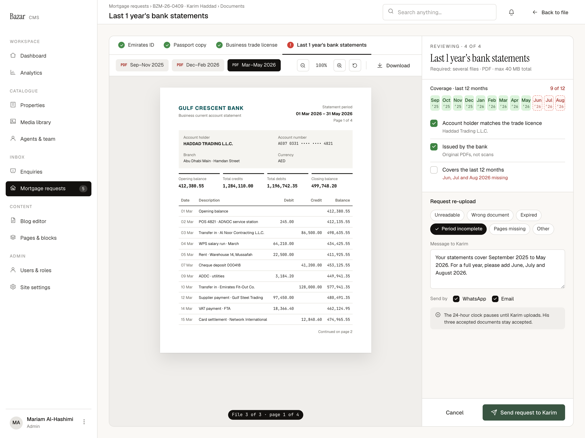

# C4 · Document viewer · Request re-upload

| | |
|---|---|
| Route | `/admin/mortgages/[reference]/documents/[kind]` (same as C3) |
| Used by | Mortgage advisers, Head of mortgages |
| Design | `C4-document-viewer-reupload-2x.png` (1440 × 1080 at 2×, 12-month statements) · `MrqViewStatements` in `reference/mreq-cms-2.jsx` |
| PLAN phase | 5 |
| Depends on | C3 (same viewer), W8 on the website |
| Size | M |



## Purpose
When a document fails a check, the reviewer asks the applicant for a replacement or the missing part. The request pauses the 24-hour clock, leaves accepted documents alone, and sends the applicant a secure link (W8).

## Layout
Same shell and viewer as C3, with these differences:
- Title "Last 1 year's bank statements"; breadcrumbs for Karim Haddad (BZM-26-0409).
- The flagged tab shows the red "!" dot.
- **Toolbar file chips** replace the file line: 30px, padding 0 12, radius 6, 12px, with a mono 9/600 "PDF" label (red, or inherited on the active chip). Active chip ink. Each chip is labelled with the file's statement period ("Sep–Nov 2025").
- Page pill: "File {file} of {files} · page {page} of {total}".
- **Review panel:**
  - Head as C3: "Reviewing · 4 of 4", "Required: several files · PDF · max 40 MB total".
  - **Coverage section** (padding 14 20 16, bottom border): "Coverage · last 12 months" with "{have} of {total}" on the right in danger; the 12-month grid at 38px; the three checks, 12 below. The failing check reads "Jun, Jul and Aug 2026 missing" in danger.
  - **Re-upload section** (`--bz-bg` background, padding 14×20): "Request re-upload" 13/500; reason chips (gap 6, 10 below); "Message to {firstName}" (11.5 muted, 14 above, 6 below); a 4-row textarea at 12.5/1.5; "Send by" with WhatsApp and Email checkboxes (16px, 10 above); the pause note (12 above, padding 10×12, radius 8, surface-2, 11.5/1.5 ink-2, pause icon).
  - **Footer** (padding 14×20, top border): ghost "Cancel" (flex 1) and primary "Send request to {firstName}" (send icon, flex 2).

## Components
As C3, plus `StatementCoverage`, `ChoiceChip` (reasons), textarea, `Checkbox`.

## Copy
Verbatim from the design. `{braces}` are runtime values; `<b>` marks bold (00-foundations §11). The same keys are in `strings.en.json`.

**This screen**

| Key | Text | Note |
|---|---|---|
| `c4.required.bankStatements12m` | Required: several files · PDF · max 40 MB total |  |
| `c4.coverage.title` | Coverage · last 12 months |  |
| `c4.coverage.count` | `{have} of {total}` | Danger colour when incomplete |
| `c4.check.holder` | Account holder matches the trade licence | "licence" spelling (CMS-16) |
| `c4.check.issued` | Issued by the bank |  |
| `c4.check.covers` | Covers the last 12 months |  |
| `c4.check.value.original` | Original PDFs, not scans |  |
| `c4.check.value.missing` | `{months} missing` |  |
| `c4.reason.unreadable` | Unreadable |  |
| `c4.reason.wrongDocument` | Wrong document |  |
| `c4.reason.expired` | Expired |  |
| `c4.reason.periodIncomplete` | Period incomplete |  |
| `c4.reason.pagesMissing` | Pages missing |  |
| `c4.reason.other` | Other |  |
| `c4.message.label` | `Message to {firstName}` |  |
| `c4.message.example` | Your statements cover September 2025 to May 2026. For a full year, please add June, July and August 2026. | Sample; proposed prefill for Period incomplete |
| `c4.pause` | `The 24-hour clock pauses until {firstName} uploads. His three accepted documents stay accepted.` | Gendered, fixed count (CMS-4) |
| `c4.send` | `Send request to {firstName}` |  |

**Shared strings used here**

| Key | Text | Note |
|---|---|---|
| `nav.group` | Inbox |  |
| `nav.mortgages` | Mortgage requests | Count badge = new requests |
| `common.backToFile` | Back to file |  |
| `common.cancel` | Cancel |  |
| `common.whatsapp` | WhatsApp |  |
| `common.email` | Email |  |
| `common.sendBy` | Send by |  |
| `docState.toReview` | To review |  |
| `docState.accepted` | Accepted |  |
| `docState.reuploadRequested` | Re-upload requested |  |
| `doc.emiratesId` | Emirates ID |  |
| `doc.passport` | Passport copy |  |
| `doc.salaryCertificate` | Salary certificate |  |
| `doc.bankStatements3m` | Last 3 months' bank statements |  |
| `doc.tradeLicense` | Business trade license | "license" spelling (CMS-16) |
| `doc.bankStatements12m` | Last 1 year's bank statements |  |
| `viewer.breadcrumbs` | `Mortgage requests › {reference} · {applicant} › Documents` |  |
| `viewer.fileMeta` | `{name} · {pages} · {size}` |  |
| `viewer.pages` | `{count, plural, one {# page} other {# pages}}` |  |
| `viewer.zoom` | `{percent}%` |  |
| `viewer.download` | Download |  |
| `viewer.page` | `Page {page} of {total}` |  |
| `viewer.fileAndPage` | `File {file} of {files} · page {page} of {total}` | Multi-file documents |
| `viewer.eyebrow` | `Reviewing · {index} of {total}` |  |
| `viewer.checks` | Checks |  |
| `viewer.requestReupload` | Request re-upload |  |


## Behaviour and states

### Entering this state
"Request re-upload" in C3's footer switches the panel into this state. Proposal: open it straight away when a check is unticked and the reviewer presses Request re-upload, with a likely reason preselected ("Period incomplete" when coverage is short). "Cancel" returns to the C3 state without saving.

### Coverage (statements only)
- Required months come from `requiredStatementMonths()` for the submission date (12 or 3).
- Coverage is the union of the periods staff enter for each file (SPEC §2.3). Where to enter a period isn't designed (CMS-5). Proposal: a month-range control in the toolbar for the active file, shown until a period is set; before that, the chip shows the file name.
- The "Covers the last 12 months" check ticks automatically when coverage is complete (proposal) and lists the missing months when not.

### The request
- One reason (required): Unreadable, Wrong document, Expired, Period incomplete, Pages missing, Other.
- Message (required, up to 1,000 characters). Proposal: prefill for Period incomplete from the coverage ("Your statements cover {received}. For a full year, please add {missing}."), as in the design; other reasons start empty.
- At least one channel. Both are ticked by default.
- WhatsApp outside the 24-hour customer-service window can only send an approved template, so the free text goes by email and on W8 (SPEC §6). Whether to warn here isn't decided (CMS-17).
- **Send request** calls `requestReupload`: creates the re-upload request and access link, sets the document to Re-upload requested, moves the request to Awaiting applicant (the clock pauses), writes events and sends WhatsApp and email. Then return to C2. The success message isn't designed.

### The pause note
It states the effect ("The 24-hour clock pauses until Karim uploads…"). Its wording assumes gender and a count of three (CMS-4); make both come from data, or use neutral copy.

## Data and actions
- Same loader as C3, plus statement periods and required months.
- Actions: `setStatementPeriod(fileId, from, to)`, `requestReupload({ documentId, reason, message, channels })`, `cancelReupload` (from C2).

## Permissions
Owners and the Head of mortgages.

## Accessibility
- The coverage grid has a text alternative listing received and missing months.
- Reason chips are a radio group.
- The pause note is linked to the Send button with `aria-describedby`.

## Edge cases
- A second document needs a re-upload too: send a separate request (one link per document).
- The applicant uploads before the reviewer finishes a second request: the request moves back to In review; the second request pauses it again.
- A request is sent by mistake: `cancelReupload` from C2 revokes the link and resumes the clock (UI not designed).

## Acceptance criteria
- [ ] Matches the PNG at 1440px with Karim's seeded statements.
- [ ] Coverage and the failing check follow the entered periods.
- [ ] Send is blocked without a reason, a message and a channel.
- [ ] Sending pauses the clock, leaves accepted documents accepted, and creates exactly one active link.
- [ ] The applicant receives WhatsApp and email with the link; W8 shows the message.

## Tests
- Unit: coverage union and missing months, including overlapping periods.
- Integration: `requestReupload` status, clock pause, events and link.
- Playwright: C4 → W8 → back in C2 as In review with the clock resumed.

## Open questions
CMS-4 (gendered note), CMS-5 (period entry), CMS-16 (licence/license), CMS-17 (WhatsApp warning), success message.

## Build steps
1. Panel state switch between accept and re-upload.
2. File chips and period entry (once designed).
3. Coverage grid and the coverage check.
4. Re-upload form with validation and prefill.
5. `requestReupload` wiring and return to C2.
6. Tests.

## Claude Code prompt
```
Build C4 · Document viewer (request re-upload) from docs/mortgage/cms/C4-document-viewer-reupload/README.md, on top of the C3 viewer.
Compare with C4-document-viewer-reupload-2x.png and reference/mreq-cms-2.jsx (MrqViewStatements). Coverage uses requiredStatementMonths() and the staff-entered periods.
The period entry control isn't designed: build a minimal month-range control, mark it TODO for design, and list it in PROGRESS.md.
Plan first, then follow the build steps. Check the acceptance criteria, run the tests, and compare a 1440px screenshot with the PNG. Update docs/mortgage/PROGRESS.md.
```
