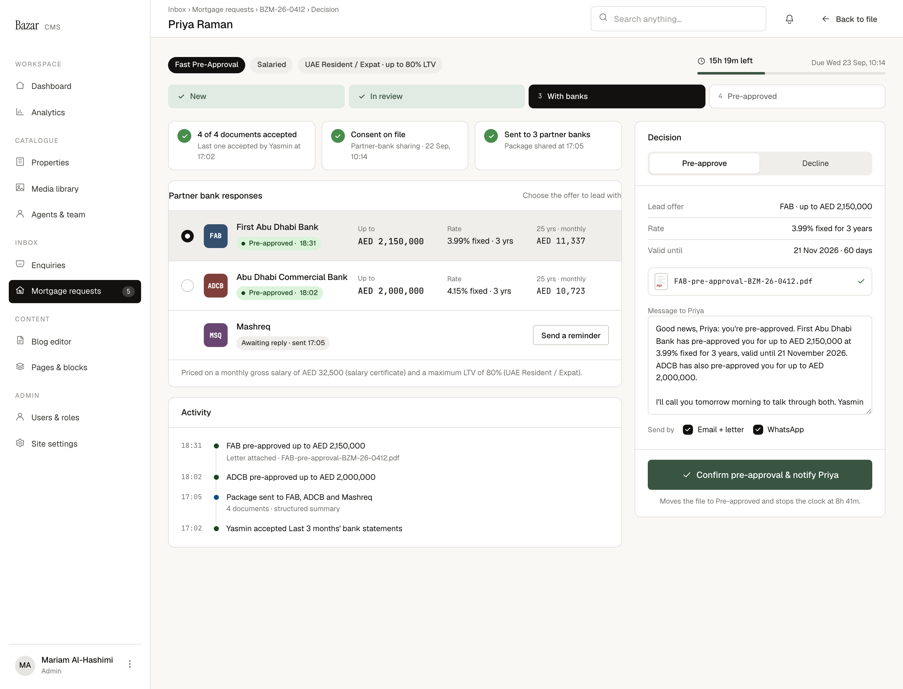

# C5 · Decision · Pre-approve and notify

| | |
|---|---|
| Route | `/admin/mortgages/[reference]/decision` |
| Used by | Mortgage advisers (owner), Head of mortgages |
| Design | `C5-decision-2x.png` (1440 × 1100 at 2×, with banks) · `MrqDecision` in `reference/mreq-cms-2.jsx` |
| PLAN phase | 6 |
| Depends on | 00-foundations, C2, partner banks |
| Size | L |



## Purpose
Once the file is with the banks, the owner compares their responses, picks the offer to lead with, and sends the applicant the pre-approval within the 24 hours.

## Layout
- Shell: title = applicant name; breadcrumbs "Inbox › Mortgage requests › {reference} › Decision"; ghost small "Back to file".
- File header with the clock (e.g. "15h 19m left", "Due Wed 23 Sep, 10:14"); stage rail at With banks.
- **Grid:** `minmax(0,1fr) 400px`, gap 20.
  - **Left, gap 16:**
    1. **Status tiles:** three columns, gap 10. Each: row gap 10, padding 12×14, radius 10, surface, border; 22px green circle with a tick; title 12.5/500 and sub 11.5 muted.
    2. **Partner bank responses** card (aside "Choose the offer to lead with", no body padding). Rows: grid `22px 38px minmax(0,1.4fr) minmax(0,1fr) minmax(0,1fr) minmax(0,.9fr)`, gap 14, padding 16×20, top borders; the lead offer row has a surface-2 background. Columns: radio (empty for banks still waiting), bank mark (38px, radius 8, mono 10.5/600 white on the bank colour), name 13.5/500 with a small pill 4 below, then "Up to" (mono 13.5/500), "Rate" (13) and "25 yrs · monthly" (mono 13), each with an 11px muted label. A waiting bank spans the last three columns with a right-aligned outline small "Send a reminder". Footer line (padding 12×20, 12 muted) with the pricing basis.
    3. **Activity** card.
  - **Right: Decision card** (`.bz-card`):
    - Header (padding 16×20, bottom border): "Decision" 13.5/500 and a segmented control (Pre-approve, Decline), 12 below.
    - Body (padding 16×20): key-value rows (Lead offer, Rate, Valid until); the letter row (10 above, padding 8×10, radius 8, border: PDF thumb, mono 11.5 name, green tick); "Message to {firstName}" (11.5 muted, 16 above); a 7-row textarea at 12.5/1.55; "Send by" with "Email + letter" and "WhatsApp".
    - Footer (padding 16×20, top border): full-width primary large "Confirm pre-approval & notify {firstName}" (tick icon); note 11.5 muted, centred, 10 below.

## Components
`FileHeader`, `PromiseClock`, `StageRail`, `Card`, `Radio`, `Pill`, bank mark, `ActivityList`, `KeyValueList`, `SegmentedControl`, textarea, `Checkbox`.

## Copy
Verbatim from the design. `{braces}` are runtime values; `<b>` marks bold (00-foundations §11). The same keys are in `strings.en.json`.

**This screen**

| Key | Text | Note |
|---|---|---|
| `c5.breadcrumbs` | `Inbox › Mortgage requests › {reference} › Decision` |  |
| `c5.tile.docs` | `{accepted} of {total} documents accepted` |  |
| `c5.tile.docs.sub` | `Last one accepted by {name} at {time}` |  |
| `c5.tile.consent` | Consent on file |  |
| `c5.tile.consent.sub` | `Partner-bank sharing · {givenAt}` |  |
| `c5.tile.sent` | `Sent to {count} partner banks` |  |
| `c5.tile.sent.sub` | `Package shared at {time}` |  |
| `c5.banks.title` | Partner bank responses |  |
| `c5.banks.hint` | Choose the offer to lead with |  |
| `c5.bank.preApproved` | `Pre-approved · {time}` |  |
| `c5.bank.awaiting` | `Awaiting reply · sent {time}` |  |
| `c5.bank.upTo` | Up to |  |
| `c5.bank.rate` | Rate |  |
| `c5.bank.monthly` | 25 yrs · monthly |  |
| `c5.bank.rateValue` | `{rate}% fixed · {years} yrs` |  |
| `c5.bank.reminder` | Send a reminder |  |
| `c5.banks.basis` | `Priced on a monthly gross salary of {salary} (salary certificate) and a maximum LTV of {ltv}% ({residency}).` |  |
| `c5.decision.title` | Decision |  |
| `c5.decision.preApprove` | Pre-approve |  |
| `c5.decision.decline` | Decline |  |
| `c5.lead.offer` | Lead offer |  |
| `c5.lead.offerValue` | `{bank} · up to {amount}` |  |
| `c5.lead.rate` | Rate |  |
| `c5.lead.rateValue` | `{rate}% fixed for {years} years` |  |
| `c5.lead.validUntil` | Valid until |  |
| `c5.lead.validValue` | `{date} · {days} days` |  |
| `c5.message.label` | `Message to {firstName}` |  |
| `c5.message.example` | `Good news, Priya: you're pre-approved. First Abu Dhabi Bank has pre-approved you for up to AED 2,150,000 at 3.99% fixed for 3 years, valid until 21 November 2026. ADCB has also pre-approved you for up to AED 2,000,000.\n\nI'll call you tomorrow morning to talk through both. Yasmin` | Sample; default template not specified (CMS-6) |
| `c5.channel.emailLetter` | Email + letter |  |
| `c5.cta` | `Confirm pre-approval & notify {firstName}` |  |
| `c5.cta.note` | `Moves the file to Pre-approved and stops the clock at {elapsed}.` | {elapsed} from slaStatus(), e.g. "8h 41m" |

**Shared strings used here**

| Key | Text | Note |
|---|---|---|
| `nav.group` | Inbox |  |
| `nav.mortgages` | Mortgage requests | Count badge = new requests |
| `common.backToFile` | Back to file |  |
| `common.whatsapp` | WhatsApp |  |
| `common.sendBy` | Send by |  |
| `service.preApproval` | Fast Pre-Approval |  |
| `residency.uaeNational` | UAE National |  |
| `residency.expat` | UAE Resident / Expat |  |
| `residency.withLtv` | `{residency} · up to {ltv}% LTV` |  |
| `employment.salaried` | Salaried |  |
| `employment.businessOwner` | Business Owner |  |
| `status.new` | New |  |
| `status.inReview` | In review |  |
| `status.withBanks` | With banks |  |
| `status.preApproved` | Pre-approved |  |
| `clock.left` | `{remaining} left` | {remaining} as "17h 42m" |
| `clock.paused` | `Paused · {remaining} left` |  |
| `clock.due` | `Due {dueAt}` |  |
| `card.activity` | Activity |  |
| `activity.accepted` | `{actor} accepted {document}` |  |
| `activity.bankPreApproved` | `{bank} pre-approved up to {amount}` |  |
| `activity.bankPreApproved.sub` | `Letter attached · {fileName}` |  |
| `activity.packageSent` | `Package sent to {banks}` |  |
| `activity.packageSent.sub` | `{count} documents · structured summary` |  |


## Behaviour and states

### Bank responses
- One row per bank submission. Statuses: Awaiting reply (`sent`), Pre-approved, and (not designed) Declined and Withdrawn.
- **Recording a response isn't designed** (CMS-2). It needs: max amount (AED), rate %, fixed or variable, fixed years, valid until, and the bank's letter PDF (uploaded to the private bucket). Proposal: a "Record response" action on each waiting row that opens a side panel.
- The 25-year monthly payment is computed with `payments.ts`, never stored: AED 2,150,000 at 3.99% over 25 years = AED 11,337.
- **Send a reminder** emails the bank's package contacts again (`sendBankReminder`). Proposal: after sending, the row shows "Reminder sent {time}".
- The pricing line uses the salary recorded on C3 and the residency's maximum LTV.

### Lead offer
Pick one pre-approved bank with its radio. The decision card fills from it: "Lead offer {bank} · up to {amount}", "Rate {rate}% fixed for {years} years", "Valid until {date} · {days} days", and the bank's letter.

### Decision
- **Pre-approve** (designed). The message is editable; the design's text is a sample, and the default template isn't specified (CMS-6). Required: a lead offer with a letter, a non-empty message, at least one channel, and consent on file.
- **Confirm** calls `decide('pre_approved')`: moves the request to Pre-approved, stops the clock (met or breached), emails the message with the letter and sends WhatsApp (template rules as SPEC §6), and writes events. The note shows the elapsed time from `slaStatus()` ("stops the clock at 8h 41m").
- **Decline** isn't designed (SPEC §9 #8): reasons, message template, and whether a file can be declined before it goes to banks.
- After confirming, return to C2 in its Pre-approved state (not designed).

### Status tiles
"{accepted} of {total} documents accepted" with the last acceptance; "Consent on file" with its time; "Sent to {count} partner banks" with the package time. Proposal: a tile turns warn or danger when its condition fails (not designed).

## Data and actions
- `getDecision(reference)` → request, `slaStatus()`, tile facts, bank submissions with responses, recorded salary and LTV, events.
- Actions: `recordBankResponse`, `sendBankReminder`, `decide({ decision, leadSubmissionId, message, channels })`.

## Permissions
Owners and the Head of mortgages.

## Accessibility
- Bank rows are a radio group labelled "Choose the offer to lead with"; each option's name includes the bank, amount and rate.
- The Confirm button's note is its description.

## Edge cases
- No bank has answered yet: no lead offer; Confirm disabled (copy needed).
- Only one bank pre-approves: the message shouldn't mention others.
- An offer's validity has passed: block it as the lead (copy needed).
- The clock has already breached: confirming still works and records breached.

## Acceptance criteria
- [ ] Matches the PNG at 1440px with Priya's seeded bank responses.
- [ ] Monthly payments match `payments.ts` (AED 11,337 for FAB).
- [ ] Choosing another lead offer updates the decision card and letter.
- [ ] Confirm is blocked without a lead offer, letter, message, channel or consent.
- [ ] Confirming moves the file to Pre-approved, stops the clock, and sends email with the letter and WhatsApp.

## Tests
- Unit: payment formula against the examples.
- Integration: `decide` status, clock stop (met vs breached), events, notifications enqueued.
- Playwright: Priya's file from With banks to Pre-approved; C1 then shows it under Closed.

## Open questions
CMS-2 (record response, decline, bank selection), CMS-6 (default message), CMS-12 (stage rail for Declined), CMS-17 (WhatsApp warning).

## Build steps
1. Route, guard (With banks or later) and `getDecision`.
2. Status tiles and the bank responses list with computed payments.
3. Lead offer selection and the decision card.
4. `decide` wiring with validation.
5. Reminder action; stub the record-response panel until designed.
6. Tests.

## Claude Code prompt
```
Build C5 · Decision from docs/mortgage/cms/C5-decision/README.md.
Compare with C5-decision-2x.png and reference/mreq-cms-2.jsx (MrqDecision). Compute monthly payments with payments.ts; the elapsed time in the note comes from slaStatus().
Recording a bank response and the Decline mode aren't designed: build minimal stubs, mark them TODO for design, and list them in PROGRESS.md.
Plan first, then follow the build steps. Check the acceptance criteria, run the tests, and compare a 1440px screenshot with the PNG. Update docs/mortgage/PROGRESS.md.
```
