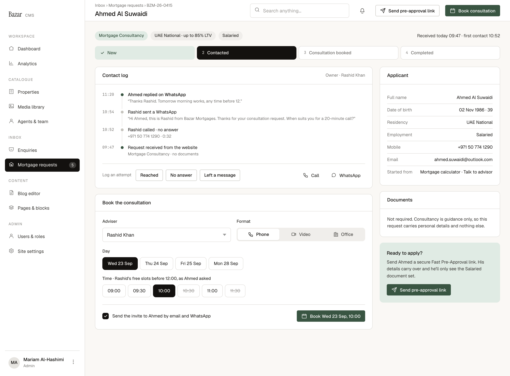

# C6 · Consultancy request · Contact and book

| | |
|---|---|
| Route | `/admin/mortgages/[reference]` (service = consultancy) |
| Used by | Mortgage advisers, Head of mortgages |
| Design | `C6-consultancy-request-2x.png` (1440 × 1060 at 2×, contacted) · `MrqConsultRequest` in `reference/mreq-cms-1.jsx` |
| PLAN phase | 4; the invite landing on the website is Phase 5 |
| Depends on | 00-foundations, C1 |
| Size | M |



## Purpose
The adviser works a consultancy request: logs contact attempts, books the consultation, and can send a Fast Pre-Approval link when the applicant is ready.

## Layout
- Shell: title = applicant name; breadcrumbs "Inbox › Mortgage requests › {reference}". Top-bar actions: outline small "Send pre-approval link" (send icon) and primary small "Book consultation" (calendar icon).
- **File header:** chips "Mortgage Consultancy" (accent), "{residency} · up to {ltv}% LTV", employment; on the right, 12.5 ink-2 "Received {when} · first contact {time}".
- **Stage rail:** New · Contacted · Consultation booked · Completed.
- **Grid:** `minmax(0,1fr) 340px`, gap 20.
  - **Left, gap 16:**
    1. **Contact log** card (aside "Owner · {name}"): the activity list, newest first, with quoted messages as sub-lines. Below (18 above, 16 padding, top border): "Log an attempt" (12 muted), outline small Reached, No answer and Left a message; spacer; ghost small Call and WhatsApp.
    2. **Book the consultation** card: two columns (gap 16) with Adviser (select) and Format (segmented Phone, Video, Office with icons). "Day" chips (18 above). "Time" chips (16 above, wrapping). Labels 12/500 ink-2, 8 below. Footer row (20 above, 16 padding, top border): checkbox 18, "Send the invite to {firstName} by email and WhatsApp" (12.5), primary small "Book {day}, {time}" (calendar icon).
  - **Right, gap 16:** Applicant card (key-value rows); Documents card (12.5/1.5 ink-2); an accent-soft panel (padding 20, radius 10) with "Ready to apply?" 13.5/500, 12.5/1.55 ink-2 text, and primary small "Send pre-approval link" 14 below.

## Components
`FileHeader`, `StageRail`, `Card`, `ActivityList`, `SegmentedControl`, `ChoiceChip`, `KeyValueList`, `Checkbox`, `.bz-field` select, buttons.

## Copy
Verbatim from the design. `{braces}` are runtime values; `<b>` marks bold (00-foundations §11). The same keys are in `strings.en.json`.

**This screen**

| Key | Text | Note |
|---|---|---|
| `c6.breadcrumbs` | `Inbox › Mortgage requests › {reference}` |  |
| `c6.action.sendLink` | Send pre-approval link |  |
| `c6.action.book` | Book consultation |  |
| `c6.header.received` | `Received {when} · first contact {time}` | {when} as "today 09:47" |
| `c6.log.title` | Contact log |  |
| `c6.log.owner` | `Owner · {name}` |  |
| `c6.log.label` | Log an attempt |  |
| `c6.log.reached` | Reached |  |
| `c6.log.noAnswer` | No answer |  |
| `c6.log.leftMessage` | Left a message |  |
| `c6.book.title` | Book the consultation |  |
| `c6.book.adviser` | Adviser |  |
| `c6.book.format` | Format |  |
| `c6.book.phone` | Phone |  |
| `c6.book.video` | Video |  |
| `c6.book.office` | Office |  |
| `c6.book.day` | Day |  |
| `c6.book.time` | `Time · {adviserFirstName}'s free slots before 12:00, as {firstName} asked` | "before 12:00, as … asked" is a filter (CMS-7) |
| `c6.book.invite` | `Send the invite to {firstName} by email and WhatsApp` |  |
| `c6.book.cta` | `Book {dateTime}` | {dateTime} as "Wed 23 Sep, 10:00" |
| `c6.applicant.residency` | Residency |  |
| `c6.applicant.employment` | Employment |  |
| `c6.docs.title` | Documents |  |
| `c6.docs.body` | Not required. Consultancy is guidance only, so this request carries personal details and nothing else. |  |
| `c6.ready.title` | Ready to apply? |  |
| `c6.ready.body` | `Send {firstName} a secure Fast Pre-Approval link. His details carry over and he'll only see the {employment} document set.` | Gendered (CMS-4) |

**Shared strings used here**

| Key | Text | Note |
|---|---|---|
| `nav.group` | Inbox |  |
| `nav.mortgages` | Mortgage requests | Count badge = new requests |
| `common.call` | Call |  |
| `common.whatsapp` | WhatsApp |  |
| `service.consultancy` | Mortgage Consultancy |  |
| `residency.uaeNational` | UAE National |  |
| `residency.expat` | UAE Resident / Expat |  |
| `residency.withLtv` | `{residency} · up to {ltv}% LTV` |  |
| `employment.salaried` | Salaried |  |
| `employment.businessOwner` | Business Owner |  |
| `status.new` | New |  |
| `status.contacted` | Contacted |  |
| `status.consultationBooked` | Consultation booked |  |
| `status.completed` | Completed |  |
| `card.applicant` | Applicant |  |
| `field.fullName` | Full name |  |
| `field.dateOfBirth` | Date of birth |  |
| `field.mobile` | Mobile |  |
| `field.email` | Email |  |
| `field.startedFrom` | Started from |  |
| `field.dobAge` | `{date} · {age}` | e.g. "14 Mar 1990 · 36" |
| `entry.calculatorPreapproval` | Mortgage calculator |  |
| `entry.calculatorAdvisor` | Mortgage calculator · Talk to advisor | Other entry points not designed (CMS-8) |
| `activity.whatsappIn` | `<b>{firstName} replied on WhatsApp</b>` | Inbound, from the WhatsApp webhook |
| `activity.whatsappOut` | `{actor} sent a WhatsApp` |  |
| `activity.callNoAnswer` | `{actor} called · no answer` |  |
| `activity.call.sub` | `{mobile} · {duration}` |  |
| `activity.consultReceived` | Request received from the website |  |
| `activity.consultReceived.sub` | Mortgage Consultancy · no documents |  |
| `activity.quote` | `“{text}”` | Curly quotes around message text |


## Behaviour and states

### Contact log
- Shows `mortgage_contact_attempts` and inbound WhatsApp messages (from the WhatsApp webhook) as one timeline, plus "Request received from the website".
- **Log an attempt:** Reached, No answer or Left a message calls `logContactAttempt`. The channel and an optional note or duration aren't designed; proposal: a small popover defaulting to Call, with an optional note. The first attempt moves New → Contacted and sets the first-contact time in the header.
- **Call** is a `tel:` link; **WhatsApp** opens the team's WhatsApp tool. Proposal: after a call, prompt to log the outcome.

### Booking
- **Adviser:** defaults to the owner; lists the mortgage team.
- **Format:** Phone, Video or Office.
- **Day:** proposal: the next four working days.
- **Time:** the adviser's free slots — working hours minus existing bookings (SPEC scope: no calendar sync in v1), on a 30-minute grid. Taken slots are struck through and can't be chosen. The label's "before 12:00, as Ahmed asked" implies a time-of-day filter that isn't specified (CMS-7).
- **Book** calls `bookConsultation`: creates the consultation (20 minutes by default), moves the request to Consultation booked, and, if ticked, sends the invite by email (with an .ics) and WhatsApp. The button label shows the chosen slot.
- "Book consultation" in the top bar scrolls to and focuses this card.
- Rescheduling, cancelling, no-show and marking held (→ Completed) aren't designed (CMS-2).

### Send pre-approval link
`sendPreapprovalInvite` creates an invite link and sends it by WhatsApp and email. When the applicant submits through it, a new pre-approval request is created and linked to this one; this request's status doesn't change (SPEC §2.4). The confirmation state and how the link shows here afterwards aren't designed.

### Header
"Received today 09:47 · first contact 10:52". Before the first contact, proposal: "Received today 09:47 · not contacted yet" (copy needed).

## Data and actions
- `getFile(reference)` for consultancy → request, owner, contact timeline, current consultation, adviser slots for the selected day.
- Actions: `logContactAttempt`, `bookConsultation`, `sendPreapprovalInvite`, and later `markConsultationHeld`.

## Permissions
Owners and the Head of mortgages. Other advisers see the page read-only.

## Accessibility
- Day and time chips are radio groups; struck slots are `aria-disabled` with "unavailable" in their names.
- The contact log is a list; quoted messages are marked as quotes.

## Edge cases
- The applicant replies on WhatsApp before anyone contacts them: it appears in the log. Proposal: an inbound reply alone doesn't move the request to Contacted.
- Two advisers book the same slot: the second gets a conflict and fresh slots.
- The applicant asks for another time: rebook from the same card (reschedule isn't designed).

## Acceptance criteria
- [ ] Matches the PNG at 1440px with Ahmed's seeded request (BZM-26-0415).
- [ ] The first logged attempt moves New → Contacted and sets first contact.
- [ ] Only free slots can be booked; booking moves to Consultation booked and sends the invite with an .ics.
- [ ] "Send pre-approval link" creates one active invite link and sends it.
- [ ] C1's promise column reflects the latest contact and the booking.

## Tests
- Unit: slot calculation (working hours minus bookings, 20-minute meetings on a 30-minute grid).
- Integration: `logContactAttempt` transitions; `bookConsultation` conflict.
- Playwright: New → Contacted → Consultation booked; the invite email includes an .ics.

## Open questions
CMS-4 (gendered invite card), CMS-7 (slot filter), CMS-8 ("Started from" labels), CMS-2 (reschedule, held, no-show, cancel; invite confirmation).

## Build steps
1. C6 branch of the file route, with header and stage rail.
2. Contact log timeline and attempt logging.
3. Booking card with slot calculation.
4. `bookConsultation` with invite email (.ics) and WhatsApp.
5. Send pre-approval link.
6. Tests.

## Claude Code prompt
```
Build C6 · Consultancy request from docs/mortgage/cms/C6-consultancy-request/README.md.
Compare with C6-consultancy-request-2x.png and reference/mreq-cms-1.jsx (MrqConsultRequest). The route is shared with C2; render by service.
Adviser slots are working hours minus existing bookings; there's no calendar sync in v1. Status changes go through transition().
Plan first, then follow the build steps. Check the acceptance criteria, run the tests, and compare a 1440px screenshot with the PNG. Update docs/mortgage/PROGRESS.md.
```
