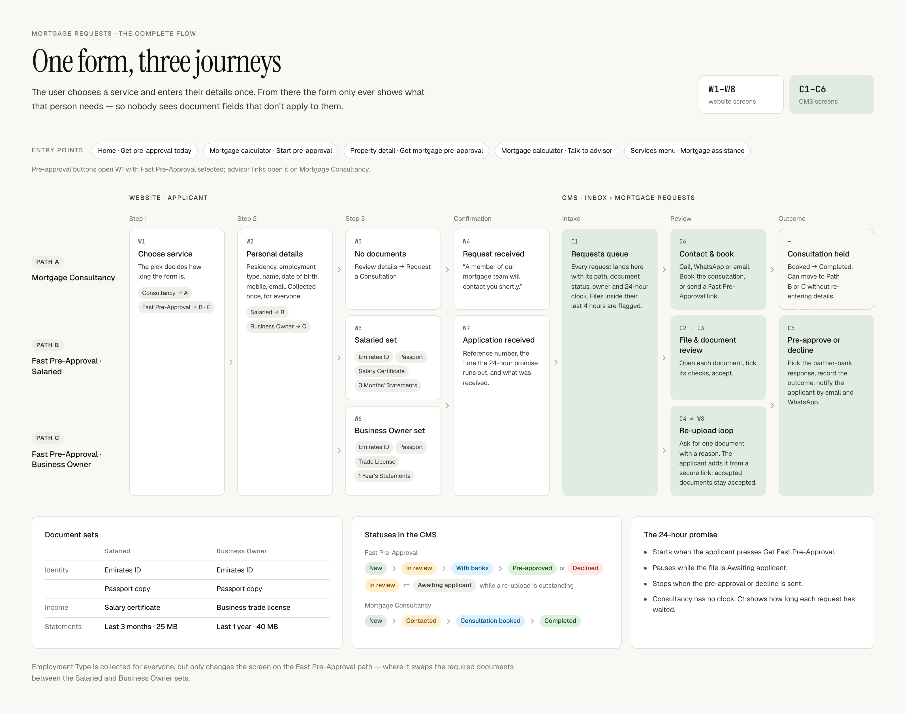
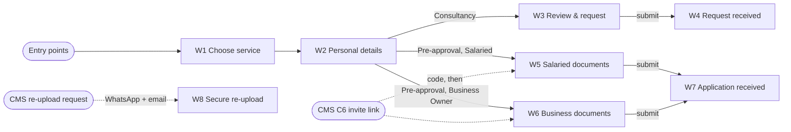

# 00 · Foundations — mortgage application (website)

Build this before any screen. It covers everything W1–W8 share: page shell, tokens, components, wizard state, upload engine, API client, formatting, analytics, accessibility and responsive rules.

| | |
|---|---|
| Screens served | W1–W8 |
| PLAN phase | 3 (W8 parts in 5) |
| Size | L |
| In this zip | `journey-map-2x.png` · `strings.shared.en.json` · `SPEC.md` · `reference/` (open `index.html` for all eight screens) |



## 1. Screens and routes

| Code | Screen | Route | Shown when |
|---|---|---|---|
| W1 | Choose service | `/mortgages/apply` | Everyone |
| W2 | Personal details | `/mortgages/apply/details` | Everyone |
| W3 | Consultancy · review & request | `/mortgages/apply/review` | Consultancy |
| W4 | Consultancy · request received | `/mortgages/apply/received` | Consultancy, after submit |
| W5 | Salaried documents | `/mortgages/apply/documents` | Pre-approval + Salaried |
| W6 | Business Owner documents | `/mortgages/apply/documents` | Pre-approval + Business Owner |
| W7 | Application received | `/mortgages/apply/received` | Pre-approval, after submit |
| W8 | Re-upload from a secure link | `/mortgages/r/[token]` | Link sent by the mortgage team |



## 2. Suggested file structure (Next.js App Router)
```
app/(site)/mortgages/apply/layout.tsx          flow shell, store provider, flag check
app/(site)/mortgages/apply/page.tsx            W1
app/(site)/mortgages/apply/details/page.tsx    W2
app/(site)/mortgages/apply/review/page.tsx     W3
app/(site)/mortgages/apply/documents/page.tsx  W5 / W6
app/(site)/mortgages/apply/received/page.tsx   W4 / W7
app/(site)/mortgages/r/[token]/page.tsx        W8 and the invite landing (server-rendered)
components/mortgage/                           components in §5
lib/mortgage/client/apply-store.ts             wizard state (§6)
lib/mortgage/client/upload-queue.ts            upload engine (§7)
lib/mortgage/client/api.ts                     API client (§8)
lib/mortgage/format.ts                         formatting (§9)
messages/en/mortgage.json                      strings (§12)
```
Adapt to the repo. Phase 0's `IMPLEMENTATION.md` has the final say.

## 3. Tokens
Values from `reference/styles.css`. Map each one to the app's live token.

| Token | Value | Used for |
|---|---|---|
| `--bz-bg` | `oklch(0.98 0.004 85)` | Page background, W8 dropzone |
| `--bz-surface` | `#ffffff` | Cards, top bar, inputs |
| `--bz-surface-2` | `oklch(0.95 0.005 85)` | Soft rail cards, chips, input prefix |
| `--bz-surface-3` | `oklch(0.92 0.006 85)` | Progress tracks, disabled CTA |
| `--bz-border` | `oklch(0.9 0.006 85)` | Card borders, dividers |
| `--bz-border-strong` | `oklch(0.82 0.008 85)` | Dashed upload rows, radios, outline buttons |
| `--bz-ink` | `oklch(0.18 0.005 80)` | Text, selected borders, current step |
| `--bz-ink-2` | `oklch(0.32 0.006 80)` | Body text, ledes |
| `--bz-muted` | `oklch(0.55 0.005 80)` | Hints, meta, notes |
| `--bz-muted-2` | `oklch(0.68 0.005 80)` | Placeholders |
| `--bz-accent` | `oklch(0.42 0.045 155)` (moss) | Primary button, links, icons |
| `--bz-accent-hover` | `oklch(0.36 0.045 155)` | Primary hover |
| `--bz-accent-soft` | `oklch(0.93 0.015 155)` | Completed steps, busy icon |

State tones. These aren't tokens yet; add them to the app's palette.

| Tone | Background | Text | Used for |
|---|---|---|---|
| success | `oklch(0.94 0.04 145)` | `oklch(0.35 0.08 145)` | "No documents required", "Added", "Accepted", received months |
| accent | `--bz-accent-soft` | `--bz-accent` | "Supporting documents required", "Uploading" |
| danger | `oklch(0.96 0.04 28)` | `oklch(0.45 0.13 28)` | "Needs attention", "3 months missing", error text |
| danger row | `oklch(0.985 0.01 28)`, border `oklch(0.86 0.07 28)` | — | Upload row in error, W8 flagged card |
| ink | `--bz-ink` | `--bz-bg` | "Within 24 hours" badge, first selection chip, W7 deadline banner |

Icon badges: done `oklch(0.55 0.12 145)`, error `oklch(0.55 0.18 28)`.

**Type**
- Display: `--bz-font-serif` (Instrument Serif in the reference), weight 400.
- Body: `--bz-font-sans` (Geist in the reference).
- Mono: `--bz-font-mono` (JetBrains Mono) for references, file names, sizes and step numbers.
- Eyebrow: 11px, 500, 0.12em tracking, uppercase, `--bz-muted`.

| Role | Size / line-height / tracking |
|---|---|
| H1, flow steps | 54 / 1.02 / −0.025em, max-width 680, `text-wrap: balance` |
| H1, confirmation | 60 / 1.0 / −0.025em |
| Service card title | serif 36 / 1.04 / −0.02em |
| Rail card title | serif 25 / 1.1 / −0.01em |
| W7 due time | serif 30 / 1.1 |
| Lede | 16 / 1.6, `--bz-ink-2`, max-width 620 |
| Confirmation body | 18 / 1.55, `--bz-ink-2`, max-width 620 |
| Upload row title | 15.5 / 500 |
| Card body | 13.5 / 1.5–1.55 |
| Meta, hints | 12–12.5, `--bz-muted` |

**Radii:** service cards 16 · upload rows, rail and info cards 14 · selections bar, tiles, dropzone 12 · inputs, primary CTA, lock box 10 · buttons 6 (small 4) · pills 999.

## 4. Page shell (`MrqFlow` in `reference/mreq-shared.jsx`)
- **Page:** column, min-height 100vh, `--bz-bg`.
- **Top bar:** 68px, padding 0 48px, `--bz-surface`, bottom border. Left to right, gap 18: logo (serif 22px, italic "Bazar"), 1×20 divider (`--bz-border-strong`), "Mortgages" (11px, 500, 0.14em, uppercase, `--bz-ink-2`), spacer, permit line (10.5px, 0.1em, uppercase, `--bz-muted`), 1×20 divider (`--bz-border`), Exit (ghost, small, ✕ icon).
- **Main:** padding 30px 48px 64px; content max-width 1216, centred.
- **Stepper** at the top of main (not on W8), then an optional top slot (W8's secure-link pill).
- **Grid:** margin-top 40, columns `minmax(0,1fr) 356px`, gap 72, top-aligned. The rail is a column with gap 16.
- **Footer:** padding 18px 48px, top border, 11.5px `--bz-muted`, space-between. Left: legal line. Right, gap 20: Privacy Policy, Terms of Use, and the phone number as a `tel:` link.

**Exit** leaves the flow. Proposed target: the page the applicant came from (`entryPoint`), otherwise `/`. A confirmation when there's unsaved data isn't designed (FE-13).

## 5. Components
Reference names are from `reference/mreq-shared.jsx` and `mreq-front-*.jsx`. The proposed names are suggestions.

| Proposed | Reference | Used on | Spec |
|---|---|---|---|
| `FlowLayout` | `MrqFlow` | all | §4. Props: `step`, `lastStep: 'documents' \| 'submit'`, `rail`, `top` |
| `FlowStepper` | `MrqStepper` | W1–W7 | Three steps: "Choose service", "Your details", then "Documents" (pre-approval) or "Submit" (consultancy). Circle 24px, mono 11. Current: ink fill, bg-colour number. Done: accent-soft fill, accent tick. To do: 1px `--bz-border-strong`, muted number. Connectors 40×1: `--bz-ink-2` up to the current step, then `--bz-border-strong`. Label 13px; current 500; to-do muted. `step=3` means all done (W4, W7) |
| `FlowHeading` | `MrqHead` | W1–W3, W5, W6, W8 | Eyebrow; H1 12 below; lede 16 below |
| `ConfirmationHeading` | `MrqDone` | W4, W7 | 56px accent-soft circle with a 24px accent tick; eyebrow 28 below; H1 60; body 18 |
| `SelectionSummary` | `MrqSelections` | W2, W3, W5, W6 | Row, gap 8, padding 10×16, surface, 1px border, radius 12, margin-bottom 36. Eyebrow "Your selections" (8 extra right margin). Chips 28px, padding 0 12, 12.5/500, radius 999; first chip ink on bg colour, others surface-2 with ink. Right link 12.5/500 accent: "Edit" or "Change" |
| `RailCard` | `MrqRailCard` | all | Surface (soft: surface-2), 1px border, radius 14, padding 24 (soft cards 20). Serif title 25, 18 below |
| `NextSteps` | `MrqNext` | W3, W5, W6, W8 | Numbered rows: 26px mono circle (surface-2, ink-2), bold lead then text, 13.5/1.5 ink-2. Dividers with 14px either side |
| `ProgressTrack` | `MrqTrack` | W4, W7 | Equal columns in a bordered card, radius 14. Cell padding 20 22 22, left border between cells. Circle 24 + eyebrow 10.5 "Done" / "Now" / "Next". Text 13.5/1.5, 14 below. Optional mono 11 meta, 8 below |
| `FlowActions` | `MrqActions` | W1–W3, W5, W6, W8 | Top border, margin-top 36, padding-top 24. Row, gap 18: Back (ghost, ← icon), spacer, note (13px muted, right-aligned), primary CTA. CTA 52px high, padding 0 28, 15px, radius 10. Disabled: `--bz-surface-3` background, `--bz-muted` text, `not-allowed`. Optional fine print: 12px muted, right-aligned, 14 below |
| `ChoiceTile` | `MrqTile` | W2 | Radio row, gap 14, padding 15×18, radius 12, surface, 1px border. Selected: ink border + 0.5px ink ring. Title 15/500; sub 12.5 muted |
| `ServiceCard` | `MrqServiceCard` | W1 | See the W1 README |
| `TextField` | `MrqInput` | W2 | Label 13px ink, 8 below. Field 50px, 15px, padding 0 16, radius 10, 1px `--bz-border`, surface; focus border `--bz-ink-2`; placeholder `--bz-muted-2`. Prefix: 50px, padding 0 16, 15/500, surface-2, bordered except the right edge, radius 10 0 0 10 (the field becomes 0 10 10 0). Hint 12px muted, 4 above |
| `Radio` | `MrqRadio` | W1, W2 | 20px (22 on service cards), surface. Off: 1.5px `--bz-border-strong`. On: ink border at 30% of the size (6px at 20px) |
| `Checkbox` | `MrqCheck` | W5, W6 | 18px (20 for consent), radius 5. Off: 1.5px `--bz-border-strong`. On: ink fill, bg-colour tick |
| `Pill` | `MrqPill` | all | 26px (small 22), padding 0 11 (small 0 8), radius 999, 12/500 (small 11), gap 6, optional dot. Tones in §3 |
| `DocumentIcon` | `MrqDocTile` | W5–W8 | 44px (32 in lists), radius 24% of size, glyph 46% of size. States: empty (surface-2, ink-2), busy (accent-soft, accent), done (success), error (danger). Done and error add an 18px badge at −5/−5 bottom-right with a 2px surface ring: tick or "!" |
| `DocumentUploadRow` | `MrqUploadRow` | W5, W6 | §7.3 |
| `UploadedFile` | `MrqFile` | W5, W6, W8 | Thumb (PDF: 30×38 page with a red "PDF"; image: 46×30 hatched). Name mono 12.5 (danger when in error); meta 11.5 muted. Uploading: progress bar (max 280, 4px, accent) with the meta beside it. Ready: success tick. Remove ✕ always |
| `ConsentCheckbox` | `MrqConsent` | W5, W6 | Row, gap 14, margin-top 20, padding 18×20, radius 14, 1px border; surface when ticked, transparent when not. Text 13.5/1.6; compliance note muted |
| `StatementCoverage` | `MrqCoverage` | W8 | 12 columns, gap 4; cells 46px, radius 6. Received: success background, month 11.5/500, year mono 9.5. Missing: `oklch(0.985 0.01 28)` with a 1.5px dashed `oklch(0.72 0.12 28)` border, danger text |
| `KeyValueList` | `MrqKV` | W4, W7 | Rows with 8px vertical padding and top borders; label muted, value right-aligned; 13px |

**Buttons** (`.bz-btn` in `reference/styles.css`): default 40px, padding 0 18, radius 6, gap 8; small 32px, padding 0 12, 12.5px, radius 4; large 48px, padding 0 24, 14px. Primary: accent with white text, hover accent-hover. Outline: `--bz-border-strong` border, ink text, hover surface-2. Ghost: ink-2 text, hover surface-2.

**Icons:** inline SVG paths (`MRQ_P` in mreq-shared.jsx, `I` in ui.jsx), 1.6 stroke at 16px. Map them to the app's icon set: ID card, passport, certificate, licence, statement, lock, clock, chat, alert, shield, switch, upload, plus, refresh, cross, arrows, phone, mail, chart, document.

## 6. Wizard state
W1–W7 keep answers in the browser until submit, as W2 promises. Use `sessionStorage` (one tab; cleared when the tab closes).

```ts
// key: "bz.mortgage.apply.v1"
type ApplyState = {
  v: 1;
  service?: 'consultancy' | 'pre_approval';
  entryPoint: 'home' | 'calculator_preapproval' | 'calculator_advisor' | 'property_detail'
            | 'services_menu' | 'consult_invite' | 'direct';
  propertyRef?: string;
  details: {
    residency?: 'uae_national' | 'uae_resident_expat';
    employmentType?: 'salaried' | 'business_owner';
    fullName?: string;
    dateOfBirth?: string;      // YYYY-MM-DD
    mobileNational?: string;   // the 9 digits after +971
    email?: string;
  };
  draft?: { id: string; token: string; expiresAt: string };  // pre-approval only
  files: Partial<Record<DocKind, ClientFile[]>>;             // metadata only, never bytes
  consent: boolean;
  idempotencyKey: string;        // uuid created with the state, sent on submit
  submitted?: SubmittedSummary;  // set on success; the only thing kept afterwards
};
```

**Guards** run in the flow layout and redirect to the earliest incomplete step.

| Route | Requires |
|---|---|
| `/details` | `service` |
| `/review` | `service = consultancy`, complete details |
| `/documents` | `service = pre_approval`, complete details |
| `/received` | `submitted` |

After a successful submit, replace the state with `{ submitted }` only, and navigate with `router.replace` so Back can't resubmit.

## 7. Upload engine (W5, W6, W8)

### 7.1 Rules per document
Mirror `documents.ts` from PLAN Phase 1.

| Kind | Files | Types | Limit |
|---|---|---|---|
| `emirates_id` | 1–2 (front and back) | PDF, JPG, PNG | 10 MB per file |
| `passport` | 1 | PDF, JPG, PNG | 10 MB |
| `salary_certificate` | 1 | PDF | 10 MB |
| `bank_statements_3m` | 1–12 | PDF | 25 MB total |
| `trade_license` | 1 | PDF, JPG, PNG | 10 MB |
| `bank_statements_12m` | 1–12 | PDF | 40 MB total |

- 1 MB = 1,048,576 bytes, for limits and every displayed size. Show one decimal ("14.8 MB").
- `.jpg` and `.jpeg` are both JPEG. Set `accept` on each file input.
- Client checks are only for speed. The server re-checks everything, including magic bytes and password-protected PDFs.

### 7.2 File lifecycle
`queued → presigning → uploading (progress) → verifying → ready`, or `error(code)`, or `cancelled`.

- Presign with `POST …/files`. Upload with an XHR `PUT` to the returned URL so progress events work. Then `POST …/files/:id/complete`. The server scans each file before it's `ready`; keep showing "Uploading" until then.
- Up to 3 uploads at once.
- **Cancel** aborts the request and deletes the file record.
- **✕** on a ready file deletes it. On a failed file it only removes the line.
- **Replace** (single-file kinds) opens the picker. The old file is deleted only once the new one is ready, so a failed replace keeps the good file.
- **Add more files** (multi-file kinds) opens a multi-select picker. Running totals include files still uploading.
- The whole row accepts drops. A drag-over style isn't designed; proposal: solid `--bz-ink-2` border on `--bz-surface-2`.

### 7.3 Row states (`MrqUploadRow`)
Row: padding 18×20, radius 14. Header: icon 44; title 15.5/500 with a small pill; hint 12.5 muted; optional note 12.5 ink-2 (statement months). Action on the right. File list below: 16 above, indented 60, top border, 14 padding, gap 10.

| Row state | When | Row | Icon | Pill | Action |
|---|---|---|---|---|---|
| Empty | No files | Surface, 1.5px dashed `--bz-border-strong` | empty | — | "Drop a file here or" / "Drop files here or" + outline "Upload document" / "Upload documents" |
| Uploading | A file in progress, none in error | Surface, 1px border | busy | "Uploading" (accent) | Ghost small "Cancel" |
| Added, single | ≥1 ready file, single-file kind | Surface, 1px border | done | "Added" (success) | Ghost small "Replace" |
| Added, multi | ≥1 ready file, multi-file kind | Surface, 1px border | done | "{count} files added" (success) | Outline small "Add more files" |
| Needs attention | Any file in error | Danger row | error | "Needs attention" (danger) | Outline "Choose another file" |

The error message sits under the files: 12.5/1.5 danger with a 15px alert icon. Multi-file kinds show the running total under the list: a bar (max 320, 4px, ink-2 fill) and mono 11.5 "{used} of {limit} MB used".

### 7.4 Error codes and copy

| Code | Raised by | Copy |
|---|---|---|
| `too_large` | client + server | "This file is {size} MB and the limit is {limit} MB. Save it at a lower resolution, or upload a photo of the {documentNoun} instead." Only the licence version is designed. PDF-only kinds need a version without the photo sentence (SPEC §9 #10) |
| `total_exceeded` | client + server | Not designed |
| `bad_type` | client + server | Not designed |
| `too_many_files` | client + server | Not designed |
| `encrypted_pdf` | server | Not designed (SPEC §9 #10) |
| `infected`, `scan_failed` | server | Not designed |
| `network` | client | Not designed; also needs a retry action |
| `draft_expired` | server | Not designed. Drafts expire after 24h and the applicant uploads again |

### 7.5 Completion rule and footer note
"Get Fast Pre-Approval" is enabled when every required document has at least one ready file, nothing is uploading or in error, and consent is ticked.

- No files yet: "0 of {total} documents added".
- Otherwise: "{ready} of {total} ready" in ink, plus " · {count} file needs attention" when any row is in error.
- All ready but consent not ticked: not designed.

## 8. API client
Contract from SPEC §4.2. JSON throughout; errors return `{ code, message?, field? }`.

```ts
createDraft(turnstileToken): Promise<{ draftId: string; draftToken: string; expiresAt: string }>
presignFile(draftId, { kind, name, size, mime }): Promise<{ fileId: string; uploadUrl: string; headers: Record<string, string> }>
completeFile(draftId, fileId): Promise<{ status: 'ready'; sizeBytes: number; pageCount?: number }>
deleteFile(draftId, fileId): Promise<void>
submitRequest(body: ConsultancyBody | PreApprovalBody, idempotencyKey: string):
  Promise<{ reference: string; service: Service; submittedAt: string; dueAt?: string }>

type Details = { residency; employmentType; fullName; dateOfBirth /* YYYY-MM-DD */; mobile /* E.164 */; email };
type ConsultancyBody = { service: 'consultancy'; details: Details; entryPoint; propertyRef?; turnstileToken };
type PreApprovalBody = { service: 'pre_approval'; details: Details; draftId;
  consent: { given: true; wordingVersion: string }; entryPoint; propertyRef?; turnstileToken };
```
- Send the draft token as an `Authorization: Bearer` header, never in the URL.
- Send an `Idempotency-Key` header on submit so a retry can't create a second application. Add this to SPEC §4.2 if the backend hasn't.
- Secure links (W8) use the same shapes under `/api/mortgage/links/:token/…`. See the W8 README.
- Until Phase 2 is merged, mock these with MSW using the same types.

## 9. Formatting (`lib/mortgage/format.ts`)
All times are Asia/Dubai. Never compute deadlines in the browser; `dueAt` comes from the server.

| Function | Example |
|---|---|
| `formatDayTime(iso)` | `Tue 22 Sep, 09:47` |
| `formatTime(iso)` | `09:47` |
| `formatDob(date)` | `14 / 03 / 1990` |
| `formatMobile(e164)` | `+971 50 218 4417` |
| `maskMobile(e164)` | `+971 50 ••• 4417` |
| `formatMb(bytes)` | `14.8` |
| `requiredMonthsShort()` (3 months) | `Jun, Jul and Aug 2026` |
| `requiredMonthsRange()` (12 months) | `Sep 2025 to Aug 2026` |
| `monthRange(from, to)` (W8) | `Sep 2025 – May 2026`, `Jun – Aug 2026` |
| `monthsLong(list)` (W8) | `June, July and August 2026` |

Required months are the last N complete calendar months before today, from `requiredStatementMonths()` in the domain module. A three-month window across a year end isn't designed; proposal: `Nov, Dec 2025 and Jan 2026`. Use `Intl.ListFormat` for the "and" lists so other languages work.

## 10. Analytics
PostHog, with no PII: never send names, emails, mobiles, dates of birth, references, file names or link tokens. Report route patterns (`/mortgages/r/[token]`), not URLs.

| Event | Properties |
|---|---|
| `mortgage_apply_viewed` | `step`, `service`, `entry_point` |
| `mortgage_service_selected` | `service`, `entry_point` |
| `mortgage_details_completed` | `service`, `residency`, `employment_type` |
| `mortgage_details_error` | `field`, `rule` |
| `mortgage_doc_file_added` | `kind`, `mime`, `size_bucket` |
| `mortgage_doc_file_rejected` | `kind`, `code` |
| `mortgage_consent_toggled` | `checked` |
| `mortgage_request_submitted` | `service`, `residency`, `employment_type`, `entry_point` |
| `mortgage_request_failed` | `service`, `status` |
| `mortgage_reupload_*` | See the W8 README |
| `mortgage_apply_exit` | `step` |

## 11. Accessibility
- One `h1` per page; rail titles are `h2`. Move focus to the `h1` after each step change.
- Service cards and tiles are radio groups built on real `<input type="radio">` elements. Arrow keys move the selection, the whole card is clickable, and the focus ring is visible (proposal: 2px `--bz-ink` outline, 2px offset).
- The stepper is an `<ol>` with `aria-current="step"`. Steps aren't links.
- Each upload row is a `group` labelled by the document name. The button opens a native file input; drag and drop is an extra. Progress uses `role="progressbar"`. A polite live region announces files added, removed and failed. Error text is linked with `aria-describedby`.
- Disabled CTA: use `aria-disabled` and keep it focusable, with the footer note linked by `aria-describedby` so screen readers hear why.
- Check the contrast of 11–12.5px muted text on `--bz-bg` once the final palette is in (target 4.5:1).
- Respect `prefers-reduced-motion` for progress animation.

## 12. Strings
- `strings.shared.en.json` is here. Each screen zip has its own `strings.en.json`, which repeats the shared keys it uses.
- Merge them into `messages/en/mortgage.json` (namespace `mortgage`), using ICU MessageFormat.
- Rich-text tags: `<b>` = weight 600 in ink · `<ink>` = ink colour at the same weight · `<link>` = a link. Phone numbers inside `<ink>` are also `tel:` or `https://wa.me/` links.
- Only the counts shown in the designs were written. The other plural forms in the copy decks follow the same pattern; confirm them with design.
- Build RTL-ready: logical CSS properties (`margin-inline-start`, `padding-inline`), and mirror directional icons such as arrows.

**Shared strings** (`strings.shared.en.json`)

| Key | Text | Note |
|---|---|---|
| `shell.brand` | Bazar |  |
| `shell.section` | Mortgages | Uppercase via CSS |
| `shell.permit` | Mortgage brokerage · ADREC permit MB-2026-01184 | Uppercase via CSS. Confirm the number (FE-12) |
| `shell.exit` | Exit |  |
| `shell.footer.legal` | © 2026 Bazar Real Estate L.L.C. · Regulated by ADREC |  |
| `shell.footer.privacy` | Privacy Policy |  |
| `shell.footer.terms` | Terms of Use |  |
| `shell.footer.phone` | +971 2 632 2223 |  |
| `stepper.chooseService` | Choose service |  |
| `stepper.yourDetails` | Your details |  |
| `stepper.documents` | Documents |  |
| `stepper.submit` | Submit |  |
| `actions.back` | Back |  |
| `selections.label` | Your selections | Uppercase via CSS |
| `selections.edit` | Edit |  |
| `selections.change` | Change |  |
| `selections.service.consultancy` | Service: Mortgage Consultancy |  |
| `selections.service.preApproval` | Service: Fast Pre-Approval |  |
| `service.consultancy` | Mortgage Consultancy |  |
| `service.preApproval` | Fast Pre-Approval |  |
| `residency.uaeNational` | UAE National |  |
| `residency.uaeNational.sub` | Up to 85% LTV |  |
| `residency.expat` | UAE Resident / Expat |  |
| `residency.expat.sub` | Up to 80% LTV |  |
| `employment.salaried` | Salaried |  |
| `employment.salaried.sub` | Employed, fixed salary |  |
| `employment.businessOwner` | Business Owner |  |
| `employment.businessOwner.sub` | Trade licence holder | "licence" spelling (FE-8) |
| `field.fullName` | Full name |  |
| `field.dateOfBirth` | Date of birth |  |
| `field.mobile` | Mobile number |  |
| `field.email` | Email address |  |
| `common.whatHappensNext` | What happens next |  |
| `consultNext.receive` | `<b>We receive your request</b> straight away.` |  |
| `consultNext.review` | `<b>An adviser reviews</b> your profile and residency.` |  |
| `consultNext.contact` | `<b>We contact you</b> to arrange your consultation.` |  |
| `preNext.review` | `<b>We review your file</b> — usually the same working day.` |  |
| `preNext.price` | `<b>We price it</b> against our partner banks.` |  |
| `preNext.contact` | `<b>We contact you within 24 hours</b> with your pre-approval.` |  |
| `track.done` | Done |  |
| `track.now` | Now |  |
| `track.next` | Next |  |
| `received.backToBazar` | Back to Bazar |  |
| `received.estimatePayment` | Estimate your monthly payment |  |
| `summary.reference` | Reference |  |
| `summary.service` | Service |  |
| `summary.residency` | Residency |  |
| `summary.employment` | Employment |  |
| `summary.received` | Received |  |
| `doc.emiratesId.name` | Emirates ID |  |
| `doc.emiratesId.hint` | Front and back · PDF, JPG, PNG · max 10 MB |  |
| `doc.passport.name` | Passport copy |  |
| `doc.passport.hint` | Photo page · PDF, JPG, PNG · max 10 MB |  |
| `doc.salaryCertificate.name` | Salary certificate |  |
| `doc.salaryCertificate.hint` | Addressed to the bank · PDF · max 10 MB |  |
| `doc.bankStatements3m.name` | Last 3 months' bank statements |  |
| `doc.bankStatements3m.hint` | Several files · PDF · max 25 MB total |  |
| `doc.tradeLicense.name` | Business trade license | "license" spelling (FE-8) |
| `doc.tradeLicense.hint` | Valid / current · PDF, JPG, PNG · max 10 MB |  |
| `doc.tradeLicense.noun` | licence | Fills {documentNoun} in upload.error.tooLarge. Other kinds not designed |
| `doc.bankStatements12m.name` | Last 1 year's bank statements |  |
| `doc.bankStatements12m.hint` | Several files · PDF · max 40 MB total |  |
| `doc.state.accepted` | Accepted |  |
| `docs.eyebrow` | Step 3 · Documents |  |
| `docs.lede` | These documents are tailored to your employment type — you only see what a bank actually needs from you. Accepted formats: PDF, JPG, JPEG, PNG. | Lists image formats; some kinds are PDF only (FE-6) |
| `docs.cta` | Get Fast Pre-Approval |  |
| `docs.note.none` | `0 of {total} documents added` |  |
| `docs.note.progress` | `<ink>{ready} of {total} ready</ink>{attention, plural, =0 {} one { · # file needs attention} other { · # files need attention}}` | Designed: "2 of 4 ready · 1 file needs attention" |
| `upload.dropOne` | Drop a file here or |  |
| `upload.dropMany` | Drop files here or |  |
| `upload.uploadOne` | Upload document |  |
| `upload.uploadMany` | Upload documents |  |
| `upload.replace` | Replace |  |
| `upload.addMore` | Add more files |  |
| `upload.cancel` | Cancel |  |
| `upload.chooseAnother` | Choose another file |  |
| `upload.pill.added` | Added |  |
| `upload.pill.filesAdded` | `{count, plural, one {# file added} other {# files added}}` | Designed: "3 files added" |
| `upload.pill.uploading` | Uploading |  |
| `upload.pill.needsAttention` | Needs attention |  |
| `upload.progress` | `{loaded} of {total} MB` | One decimal, e.g. "2.0 of 3.1 MB" |
| `upload.size` | `{size} MB` |  |
| `upload.totalUsed` | `{used} of {limit} MB used` |  |
| `upload.error.tooLarge` | `This file is {size} MB and the limit is {limit} MB. Save it at a lower resolution, or upload a photo of the {documentNoun} instead.` | Only the licence version is designed. PDF-only kinds need a variant |
| `consent.label` | I authorise Bazar Real Estate to share these documents with its partner banks for the sole purpose of obtaining my mortgage pre-approval. | Wording v0.1, pending compliance (FE-11) |
| `consent.pending` | (Consent wording to be confirmed by compliance.) | Remove after compliance sign-off |
| `security.title` | Your documents are protected |  |
| `security.body` | Encrypted in transit and at rest. Only Bazar's mortgage team can open them, and every view is recorded. | Needs engineering sign-off (SPEC §8) |


## 13. Responsive (proposed, not designed)
Confirm with design before building.
- 1280px and up: as designed.
- 1024–1279px: rail 320px, gap 48.
- Below 1024px: one column, with the rail after the main content; main padding 24px.
- Below 768px: service cards, tiles and fields stack; H1 40px (confirmation 44px); the action bar stacks with a full-width CTA and Back above it; upload row actions move under the title.
- The permit line is probably a regulatory requirement. Don't hide it on small screens; move it under the top bar or into the footer once that's confirmed (FE-10).

## 14. Feature flag and entry points
Everything sits behind the `mortgage_requests` flag. Entry links (SPEC §4.1):

| Entry | Link |
|---|---|
| Home · Get pre-approval today | `/mortgages/apply?service=pre_approval&from=home` |
| Mortgage calculator · Start pre-approval | `/mortgages/apply?service=pre_approval&from=calculator_preapproval` |
| Property detail · Get mortgage pre-approval | `/mortgages/apply?service=pre_approval&from=property_detail&property=<ref>` |
| Mortgage calculator · Talk to advisor | `/mortgages/apply?service=consultancy&from=calculator_advisor` |
| Services menu · Mortgage assistance | `/mortgages/apply?service=consultancy&from=services_menu` |

## 15. Open questions (front end)

| # | Question | Affects |
|---|---|---|
| FE-1 | Validation messages for W2, and the upload error copy in §7.4 | W2, W5, W6, W8 |
| FE-2 | W8 states: code entry, invalid or expired link, already sent, success; and the invite landing | W8 |
| FE-3 | W1 without a `service` param: nothing selected with Continue disabled (proposal), or Fast Pre-Approval preselected as in the design? | W1 |
| FE-4 | Changing employment type after uploading. Proposal: keep Emirates ID and passport, drop the rest, and warn first (copy needed) | W2, W5, W6 |
| FE-5 | Emirates ID has one "Replace" for two files. How does someone add only the back? | W5, W6 |
| FE-6 | The documents lede lists "PDF, JPG, JPEG, PNG", but salary certificates and statements are PDF only | W5, W6 |
| FE-7 | Yasmin Abdalla is "Head of mortgages" in the CMS but "Mortgage adviser" on W8. Use the role from the staff record? | W8 |
| FE-8 | "licence" vs "license" (SPEC §9 #12) | W2, W6 |
| FE-9 | Tablet and mobile designs (§13) | all |
| FE-10 | Where the permit line goes on small screens | all |
| FE-11 | Consent wording (SPEC §9 #2) and sign-off of the security copy (SPEC §9 #3) | W5, W6 |
| FE-12 | Are the permit number and phone numbers real? | all |
| FE-13 | Should Exit ask for confirmation when there's unsaved data? | all |
| FE-14 | Selection chip order: W3 shows residency then employment; W5 and W6 show employment then residency | W3, W5, W6 |

## 16. Build steps
1. Map the tokens and state tones into the app's theme.
2. `FlowLayout` (top bar, stepper, grid, footer) and the flag-gated `/mortgages/apply` layout.
3. The components in §5, each with a story (or the repo's equivalent) for every designed state.
4. `apply-store.ts` with guards.
5. `api.ts` with MSW mocks.
6. `upload-queue.ts` with unit tests (lifecycle, limits, totals, cancel, replace).
7. `format.ts` with unit tests.
8. Strings merged into the message files.
9. An analytics wrapper that drops PII keys.

## 17. Claude Code prompt
```
Build the mortgage front-end foundations from docs/mortgage/frontend/00-foundations/README.md.
Also read docs/mortgage/SPEC.md §2.2, §4.1–4.2 and §8, and docs/mortgage/IMPLEMENTATION.md for where things go in this repo.
The files in reference/ are a design prototype. Rebuild them with this repo's components and tokens; don't copy the JSX.
Plan first. Then do build steps 1–9 in §16. Give every component in §5 a story for each state in the designs.
Unit-test the upload engine (lifecycle, per-kind limits, running totals, cancel, and replace keeping the old file until the new one is ready) and the formatters (examples in §9).
Mock the API with MSW using the types in §8 until the real endpoints exist.
Don't build any screens yet. Update docs/mortgage/PROGRESS.md.
```
