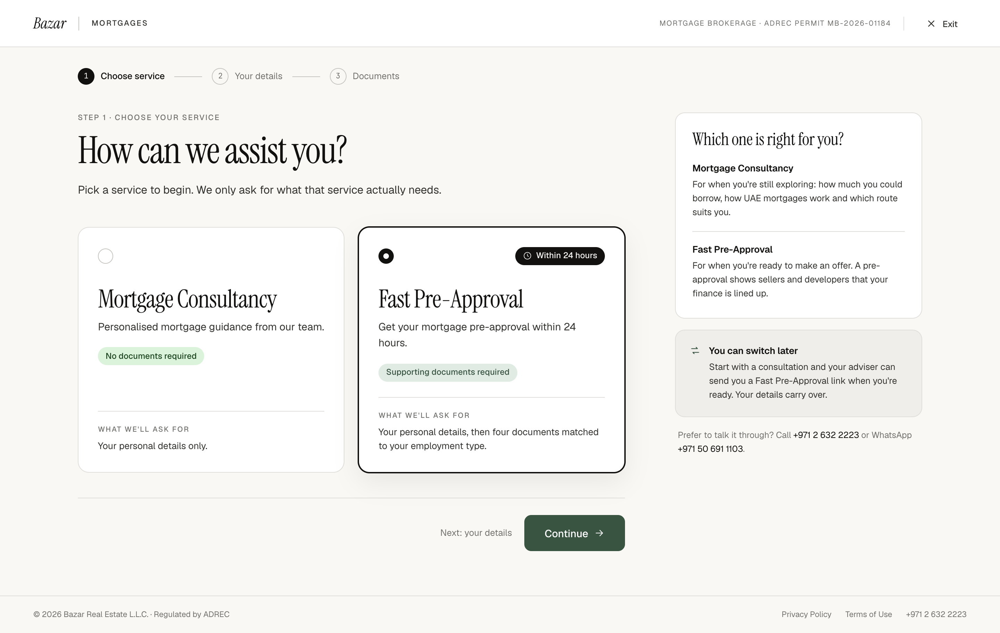

# W1 · Choose service

| | |
|---|---|
| Route | `/mortgages/apply` |
| Shown to | Every applicant |
| Stepper | Step 1 of 3 |
| Design | `W1-choose-service-2x.png` (1440 × 912 at 2×) · `MrqChooseService` in `reference/mreq-front-1.jsx` |
| Depends on | 00-foundations |
| Size | S |



## Purpose
The applicant chooses Mortgage Consultancy or Fast Pre-Approval. The choice sets the rest of the flow: consultancy ends after personal details, and pre-approval continues to documents.

## Entry and exit
- **In:** directly, or from an entry point with `?service=`, `?from=` and `?property=` (00-foundations §14). Read them once on load into the store. Ignore invalid values; an unknown `from` becomes `direct`.
- **Returning:** if the store already has a service, show it selected.
- **Continue** → `/mortgages/apply/details`.
- **Exit** → leaves the flow (00-foundations §4).

## Layout
- Shell with the stepper on step 1. The last step reads "Documents", or "Submit" when Mortgage Consultancy is selected.
- Heading block: eyebrow, H1, lede.
- Service cards in two equal columns, gap 20, margin-top 40.
- Actions: no Back. Note "Next: your details". CTA "Continue" with →.
- Rail, top to bottom:
  1. Rail card "Which one is right for you?" with two entries (title 13.5/600; text 13/1.55 ink-2, 4 below the title), separated by a 1px divider with 16 either side.
  2. Soft rail card (padding 20): switch icon in accent, gap 12, title "You can switch later" 13.5/600, text 13/1.55 ink-2.
  3. Plain text, 12.5/1.6 muted, padding 0 4, phone numbers in ink.

### Service card (`MrqServiceCard`)
- Min-height 318, padding 28, radius 16, surface, 1px `--bz-border`, column layout.
- Selected: 1px `--bz-ink` border, a `0 0 0 1px var(--bz-ink)` ring and a `0 14px 36px rgba(0,0,0,.07)` shadow.
- Top row (min-height 26): radio 22 on the left. On Fast Pre-Approval, an ink pill on the right with a 13px clock icon: "Within 24 hours".
- Title: serif 36/1.04, −0.02em, 30 below the top row.
- Description: 15/1.55 ink-2, 10 below.
- Chip, 18 below: success tone for consultancy, accent tone for pre-approval.
- Footer pushed to the bottom (auto top margin, 22 padding above): top border, 18 padding, eyebrow 10.5 "What we'll ask for", then 13.5/1.5 ink-2 text 6 below.

## Components
`FlowLayout`, `FlowStepper`, `FlowHeading`, `ServiceCard` (new here), `Radio`, `Pill`, `RailCard`, `FlowActions`.

## Copy
Verbatim from the design. `{braces}` are runtime values; `<b>`, `<ink>` and `<link>` are rich-text tags (00-foundations §12). The same keys are in `strings.en.json`.

**This screen**

| Key | Text | Note |
|---|---|---|
| `w1.eyebrow` | Step 1 · Choose your service |  |
| `w1.title` | How can we assist you? |  |
| `w1.lede` | Pick a service to begin. We only ask for what that service actually needs. |  |
| `w1.consultancy.desc` | Personalised mortgage guidance from our team. |  |
| `w1.consultancy.chip` | No documents required |  |
| `w1.consultancy.needs` | Your personal details only. |  |
| `w1.preApproval.desc` | Get your mortgage pre-approval within 24 hours. |  |
| `w1.preApproval.chip` | Supporting documents required |  |
| `w1.preApproval.badge` | Within 24 hours |  |
| `w1.preApproval.needs` | Your personal details, then four documents matched to your employment type. |  |
| `w1.needsLabel` | What we'll ask for |  |
| `w1.note` | Next: your details |  |
| `w1.cta` | Continue |  |
| `w1.rail.title` | Which one is right for you? |  |
| `w1.rail.consultancy` | For when you're still exploring: how much you could borrow, how UAE mortgages work and which route suits you. |  |
| `w1.rail.preApproval` | For when you're ready to make an offer. A pre-approval shows sellers and developers that your finance is lined up. |  |
| `w1.switch.title` | You can switch later |  |
| `w1.switch.body` | Start with a consultation and your adviser can send you a Fast Pre-Approval link when you're ready. Your details carry over. |  |
| `w1.contact` | `Prefer to talk it through? Call <ink>+971 2 632 2223</ink> or WhatsApp <ink>+971 50 691 1103</ink>.` | Numbers are tel: and wa.me links |

**Shared strings used here**

| Key | Text | Note |
|---|---|---|
| `shell.brand` | Bazar |  |
| `shell.section` | Mortgages | Uppercase via CSS |
| `shell.permit` | Mortgage brokerage · ADREC permit MB-2026-01184 | Uppercase via CSS. Confirm the number (FE-12) |
| `shell.exit` | Exit |  |
| `shell.footer.legal` | © 2026 Bazar Real Estate L.L.C. · Regulated by ADREC |  |
| `shell.footer.privacy` | Privacy Policy |  |
| `shell.footer.terms` | Terms of Use |  |
| `shell.footer.phone` | +971 2 632 2223 |  |
| `stepper.chooseService` | Choose service |  |
| `stepper.yourDetails` | Your details |  |
| `stepper.documents` | Documents |  |
| `stepper.submit` | Submit |  |
| `service.consultancy` | Mortgage Consultancy |  |
| `service.preApproval` | Fast Pre-Approval |  |


## Behaviour and states
- The two cards form one radio group. Clicking anywhere on a card selects it; arrow keys move the selection.
- Hover isn't designed. Proposal: `--bz-border-strong` border on the unselected card.
- The stepper's last label changes as soon as the selection does.
- **Continue** stores the service and moves on. It's disabled when nothing is selected (FE-3).
- Changing service later keeps the personal details, since both services use them. Draft uploads from a pre-approval attempt aren't sent with a consultancy request; they expire after 24h.
- Phone numbers are links: `tel:+97126322223` and `https://wa.me/971506911103`.

## Data
Writes `service`, `entryPoint` and `propertyRef` to the store. No API calls.

## Analytics
- `mortgage_apply_viewed` `{ step: 'service', entry_point }` on load.
- `mortgage_service_selected` `{ service, entry_point }` on Continue.

## Accessibility
- The radio group is labelled by the H1. Each card's accessible name is its title; the description, chip and "What we'll ask for" text are linked with `aria-describedby`. The badge text is part of the description.
- The focus ring goes on the card, not on the hidden input.

## Responsive (proposed)
Below 1024px the rail moves under the actions. Below 768px the cards stack and drop the fixed min-height.

## Edge cases
- `?service=` with an unknown value: ignore it.
- `?property=` for a property that doesn't exist: keep it; the server ignores it at submit.
- A stale store from earlier in the same tab: keep it. The store has no expiry.

## Acceptance criteria
- [ ] Matches the PNG at 1440px: layout, spacing, type and copy.
- [ ] `?service=pre_approval` and `?service=consultancy` preselect the right card.
- [ ] The stepper's last label follows the selection.
- [ ] Selection and Continue work with the keyboard alone.
- [ ] Back from W2 shows the earlier selection.
- [ ] No hard-coded strings; all copy comes from the message files.

## Tests
- Unit: query parsing (valid, invalid and missing values).
- Playwright: each of the five entry links lands with the right card selected; keyboard selection; the stepper label change.

## Open questions
FE-3 (default selection), FE-12 (phone numbers), FE-9 (responsive).

## Build steps
1. Page in the flow layout, with stepper and rail.
2. `ServiceCard` with selected, unselected, hover and focus states.
3. Query parsing into the store.
4. Continue and navigation.
5. Analytics.
6. Tests.

## Claude Code prompt
```
Build W1 · Choose service from docs/mortgage/frontend/W1-choose-service/README.md.
Compare with W1-choose-service-2x.png and reference/mreq-front-1.jsx (MrqChooseService). Use the foundations already built from 00-foundations.
Copy comes from strings.en.json. Plan first, then follow the build steps. Finish by checking every acceptance criterion, running the tests listed, and comparing a 1440px screenshot with the PNG. Update docs/mortgage/PROGRESS.md.
```
