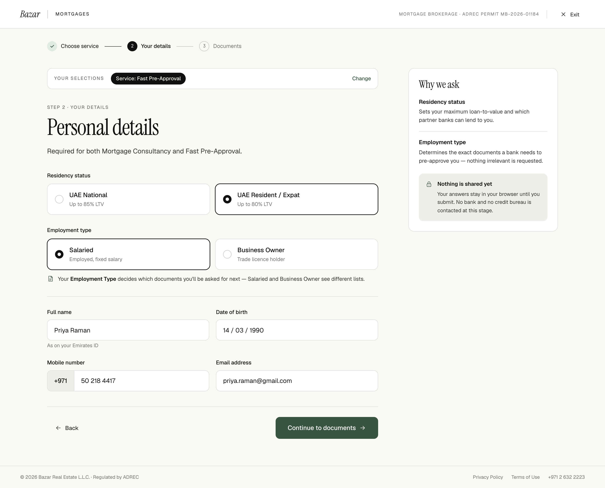

# W2 · Personal details

| | |
|---|---|
| Route | `/mortgages/apply/details` |
| Shown to | Every applicant |
| Stepper | Step 2 of 3 |
| Design | `W2-personal-details-2x.png` (1440 × 1161 at 2×) · `MrqDetails` in `reference/mreq-front-1.jsx` |
| Depends on | 00-foundations, W1 |
| Size | M |



## Purpose
Collects residency status, employment type and four personal fields. Both services use the same form. Employment type decides which document set the next step shows (W5 or W6).

## Entry and exit
- **Guard:** requires `service`; otherwise redirect to W1.
- **Back** → W1. **Change** in the selections bar → W1.
- **CTA** → `/mortgages/apply/documents` (pre-approval) or `/mortgages/apply/review` (consultancy).

## Layout
- Stepper on step 2; last label by service.
- Selections bar with one chip, "Service: Fast Pre-Approval" or "Service: Mortgage Consultancy", and the action "Change".
- Heading block.
- Form, margin-top 36, sections 28 apart:
  1. Group label (13/500, 10 below) "Residency status", then two tiles in two columns, gap 12.
  2. "Employment type", two tiles, then a note row 12 below (gap 10, 13/1.5 ink-2, document icon in accent).
  3. A 1px divider.
  4. Fields in two columns, 22 row gap, 16 column gap: Full name and Date of birth; Mobile number and Email address.
- Actions: Back; CTA "Continue to documents" with →.
- Rail "Why we ask": two entries separated by a divider, then a lock box (20 above, padding 16, radius 10, surface-2) with a lock icon in accent, a 13/600 title and 12.5/1.55 ink-2 text.

The PNG shows sample values. Empty fields show the placeholders in the copy deck.

## Components
`SelectionSummary`, `ChoiceTile`, `Radio`, `TextField` (with prefix), `RailCard`, `FlowActions`.

## Copy
Verbatim from the design. `{braces}` are runtime values; `<b>`, `<ink>` and `<link>` are rich-text tags (00-foundations §12). The same keys are in `strings.en.json`.

**This screen**

| Key | Text | Note |
|---|---|---|
| `w2.eyebrow` | Step 2 · Your details |  |
| `w2.title` | Personal details |  |
| `w2.lede` | Required for both Mortgage Consultancy and Fast Pre-Approval. |  |
| `w2.residency.label` | Residency status |  |
| `w2.employment.label` | Employment type |  |
| `w2.employment.note` | `Your <b>Employment Type</b> decides which documents you'll be asked for next — Salaried and Business Owner see different lists.` | Proposal: hide for consultancy |
| `w2.fullName.placeholder` | As on your Emirates ID |  |
| `w2.fullName.hint` | As on your Emirates ID |  |
| `w2.dateOfBirth.placeholder` | DD / MM / YYYY |  |
| `w2.mobile.prefix` | +971 |  |
| `w2.mobile.placeholder` | 50 000 0000 |  |
| `w2.email.placeholder` | you@email.com |  |
| `w2.cta.preApproval` | Continue to documents | Consultancy label not designed |
| `w2.rail.title` | Why we ask |  |
| `w2.rail.residency.title` | Residency status |  |
| `w2.rail.residency.body` | Sets your maximum loan-to-value and which partner banks can lend to you. |  |
| `w2.rail.employment.title` | Employment type |  |
| `w2.rail.employment.body` | Determines the exact documents a bank needs to pre-approve you — nothing irrelevant is requested. |  |
| `w2.rail.private.title` | Nothing is shared yet |  |
| `w2.rail.private.body` | Your answers stay in your browser until you submit. No bank and no credit bureau is contacted at this stage. |  |

**Shared strings used here**

| Key | Text | Note |
|---|---|---|
| `shell.brand` | Bazar |  |
| `shell.section` | Mortgages | Uppercase via CSS |
| `shell.permit` | Mortgage brokerage · ADREC permit MB-2026-01184 | Uppercase via CSS. Confirm the number (FE-12) |
| `shell.exit` | Exit |  |
| `shell.footer.legal` | © 2026 Bazar Real Estate L.L.C. · Regulated by ADREC |  |
| `shell.footer.privacy` | Privacy Policy |  |
| `shell.footer.terms` | Terms of Use |  |
| `shell.footer.phone` | +971 2 632 2223 |  |
| `stepper.chooseService` | Choose service |  |
| `stepper.yourDetails` | Your details |  |
| `stepper.documents` | Documents |  |
| `stepper.submit` | Submit |  |
| `actions.back` | Back |  |
| `selections.label` | Your selections | Uppercase via CSS |
| `selections.change` | Change |  |
| `selections.service.consultancy` | Service: Mortgage Consultancy |  |
| `selections.service.preApproval` | Service: Fast Pre-Approval |  |
| `residency.uaeNational` | UAE National |  |
| `residency.uaeNational.sub` | Up to 85% LTV |  |
| `residency.expat` | UAE Resident / Expat |  |
| `residency.expat.sub` | Up to 80% LTV |  |
| `employment.salaried` | Salaried |  |
| `employment.salaried.sub` | Employed, fixed salary |  |
| `employment.businessOwner` | Business Owner |  |
| `employment.businessOwner.sub` | Trade licence holder | "licence" spelling (FE-8) |
| `field.fullName` | Full name |  |
| `field.dateOfBirth` | Date of birth |  |
| `field.mobile` | Mobile number |  |
| `field.email` | Email address |  |


## Behaviour and states

### Fields

| Field | Input | Rules | Stored as |
|---|---|---|---|
| Residency status | Radio tiles | Required | `uae_national` \| `uae_resident_expat` |
| Employment type | Radio tiles | Required | `salaried` \| `business_owner` |
| Full name | Text, `autocomplete="name"` | Required; trimmed; 2–100 characters; Latin or Arabic letters, spaces, hyphens and apostrophes | string |
| Date of birth | Text with auto-inserted " / ", `inputmode="numeric"`, `autocomplete="bday"` | Required; a real date in the past. Age limits aren't designed (SPEC §9 #13) | `YYYY-MM-DD` |
| Mobile number | Fixed "+971" prefix, `type="tel"`, `autocomplete="tel-national"` | Required; 9 digits starting with 5. Format as "50 218 4417" while typing. On paste, strip `+971`, `00971`, a leading `0`, spaces, dashes and brackets | E.164, e.g. `+971502184417` |
| Email address | `type="email"`, `autocomplete="email"` | Required; a valid address; trimmed and lower-cased | string |

- Validate on blur and when the CTA is pressed. On press, focus the first invalid field. Error copy isn't designed (FE-1). Proposed style: `--bz-danger` border and a 12px danger message under the field, in place of the hint.
- The CTA stays enabled and validates on press, as designed.
- Save to the store on change (debounced) so Back and reload keep the values.
- Tiles behave like the W1 cards: radio groups with arrow-key navigation.

### Differences by service
- **Pre-approval:** as designed.
- **Consultancy:** the CTA label isn't designed; proposal "Continue". The employment note ("decides which documents you'll be asked for next") doesn't apply; proposal: hide it. Both need sign-off.

### Changing employment type later
If the applicant comes back from W5/W6 and switches employment type, some uploads no longer apply (FE-4).

## Data
Writes `details.*` to the store. No API calls, as the rail promises ("Your answers stay in your browser until you submit").

## Analytics
- `mortgage_apply_viewed` `{ step: 'details', service }`.
- `mortgage_details_error` `{ field, rule }` for each failed check (never the value).
- `mortgage_details_completed` `{ service, residency, employment_type }` on a valid submit.

## Accessibility
- Each tile group is a `fieldset` with its group label as the `legend`.
- The "+971" prefix is part of the accessible name ("Mobile number, +971").
- Invalid fields get `aria-invalid`, with `aria-describedby` pointing at the message.
- The employment note is linked to the employment group with `aria-describedby`.

## Responsive (proposed)
Below 768px, tiles and fields go to one column and the rail moves under the form.

## Edge cases
- Browser autofill writes the date in another format: normalise it on blur.
- Very long names: W3 and W4 wrap the value.
- A landline (starting 2, 3, 4, 6, 7 or 9): reject it as not a mobile. Error copy needed.

## Acceptance criteria
- [ ] Matches the PNG at 1440px.
- [ ] The guard redirects to W1 without a service.
- [ ] Every rule above is enforced, and focus goes to the first invalid field.
- [ ] Mobile is stored as E.164 and date of birth as ISO.
- [ ] Values survive Back and reload.
- [ ] Pre-approval goes to documents; consultancy goes to review.
- [ ] No network calls on this step (check devtools).

## Tests
- Unit: mobile normalisation and formatting, date parsing, the name rule.
- Playwright: fill in and continue for each service; each invalid field; reload keeps the values; the guard.

## Open questions
FE-1 (error copy), FE-4 (changing employment type), FE-8 ("Trade licence holder" vs "license"), SPEC §9 #13 (age rules), the consultancy CTA label and employment note.

## Build steps
1. Page with guard, selections bar and rail.
2. `ChoiceTile` groups.
3. `TextField` with prefix, input masks and normalisers.
4. A zod schema for these fields, shared with the server's submit validation.
5. Store persistence.
6. Routing by service.
7. Analytics and tests.

## Claude Code prompt
```
Build W2 · Personal details from docs/mortgage/frontend/W2-personal-details/README.md.
Compare with W2-personal-details-2x.png and reference/mreq-front-1.jsx (MrqDetails). Use the foundations already built.
Share one zod schema for these fields with the server's submit validation. Copy comes from strings.en.json. Where the README says copy isn't designed, use a clearly marked TODO string and list it in PROGRESS.md.
Plan first, then follow the build steps. Check the acceptance criteria, run the tests, and compare a 1440px screenshot with the PNG. Update docs/mortgage/PROGRESS.md.
```
