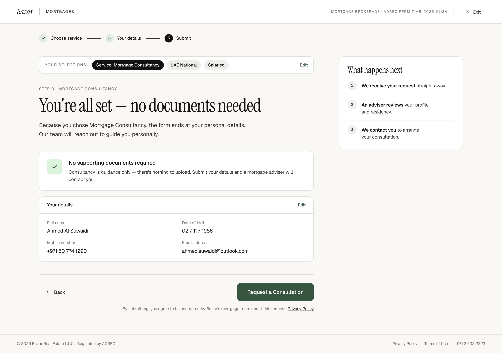

# W3 · Consultancy · Review & request

| | |
|---|---|
| Route | `/mortgages/apply/review` |
| Shown to | Mortgage Consultancy |
| Stepper | Step 3 of 3 ("Submit") |
| Design | `W3-consultancy-review-2x.png` (1440 × 1014 at 2×) · `MrqConsultSubmit` in `reference/mreq-front-1.jsx` |
| Depends on | 00-foundations, W2 |
| Size | S |



## Purpose
Consultancy needs no documents. The applicant checks their details and sends the request.

## Entry and exit
- **Guard:** `service = consultancy` and complete details; otherwise the earliest incomplete step.
- **Back** → W2. **Edit** in the selections bar → W1 (proposal, since it holds the service). **Edit** on "Your details" → W2.
- **Request a Consultation** → submit → `router.replace('/mortgages/apply/received')` (W4).

## Layout
- Stepper on step 3, last label "Submit".
- Selections bar: "Service: Mortgage Consultancy" (first chip), then residency, then employment; action "Edit".
- Heading block.
- Info card, margin-top 36: row, gap 18, padding 22, radius 14, surface, border. A 44px success square (radius 11) with a 20px tick; title 15.5/500; text 13.5/1.55 ink-2, 4 below.
- "Your details" card, margin-top 16, radius 14. Header 14×22 with a bottom border: "Your details" 13.5/500 and "Edit" 12.5/500 in accent. Body in two columns (32 column gap, 16 row gap, padding 18 22 20): label 12 muted, value 14.5, 3 between.
- Actions: Back; CTA "Request a Consultation" (no arrow); fine print with an underlined "Privacy Policy" link in ink-2.
- Rail: "What happens next" with three numbered steps.

## Components
`SelectionSummary`, `FlowHeading`, `DetailsSummary` (new: the "Your details" card), `NextSteps`, `FlowActions`.

## Copy
Verbatim from the design. `{braces}` are runtime values; `<b>`, `<ink>` and `<link>` are rich-text tags (00-foundations §12). The same keys are in `strings.en.json`.

**This screen**

| Key | Text | Note |
|---|---|---|
| `w3.eyebrow` | Step 3 · Mortgage Consultancy |  |
| `w3.title` | You're all set — no documents needed |  |
| `w3.lede` | Because you chose Mortgage Consultancy, the form ends at your personal details. Our team will reach out to guide you personally. |  |
| `w3.noDocs.title` | No supporting documents required |  |
| `w3.noDocs.body` | Consultancy is guidance only — there's nothing to upload. Submit your details and a mortgage adviser will contact you. |  |
| `w3.details.title` | Your details |  |
| `w3.details.edit` | Edit |  |
| `w3.cta` | Request a Consultation |  |
| `w3.fine` | `By submitting, you agree to be contacted by Bazar's mortgage team about this request. <link>Privacy Policy</link>` | <link> goes to the Privacy Policy |

**Shared strings used here**

| Key | Text | Note |
|---|---|---|
| `shell.brand` | Bazar |  |
| `shell.section` | Mortgages | Uppercase via CSS |
| `shell.permit` | Mortgage brokerage · ADREC permit MB-2026-01184 | Uppercase via CSS. Confirm the number (FE-12) |
| `shell.exit` | Exit |  |
| `shell.footer.legal` | © 2026 Bazar Real Estate L.L.C. · Regulated by ADREC |  |
| `shell.footer.privacy` | Privacy Policy |  |
| `shell.footer.terms` | Terms of Use |  |
| `shell.footer.phone` | +971 2 632 2223 |  |
| `stepper.chooseService` | Choose service |  |
| `stepper.yourDetails` | Your details |  |
| `stepper.documents` | Documents |  |
| `stepper.submit` | Submit |  |
| `actions.back` | Back |  |
| `selections.label` | Your selections | Uppercase via CSS |
| `selections.edit` | Edit |  |
| `selections.service.consultancy` | Service: Mortgage Consultancy |  |
| `residency.uaeNational` | UAE National |  |
| `residency.expat` | UAE Resident / Expat |  |
| `employment.salaried` | Salaried |  |
| `employment.businessOwner` | Business Owner |  |
| `field.fullName` | Full name |  |
| `field.dateOfBirth` | Date of birth |  |
| `field.mobile` | Mobile number |  |
| `field.email` | Email address |  |
| `common.whatHappensNext` | What happens next |  |
| `consultNext.receive` | `<b>We receive your request</b> straight away.` |  |
| `consultNext.review` | `<b>An adviser reviews</b> your profile and residency.` |  |
| `consultNext.contact` | `<b>We contact you</b> to arrange your consultation.` |  |


## Behaviour and states
- Values: full name as entered; date of birth "02 / 11 / 1986"; mobile "+971 50 774 1290"; email as entered.
- **Submit:**
  1. Disable the CTA and set `aria-busy`. A loading style isn't designed; proposal: keep the label and add a spinner.
  2. Get an invisible Turnstile token.
  3. `submitRequest({ service: 'consultancy', details, entryPoint, propertyRef, turnstileToken }, idempotencyKey)`.
  4. On success, keep only `{ submitted }` (reference, service, residency, employment, submittedAt, mobile, email) and replace the route with W4.
- **Errors:** a 422 with a `field` → back to W2 with that field marked. A 429 or 5xx → an inline message above the actions and the CTA re-enabled (copy not designed, FE-1). The idempotency key makes a retry safe.

## Data
Reads the store and calls `POST /api/mortgage/requests`. The server creates the request, allocates the reference, notifies the team and emails the applicant (SPEC §2.4, §6).

## Analytics
- `mortgage_apply_viewed` `{ step: 'review', service: 'consultancy' }`.
- `mortgage_request_submitted` `{ service: 'consultancy', residency, employment_type, entry_point }`.
- `mortgage_request_failed` `{ service: 'consultancy', status }`.

## Accessibility
- "Your details" is a `<dl>`.
- The fine print is linked to the CTA with `aria-describedby`.
- Errors go in an `alert` region, and focus moves to it.

## Responsive (proposed)
Below 768px, details go to one column, and the fine print sits left-aligned under a full-width CTA.

## Edge cases
- A double click sends one request (the CTA disables, and the idempotency key covers retries).
- Browser Back from W4 lands here with an empty store, so the guard sends the applicant to W1.

## Acceptance criteria
- [ ] Matches the PNG at 1440px.
- [ ] The guard works.
- [ ] One request per submit, even with double clicks and retries.
- [ ] W4 shows the reference from the response.
- [ ] Back after submitting doesn't resubmit.
- [ ] No PII in the URL or analytics.

## Tests
Playwright with a mocked API: the happy path to W4; a 422 returns to W2 with the field marked; a 500 shows the inline error, and a retry creates one request.

## Open questions
FE-1 (error copy), FE-14 (chip order), the loading state, where the selections "Edit" goes.

## Build steps
1. Page, guard and layout.
2. `DetailsSummary`.
3. Submit with Turnstile and the idempotency key.
4. Error handling.
5. Analytics and tests.

## Claude Code prompt
```
Build W3 · Consultancy review & request from docs/mortgage/frontend/W3-consultancy-review/README.md.
Compare with W3-consultancy-review-2x.png and reference/mreq-front-1.jsx (MrqConsultSubmit). Use the foundations already built, and call the API through lib/mortgage/client/api.ts.
Plan first, then follow the build steps. Check the acceptance criteria, run the tests, and compare a 1440px screenshot with the PNG. Update docs/mortgage/PROGRESS.md.
```
