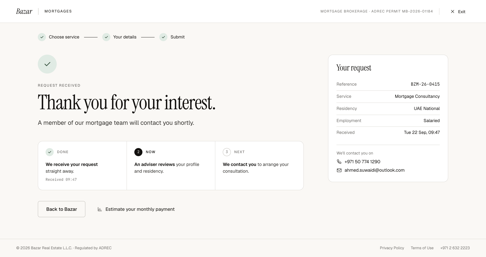

# W4 · Consultancy · Request received

| | |
|---|---|
| Route | `/mortgages/apply/received` |
| Shown to | Mortgage Consultancy, after submit |
| Stepper | All three steps done ("Submit") |
| Design | `W4-consultancy-received-2x.png` (1440 × 762 at 2×) · `MrqConsultDone` in `reference/mreq-front-1.jsx` |
| Depends on | 00-foundations, W3 |
| Size | S |



## Purpose
Confirms the request, gives the reference, and says how and where the team will get in touch.

## Entry and exit
- **Guard:** `submitted.service = consultancy`; otherwise W1. W7 uses the same route; the service decides which one renders.
- **Back to Bazar** → `/` (proposal: the entry page, if known).
- **Estimate your monthly payment** → the existing mortgage calculator page.

## Layout
- Stepper with all steps done, last label "Submit".
- Confirmation heading: 56px accent-soft circle with a tick; eyebrow 28 below; H1 60; body 18/1.55.
- Progress track, margin-top 40, three cells: 1 Done with the meta "Received {time}", 2 Now, 3 Next.
- Buttons, margin-top 32, gap 10: outline large "Back to Bazar"; ghost large with a chart icon, "Estimate your monthly payment".
- Rail "Your request": key-value rows at 13px (Reference in mono, Service, Residency, Employment, Received). Below, a block with a top border (18 above, 16 padding): "We'll contact you on" (12 muted), then a phone row and an email row (13.5, icon and value, 6 apart).

## Components
`ConfirmationHeading`, `ProgressTrack`, `KeyValueList`, `RailCard`.

## Copy
Verbatim from the design. `{braces}` are runtime values; `<b>`, `<ink>` and `<link>` are rich-text tags (00-foundations §12). The same keys are in `strings.en.json`.

**This screen**

| Key | Text | Note |
|---|---|---|
| `w4.eyebrow` | Request received |  |
| `w4.title` | Thank you for your interest. |  |
| `w4.body` | A member of our mortgage team will contact you shortly. |  |
| `w4.track.receivedAt` | `Received {time}` | {time} as "09:47" |
| `w4.rail.title` | Your request |  |
| `w4.rail.contactOn` | We'll contact you on |  |

**Shared strings used here**

| Key | Text | Note |
|---|---|---|
| `shell.brand` | Bazar |  |
| `shell.section` | Mortgages | Uppercase via CSS |
| `shell.permit` | Mortgage brokerage · ADREC permit MB-2026-01184 | Uppercase via CSS. Confirm the number (FE-12) |
| `shell.exit` | Exit |  |
| `shell.footer.legal` | © 2026 Bazar Real Estate L.L.C. · Regulated by ADREC |  |
| `shell.footer.privacy` | Privacy Policy |  |
| `shell.footer.terms` | Terms of Use |  |
| `shell.footer.phone` | +971 2 632 2223 |  |
| `stepper.chooseService` | Choose service |  |
| `stepper.yourDetails` | Your details |  |
| `stepper.documents` | Documents |  |
| `stepper.submit` | Submit |  |
| `service.consultancy` | Mortgage Consultancy |  |
| `residency.uaeNational` | UAE National |  |
| `residency.expat` | UAE Resident / Expat |  |
| `employment.salaried` | Salaried |  |
| `employment.businessOwner` | Business Owner |  |
| `consultNext.receive` | `<b>We receive your request</b> straight away.` |  |
| `consultNext.review` | `<b>An adviser reviews</b> your profile and residency.` |  |
| `consultNext.contact` | `<b>We contact you</b> to arrange your consultation.` |  |
| `track.done` | Done |  |
| `track.now` | Now |  |
| `track.next` | Next |  |
| `received.backToBazar` | Back to Bazar |  |
| `received.estimatePayment` | Estimate your monthly payment |  |
| `summary.reference` | Reference |  |
| `summary.service` | Service |  |
| `summary.residency` | Residency |  |
| `summary.employment` | Employment |  |
| `summary.received` | Received |  |


## Behaviour and states
- Static. The track doesn't update; step 2 is always "Now".
- Values come from `submitted`: the reference and `submittedAt` from the API response; residency, employment, mobile and email from the details.
- Received: `formatDayTime(submittedAt)` → "Tue 22 Sep, 09:47". The track meta uses `formatTime` → "Received 09:47".
- The mobile is shown in full ("+971 50 774 1290"). That's acceptable because the page is session-bound.
- The applicant also gets an email with the reference (SPEC §6).

## Data
Reads `submitted` from the store. No API calls.

## Analytics
`mortgage_apply_viewed` `{ step: 'received', service: 'consultancy' }`.

## Accessibility
- Focus the H1 on load.
- The track is an ordered list, and each item includes its status ("Done", "Now", "Next").

## Responsive (proposed)
Below 1024px the track stacks vertically. Below 480px the buttons stack.

## Edge cases
- Opened in a new tab: sessionStorage is per tab, so the guard sends the applicant to W1. The email has the reference.
- Reload: still works, since sessionStorage survives reloads.

## Acceptance criteria
- [ ] Matches the PNG at 1440px.
- [ ] Shows the reference and time from the API response.
- [ ] No PII or reference in the URL.
- [ ] A fresh tab is redirected to W1.

## Tests
Playwright: after the W3 happy path, check the reference, service, residency, employment, time and contact details; reload; open the route in a new context and expect W1.

## Open questions
The "Back to Bazar" target; the calculator route.

## Build steps
1. The received route, switching between W4 and W7 by service.
2. W4 layout from shared components.
3. Formatting and guard.
4. Tests.

## Claude Code prompt
```
Build W4 · Consultancy request received from docs/mortgage/frontend/W4-consultancy-received/README.md.
Compare with W4-consultancy-received-2x.png and reference/mreq-front-1.jsx (MrqConsultDone). The route is shared with W7; render by submitted.service.
Plan first, then follow the build steps. Check the acceptance criteria, run the tests, and compare a 1440px screenshot with the PNG. Update docs/mortgage/PROGRESS.md.
```
