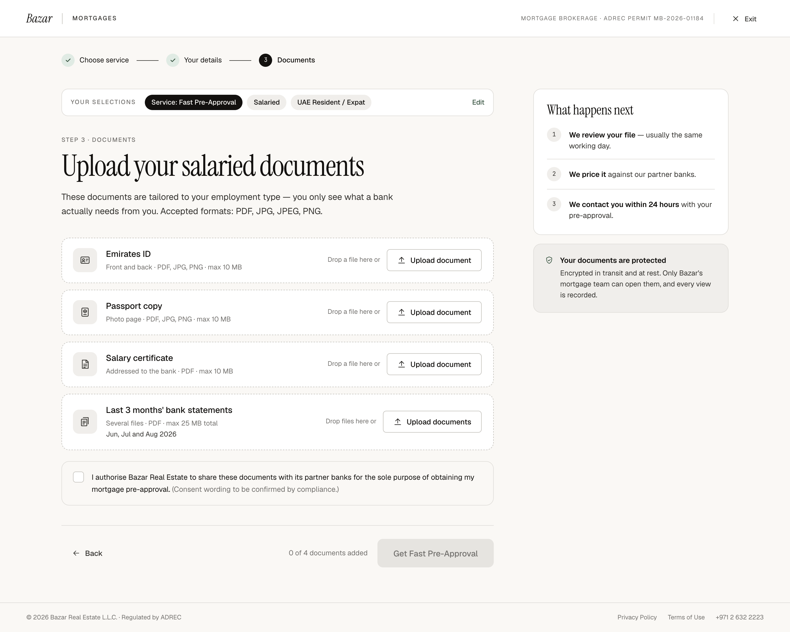

# W5 · Salaried documents

| | |
|---|---|
| Route | `/mortgages/apply/documents` |
| Shown to | Fast Pre-Approval, Salaried |
| Stepper | Step 3 of 3 ("Documents") |
| Design | `W5-documents-salaried-2x.png` (1440 × 1154 at 2×, empty state) · `MrqDocsSalaried` in `reference/mreq-front-2.jsx`. The uploading, added and error states are in W6 |
| Depends on | 00-foundations (upload engine), W2 |
| Size | M |



## Purpose
A salaried applicant uploads four documents, gives consent and submits for Fast Pre-Approval.

## Entry and exit
- **Guard:** `service = pre_approval` and complete details. Employment type picks W5 (salaried) or W6 (business owner) on the same route.
- **On load:** restore the draft from the store, or create one with `createDraft`. If the draft has expired, create a new one and clear the file list (copy not designed).
- **Back** → W2, keeping the uploads. **Edit** → W1 (proposal, as on W3).
- **Get Fast Pre-Approval** → submit → `router.replace('/mortgages/apply/received')` (W7).

## Layout
- Stepper on step 3, last label "Documents".
- Selections bar: "Service: Fast Pre-Approval" (first chip), "Salaried", "UAE Resident / Expat" (employment, then residency); action "Edit".
- Heading block: eyebrow "Step 3 · Documents", H1 "Upload your salaried documents", and the shared documents lede.
- Upload rows, margin-top 36, gap 12, in this order: Emirates ID, Passport copy, Salary certificate, Last 3 months' bank statements. The statements row shows the required months as its note ("Jun, Jul and Aug 2026").
- Consent row, unticked (transparent background).
- Actions: Back; note "0 of 4 documents added"; CTA "Get Fast Pre-Approval", disabled.
- Rail: "What happens next" (three steps) and the soft "Your documents are protected" card with a shield icon.

## Components
`DocumentUploadRow`, `UploadedFile`, `DocumentIcon`, `ConsentCheckbox`, `SelectionSummary`, `NextSteps`, `RailCard`, `FlowActions`.

## Copy
Verbatim from the design. `{braces}` are runtime values; `<b>`, `<ink>` and `<link>` are rich-text tags (00-foundations §12). The same keys are in `strings.en.json`.

**This screen**

| Key | Text | Note |
|---|---|---|
| `w5.title` | Upload your salaried documents |  |

**Shared strings used here**

| Key | Text | Note |
|---|---|---|
| `shell.brand` | Bazar |  |
| `shell.section` | Mortgages | Uppercase via CSS |
| `shell.permit` | Mortgage brokerage · ADREC permit MB-2026-01184 | Uppercase via CSS. Confirm the number (FE-12) |
| `shell.exit` | Exit |  |
| `shell.footer.legal` | © 2026 Bazar Real Estate L.L.C. · Regulated by ADREC |  |
| `shell.footer.privacy` | Privacy Policy |  |
| `shell.footer.terms` | Terms of Use |  |
| `shell.footer.phone` | +971 2 632 2223 |  |
| `stepper.chooseService` | Choose service |  |
| `stepper.yourDetails` | Your details |  |
| `stepper.documents` | Documents |  |
| `stepper.submit` | Submit |  |
| `actions.back` | Back |  |
| `selections.label` | Your selections | Uppercase via CSS |
| `selections.edit` | Edit |  |
| `selections.service.preApproval` | Service: Fast Pre-Approval |  |
| `residency.uaeNational` | UAE National |  |
| `residency.expat` | UAE Resident / Expat |  |
| `employment.salaried` | Salaried |  |
| `common.whatHappensNext` | What happens next |  |
| `preNext.review` | `<b>We review your file</b> — usually the same working day.` |  |
| `preNext.price` | `<b>We price it</b> against our partner banks.` |  |
| `preNext.contact` | `<b>We contact you within 24 hours</b> with your pre-approval.` |  |
| `doc.emiratesId.name` | Emirates ID |  |
| `doc.emiratesId.hint` | Front and back · PDF, JPG, PNG · max 10 MB |  |
| `doc.passport.name` | Passport copy |  |
| `doc.passport.hint` | Photo page · PDF, JPG, PNG · max 10 MB |  |
| `doc.salaryCertificate.name` | Salary certificate |  |
| `doc.salaryCertificate.hint` | Addressed to the bank · PDF · max 10 MB |  |
| `doc.bankStatements3m.name` | Last 3 months' bank statements |  |
| `doc.bankStatements3m.hint` | Several files · PDF · max 25 MB total |  |
| `docs.eyebrow` | Step 3 · Documents |  |
| `docs.lede` | These documents are tailored to your employment type — you only see what a bank actually needs from you. Accepted formats: PDF, JPG, JPEG, PNG. | Lists image formats; some kinds are PDF only (FE-6) |
| `docs.cta` | Get Fast Pre-Approval |  |
| `docs.note.none` | `0 of {total} documents added` |  |
| `docs.note.progress` | `<ink>{ready} of {total} ready</ink>{attention, plural, =0 {} one { · # file needs attention} other { · # files need attention}}` | Designed: "2 of 4 ready · 1 file needs attention" |
| `upload.dropOne` | Drop a file here or |  |
| `upload.dropMany` | Drop files here or |  |
| `upload.uploadOne` | Upload document |  |
| `upload.uploadMany` | Upload documents |  |
| `upload.replace` | Replace |  |
| `upload.addMore` | Add more files |  |
| `upload.cancel` | Cancel |  |
| `upload.chooseAnother` | Choose another file |  |
| `upload.pill.added` | Added |  |
| `upload.pill.filesAdded` | `{count, plural, one {# file added} other {# files added}}` | Designed: "3 files added" |
| `upload.pill.uploading` | Uploading |  |
| `upload.pill.needsAttention` | Needs attention |  |
| `upload.progress` | `{loaded} of {total} MB` | One decimal, e.g. "2.0 of 3.1 MB" |
| `upload.size` | `{size} MB` |  |
| `upload.totalUsed` | `{used} of {limit} MB used` |  |
| `upload.error.tooLarge` | `This file is {size} MB and the limit is {limit} MB. Save it at a lower resolution, or upload a photo of the {documentNoun} instead.` | Only the licence version is designed. PDF-only kinds need a variant |
| `consent.label` | I authorise Bazar Real Estate to share these documents with its partner banks for the sole purpose of obtaining my mortgage pre-approval. | Wording v0.1, pending compliance (FE-11) |
| `consent.pending` | (Consent wording to be confirmed by compliance.) | Remove after compliance sign-off |
| `security.title` | Your documents are protected |  |
| `security.body` | Encrypted in transit and at rest. Only Bazar's mortgage team can open them, and every view is recorded. | Needs engineering sign-off (SPEC §8) |


## Behaviour and states
Uploads follow 00-foundations §7: rules per kind, file lifecycle, row states, error codes, the completion rule and the footer note.

| Row | Kind | Files | Types | Limit | Note |
|---|---|---|---|---|---|
| Emirates ID | `emirates_id` | 1–2 | PDF, JPG, PNG | 10 MB each | — |
| Passport copy | `passport` | 1 | PDF, JPG, PNG | 10 MB | — |
| Salary certificate | `salary_certificate` | 1 | PDF | 10 MB | — |
| Last 3 months' bank statements | `bank_statements_3m` | 1–12 | PDF | 25 MB total | `requiredMonthsShort()` |

- Required months use today's date in Asia/Dubai; the server recalculates them at submit.
- The browser doesn't check which months a statement covers. The mortgage team checks in the CMS and uses W8 to ask for missing months.
- **Consent:** a real checkbox. On submit, send `{ given: true, wordingVersion }` (currently `v0.1`). Remove "(Consent wording to be confirmed by compliance.)" once compliance signs off.
- **Submit:** same pattern as W3 (disable, Turnstile, idempotency key) with `{ service: 'pre_approval', details, draftId, consent, entryPoint, propertyRef }`. On success keep `{ submitted }` with the reference, `submittedAt`, `dueAt` and the file count per document, then replace the route with W7.
- **Submit errors:** `files_not_ready` → refresh the rows; `draft_expired` → new draft and upload again (copy needed); a 422 on details → W2; a 5xx → inline error (copy needed).
- Leaving mid-upload triggers the browser's `beforeunload` prompt.

## Data
The draft and file endpoints, and `POST /api/mortgage/requests` (00-foundations §8). The server creates the document rows, starts the 24-hour clock and emails the applicant.

## Analytics
`mortgage_apply_viewed`, `mortgage_doc_file_added`, `mortgage_doc_file_rejected`, `mortgage_consent_toggled`, and `mortgage_request_submitted` `{ service: 'pre_approval', employment_type: 'salaried', residency, entry_point }`.

## Accessibility
00-foundations §11: upload rows as groups, the live region, and the disabled CTA described by the note.

## Responsive (proposed)
Below 768px, row actions move under the title and file lines lose the 60px indent.

## Edge cases
- A three-month window across a year end: see 00-foundations §9.
- The same file added twice: allow it; the team sees both.
- `.jpeg` or `.JPG` extensions: accept.
- A salary certificate as a JPG is rejected (PDF only). Error copy needed (FE-1, FE-6).

## Acceptance criteria
- [ ] The empty state matches the PNG at 1440px; the other row states match W6.
- [ ] Limits are enforced per kind, including the 25 MB statements total.
- [ ] The CTA is enabled only when all four rows have a ready file, nothing is uploading or in error, and consent is ticked.
- [ ] The footer note follows 00-foundations §7.5.
- [ ] Consent is stored with its wording version.
- [ ] One application per submit; W7 shows `dueAt` from the server.

## Tests
Playwright with mocked storage: upload all four, tick consent, submit and land on W7; an oversize file shows the error and blocks the CTA; cancel mid-upload; a failed replace keeps the old file; reload restores the draft.

## Open questions
FE-1, FE-5 (adding only the Emirates ID back), FE-6 (formats in the lede), FE-11 (consent wording, security copy), FE-14 (chip order), and the note when everything is ready but consent isn't ticked.

## Build steps
1. Route, guard, and draft creation and restore.
2. Rows from the document set for the employment type.
3. Upload engine wired to the rows.
4. Consent and the completion rule.
5. Submit and errors.
6. Analytics and tests.

## Claude Code prompt
```
Build W5 · Salaried documents from docs/mortgage/frontend/W5-documents-salaried/README.md.
Compare with W5-documents-salaried-2x.png (empty state) and the W6 PNG for every other row state; see reference/mreq-front-2.jsx (MrqDocsSalaried, MrqUploadRow). Use the upload engine and components from the foundations.
The route is shared with W6: build it once, with the document set chosen by employment type.
Plan first, then follow the build steps. Check the acceptance criteria, run the tests, and compare a 1440px screenshot with the PNG. Update docs/mortgage/PROGRESS.md.
```
