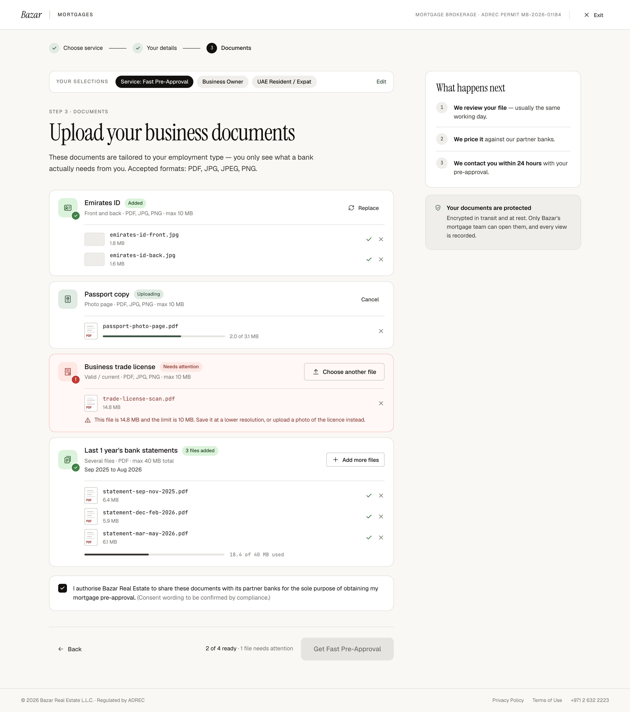

# W6 · Business Owner documents

| | |
|---|---|
| Route | `/mortgages/apply/documents` |
| Shown to | Fast Pre-Approval, Business Owner |
| Stepper | Step 3 of 3 ("Documents") |
| Design | `W6-documents-business-owner-2x.png` (1440 × 1628 at 2×, mid-upload) · `MrqDocsBusiness` in `reference/mreq-front-2.jsx` |
| Depends on | W5 (same route and components) |
| Size | S |



## Purpose
The Business Owner version of W5. The design also shows every non-empty upload row state, so it's the state reference for W5 and W8 too.

## Entry and exit
Same as W5.

## Layout
Same as W5, except:
- Selections: "Service: Fast Pre-Approval", "Business Owner", "UAE Resident / Expat".
- H1 "Upload your business documents".
- Rows: Emirates ID, Passport copy, Business trade license, Last 1 year's bank statements. The statements note reads "Sep 2025 to Aug 2026" (`requiredMonthsRange()`).

## What the PNG shows

| Row | State | On screen |
|---|---|---|
| Emirates ID | Added (single-file kind with two files) | Done icon, "Added" pill, ghost "Replace". Two image lines with 46×30 hatched thumbs, "emirates-id-front.jpg" 1.8 MB and "emirates-id-back.jpg" 1.6 MB, each with a tick and ✕ |
| Passport copy | Uploading | Busy icon (accent), "Uploading" pill, ghost "Cancel". PDF line "passport-photo-page.pdf" with a 64% bar and "2.0 of 3.1 MB"; ✕ only |
| Business trade license | Needs attention | Danger row, error icon, "Needs attention" pill, outline "Choose another file". File name in danger ("trade-license-scan.pdf", 14.8 MB) with ✕, then the oversize message with an alert icon |
| Last 1 year's bank statements | Added (multi-file kind) | Done icon, "3 files added" pill, outline "Add more files". Three PDF lines (6.4, 5.9 and 6.1 MB) and the total bar "18.4 of 40 MB used" |
| Consent | Ticked | Surface background, ink checkbox |
| Footer | Blocked | "2 of 4 ready" in ink, "· 1 file needs attention" in muted; CTA disabled |

The three statements cover Sep 2025 to May 2026, not the full year. That's deliberate: the browser can't read which months a file covers, so the row still says "3 files added". The team spots the gap in the CMS and sends the W8 link.

## Components
Same as W5.

## Copy
Verbatim from the design. `{braces}` are runtime values; `<b>`, `<ink>` and `<link>` are rich-text tags (00-foundations §12). The same keys are in `strings.en.json`.

**This screen**

| Key | Text | Note |
|---|---|---|
| `w6.title` | Upload your business documents |  |

**Shared strings used here**

| Key | Text | Note |
|---|---|---|
| `shell.brand` | Bazar |  |
| `shell.section` | Mortgages | Uppercase via CSS |
| `shell.permit` | Mortgage brokerage · ADREC permit MB-2026-01184 | Uppercase via CSS. Confirm the number (FE-12) |
| `shell.exit` | Exit |  |
| `shell.footer.legal` | © 2026 Bazar Real Estate L.L.C. · Regulated by ADREC |  |
| `shell.footer.privacy` | Privacy Policy |  |
| `shell.footer.terms` | Terms of Use |  |
| `shell.footer.phone` | +971 2 632 2223 |  |
| `stepper.chooseService` | Choose service |  |
| `stepper.yourDetails` | Your details |  |
| `stepper.documents` | Documents |  |
| `stepper.submit` | Submit |  |
| `actions.back` | Back |  |
| `selections.label` | Your selections | Uppercase via CSS |
| `selections.edit` | Edit |  |
| `selections.service.preApproval` | Service: Fast Pre-Approval |  |
| `residency.uaeNational` | UAE National |  |
| `residency.expat` | UAE Resident / Expat |  |
| `employment.businessOwner` | Business Owner |  |
| `common.whatHappensNext` | What happens next |  |
| `preNext.review` | `<b>We review your file</b> — usually the same working day.` |  |
| `preNext.price` | `<b>We price it</b> against our partner banks.` |  |
| `preNext.contact` | `<b>We contact you within 24 hours</b> with your pre-approval.` |  |
| `doc.emiratesId.name` | Emirates ID |  |
| `doc.emiratesId.hint` | Front and back · PDF, JPG, PNG · max 10 MB |  |
| `doc.passport.name` | Passport copy |  |
| `doc.passport.hint` | Photo page · PDF, JPG, PNG · max 10 MB |  |
| `doc.tradeLicense.name` | Business trade license | "license" spelling (FE-8) |
| `doc.tradeLicense.hint` | Valid / current · PDF, JPG, PNG · max 10 MB |  |
| `doc.tradeLicense.noun` | licence | Fills {documentNoun} in upload.error.tooLarge. Other kinds not designed |
| `doc.bankStatements12m.name` | Last 1 year's bank statements |  |
| `doc.bankStatements12m.hint` | Several files · PDF · max 40 MB total |  |
| `docs.eyebrow` | Step 3 · Documents |  |
| `docs.lede` | These documents are tailored to your employment type — you only see what a bank actually needs from you. Accepted formats: PDF, JPG, JPEG, PNG. | Lists image formats; some kinds are PDF only (FE-6) |
| `docs.cta` | Get Fast Pre-Approval |  |
| `docs.note.none` | `0 of {total} documents added` |  |
| `docs.note.progress` | `<ink>{ready} of {total} ready</ink>{attention, plural, =0 {} one { · # file needs attention} other { · # files need attention}}` | Designed: "2 of 4 ready · 1 file needs attention" |
| `upload.dropOne` | Drop a file here or |  |
| `upload.dropMany` | Drop files here or |  |
| `upload.uploadOne` | Upload document |  |
| `upload.uploadMany` | Upload documents |  |
| `upload.replace` | Replace |  |
| `upload.addMore` | Add more files |  |
| `upload.cancel` | Cancel |  |
| `upload.chooseAnother` | Choose another file |  |
| `upload.pill.added` | Added |  |
| `upload.pill.filesAdded` | `{count, plural, one {# file added} other {# files added}}` | Designed: "3 files added" |
| `upload.pill.uploading` | Uploading |  |
| `upload.pill.needsAttention` | Needs attention |  |
| `upload.progress` | `{loaded} of {total} MB` | One decimal, e.g. "2.0 of 3.1 MB" |
| `upload.size` | `{size} MB` |  |
| `upload.totalUsed` | `{used} of {limit} MB used` |  |
| `upload.error.tooLarge` | `This file is {size} MB and the limit is {limit} MB. Save it at a lower resolution, or upload a photo of the {documentNoun} instead.` | Only the licence version is designed. PDF-only kinds need a variant |
| `consent.label` | I authorise Bazar Real Estate to share these documents with its partner banks for the sole purpose of obtaining my mortgage pre-approval. | Wording v0.1, pending compliance (FE-11) |
| `consent.pending` | (Consent wording to be confirmed by compliance.) | Remove after compliance sign-off |
| `security.title` | Your documents are protected |  |
| `security.body` | Encrypted in transit and at rest. Only Bazar's mortgage team can open them, and every view is recorded. | Needs engineering sign-off (SPEC §8) |


## Behaviour and states
Same as W5, with the Business Owner set:

| Row | Kind | Files | Types | Limit | Note |
|---|---|---|---|---|---|
| Emirates ID | `emirates_id` | 1–2 | PDF, JPG, PNG | 10 MB each | — |
| Passport copy | `passport` | 1 | PDF, JPG, PNG | 10 MB | — |
| Business trade license | `trade_license` | 1 | PDF, JPG, PNG | 10 MB | — |
| Last 1 year's bank statements | `bank_statements_12m` | 1–12 | PDF | 40 MB total | `requiredMonthsRange()` |

- The oversize message calls this document "licence" (as designed), while the row title says "license" (FE-8).
- Analytics on submit send `employment_type: 'business_owner'`.

## Data, analytics, accessibility, responsive
Same as W5.

## Edge cases
- A 12-month window always spans two years ("Sep 2025 to Aug 2026").
- Twelve months of statements are often large. The 40 MB total includes files still uploading, so a batch that would go over is rejected before it uploads (`total_exceeded` copy needed).

## Acceptance criteria
- [ ] Matches the PNG at 1440px when driven into the same state (a story or test fixture).
- [ ] Each row matches its line in the table above.
- [ ] The 40 MB statements total is enforced.
- [ ] In the PNG's state the footer reads "2 of 4 ready · 1 file needs attention".

## Tests
- Component: each row state renders as in the table.
- Playwright: the Business Owner path end to end; an oversize trade licence; a statements batch over 40 MB is rejected.

## Open questions
FE-5, FE-8, `total_exceeded` copy.

## Build steps
1. The Business Owner set and the 12-month note.
2. A fixture that reproduces the PNG's state for visual comparison.
3. Tests.

## Claude Code prompt
```
Build W6 · Business Owner documents from docs/mortgage/frontend/W6-documents-business-owner/README.md. It shares the route and components built for W5.
Add a fixture or story that reproduces the exact state in W6-documents-business-owner-2x.png, and compare a 1440px screenshot with it. Check every row state against the table in the README.
Plan first, then follow the build steps. Update docs/mortgage/PROGRESS.md.
```
