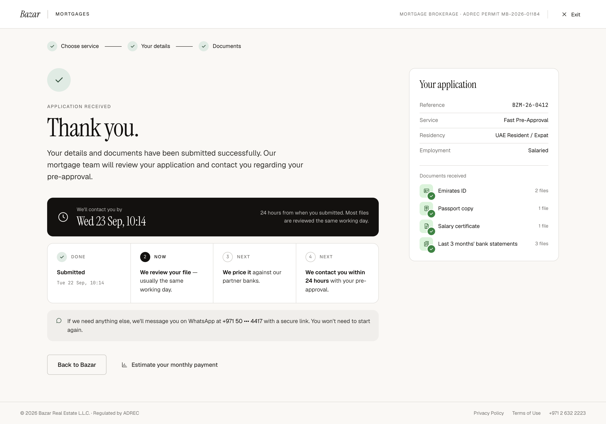

# W7 · Application received

| | |
|---|---|
| Route | `/mortgages/apply/received` |
| Shown to | Fast Pre-Approval, after submit |
| Stepper | All three steps done ("Documents") |
| Design | `W7-application-received-2x.png` (1440 × 1008 at 2×) · `MrqPreDone` in `reference/mreq-front-2.jsx` |
| Depends on | 00-foundations, W5/W6 |
| Size | S |



## Purpose
Confirms the application and turns the 24-hour promise into a specific time. Explains that any follow-up comes by WhatsApp with a secure link.

## Entry and exit
- **Guard:** `submitted.service = pre_approval`; otherwise W1. W4 uses the same route.
- Buttons as on W4: "Back to Bazar" and "Estimate your monthly payment".

## Layout
- Stepper with all steps done, last label "Documents".
- Confirmation heading: eyebrow "Application received", H1 "Thank you.", body.
- Deadline banner, margin-top 36: row, gap 18, padding 20×24, radius 14, `--bz-ink` background, `--bz-bg` text. Clock icon 28 (stroke 1.4). Label 12px at 70% opacity; time in serif 30/1.1, 2 below. On the right, 12.5/1.5 text at 75% opacity, max-width 260, right-aligned.
- Progress track, margin-top 16, four cells: 1 "Submitted" (Done, with the submit time as meta), 2 Now, 3 and 4 Next.
- WhatsApp note, margin-top 16: surface-2, radius 14, padding 16×20, chat icon in accent, 13.5/1.55 ink-2, masked mobile in ink.
- Buttons, margin-top 32.
- Rail "Your application": key-value rows (Reference in mono, Service, Residency, Employment). Then "Documents received" (12 muted; 18 above, 10 below; top border with 16 padding) and four rows: 32px done icon, document name 13/1.35, file count 11.5 muted.

The PNG shows the salaried set. A Business Owner sees their own four documents.

## Components
`ConfirmationHeading`, `DeadlineBanner` (new), `ProgressTrack`, `KeyValueList`, `DocumentIcon`, `RailCard`.

## Copy
Verbatim from the design. `{braces}` are runtime values; `<b>`, `<ink>` and `<link>` are rich-text tags (00-foundations §12). The same keys are in `strings.en.json`.

**This screen**

| Key | Text | Note |
|---|---|---|
| `w7.eyebrow` | Application received |  |
| `w7.title` | Thank you. |  |
| `w7.body` | Your details and documents have been submitted successfully. Our mortgage team will review your application and contact you regarding your pre-approval. |  |
| `w7.due.label` | We'll contact you by |  |
| `w7.due.note` | 24 hours from when you submitted. Most files are reviewed the same working day. |  |
| `w7.track.submitted` | Submitted |  |
| `w7.whatsapp` | `If we need anything else, we'll message you on WhatsApp at <ink>{maskedMobile}</ink> with a secure link. You won't need to start again.` | {maskedMobile} as "+971 50 ••• 4417" |
| `w7.rail.title` | Your application |  |
| `w7.rail.docsReceived` | Documents received |  |
| `w7.rail.fileCount` | `{count, plural, one {# file} other {# files}}` | Designed: "1 file", "2 files", "3 files" |

**Shared strings used here**

| Key | Text | Note |
|---|---|---|
| `shell.brand` | Bazar |  |
| `shell.section` | Mortgages | Uppercase via CSS |
| `shell.permit` | Mortgage brokerage · ADREC permit MB-2026-01184 | Uppercase via CSS. Confirm the number (FE-12) |
| `shell.exit` | Exit |  |
| `shell.footer.legal` | © 2026 Bazar Real Estate L.L.C. · Regulated by ADREC |  |
| `shell.footer.privacy` | Privacy Policy |  |
| `shell.footer.terms` | Terms of Use |  |
| `shell.footer.phone` | +971 2 632 2223 |  |
| `stepper.chooseService` | Choose service |  |
| `stepper.yourDetails` | Your details |  |
| `stepper.documents` | Documents |  |
| `stepper.submit` | Submit |  |
| `service.preApproval` | Fast Pre-Approval |  |
| `residency.uaeNational` | UAE National |  |
| `residency.expat` | UAE Resident / Expat |  |
| `employment.salaried` | Salaried |  |
| `employment.businessOwner` | Business Owner |  |
| `preNext.review` | `<b>We review your file</b> — usually the same working day.` |  |
| `preNext.price` | `<b>We price it</b> against our partner banks.` |  |
| `preNext.contact` | `<b>We contact you within 24 hours</b> with your pre-approval.` |  |
| `track.done` | Done |  |
| `track.now` | Now |  |
| `track.next` | Next |  |
| `received.backToBazar` | Back to Bazar |  |
| `received.estimatePayment` | Estimate your monthly payment |  |
| `summary.reference` | Reference |  |
| `summary.service` | Service |  |
| `summary.residency` | Residency |  |
| `summary.employment` | Employment |  |
| `doc.emiratesId.name` | Emirates ID |  |
| `doc.passport.name` | Passport copy |  |
| `doc.salaryCertificate.name` | Salary certificate |  |
| `doc.bankStatements3m.name` | Last 3 months' bank statements |  |
| `doc.tradeLicense.name` | Business trade license | "license" spelling (FE-8) |
| `doc.bankStatements12m.name` | Last 1 year's bank statements |  |


## Behaviour and states
- Static page with no live countdown.
- The time is `formatDayTime(dueAt)` from the submit response ("Wed 23 Sep, 10:14"). Never compute it in the browser.
- The "Submitted" meta is `formatDayTime(submittedAt)`.
- The mobile is masked with `maskMobile()` ("+971 50 ••• 4417").
- File counts come from the upload state at submit.
- If the clock pauses later for a re-upload, this page doesn't change; the WhatsApp message and W8 cover that.

## Data
Reads `submitted`. No API calls.

## Analytics
`mortgage_apply_viewed` `{ step: 'received', service: 'pre_approval' }`.

## Accessibility
- Focus the H1 on load.
- The banner reads as one sentence ("We'll contact you by Wed 23 Sep, 10:14. 24 hours from when you submitted…"). Put the time in `<time datetime>`.
- Check the 70% and 75% opacity text against the final palette (at least 4.5:1).

## Responsive (proposed)
Below 1024px the track stacks. Below 768px the banner stacks and its right-hand text aligns left.

## Edge cases
Same as W4: a new tab redirects to W1; reload works.

## Acceptance criteria
- [ ] Matches the PNG at 1440px.
- [ ] The due and submitted times come from the server and show in Asia/Dubai time.
- [ ] The right documents and counts for both employment types.
- [ ] The mobile is masked.

## Tests
Playwright: after the W5 and W6 happy paths, check the due time, masked mobile, documents and counts.

## Open questions
The "Back to Bazar" target (as W4).

## Build steps
1. The W7 branch of the received route.
2. `DeadlineBanner`.
3. The documents received list.
4. Tests.

## Claude Code prompt
```
Build W7 · Application received from docs/mortgage/frontend/W7-application-received/README.md.
Compare with W7-application-received-2x.png and reference/mreq-front-2.jsx (MrqPreDone). It shares the received route with W4.
Plan first, then follow the build steps. Check the acceptance criteria, run the tests, and compare a 1440px screenshot with the PNG. Update docs/mortgage/PROGRESS.md.
```
