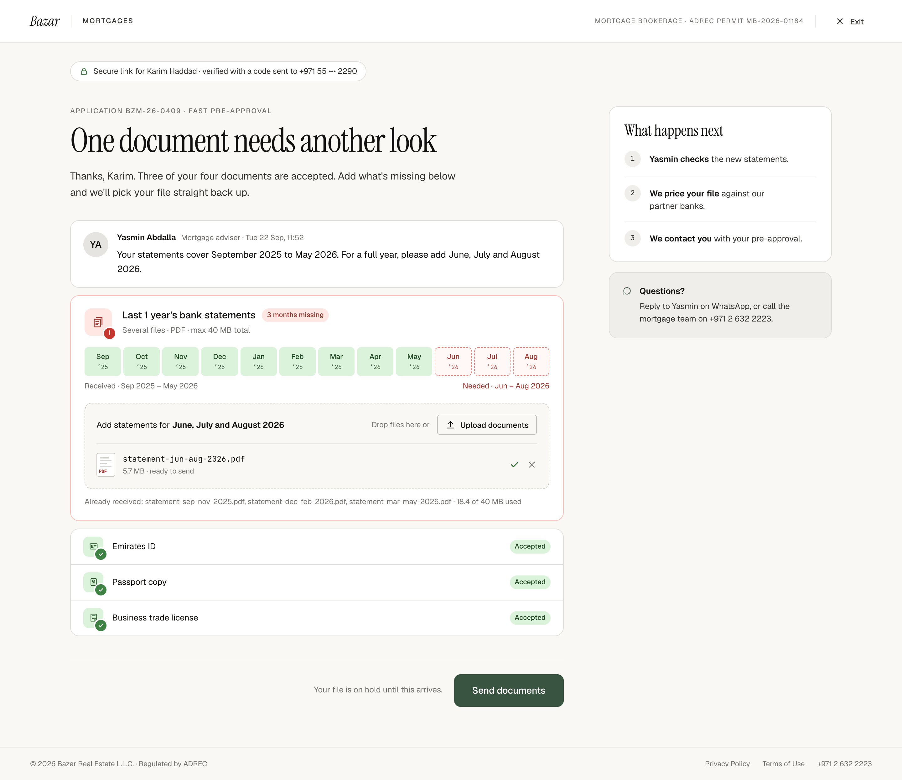

# W8 · Re-upload from a secure link

| | |
|---|---|
| Route | `/mortgages/r/[token]` |
| Shown to | An applicant the mortgage team has asked to replace or add to one document |
| Stepper | None |
| Design | `W8-secure-reupload-2x.png` (1440 × 1247 at 2×, verified state) · `MrqReupload` in `reference/mreq-front-2.jsx` |
| Depends on | 00-foundations (upload engine), the secure link API (PLAN Phase 5) |
| Size | L |



## Purpose
When a document fails review, the team sends a secure link by WhatsApp and email. The applicant proves it's them with a code, uploads only the flagged document and sends it. Accepted documents stay untouched, and the 24-hour clock resumes when they send.

## Entry and exit
The page has several states. Only the verified state is designed.

| State | When | Design |
|---|---|---|
| Invalid link | Token unknown, revoked, or for another purpose | Not designed |
| Expired link | Past its expiry (proposed 7 days) | Not designed |
| Enter code | Valid link, not yet verified in this browser | Not designed |
| **Verified** | Code accepted, cookie present | **This PNG** |
| Sent | After "Send documents" | Not designed |
| Already sent | The link has been used | Not designed |

The same route serves the pre-approval invite sent from CMS C6 (`purpose = preapproval_invite`). After the code, that link opens the W5/W6 documents step with the consultancy details carried over, and submitting creates a new pre-approval request. The invite landing isn't designed.

## Layout (verified state)
- No stepper. The top slot holds the secure pill: inline row, 32px high, padding 0 14, radius 999, surface, border, 12.5 ink-2, with a 14px lock icon in `oklch(0.5 0.12 145)`.
- Heading block: eyebrow with the reference, H1, lede.
- Adviser message, margin-top 32: row, gap 14, padding 18×20, radius 14, surface, border. Avatar 40 with initials. Name 13/600 and "{role} · {sent at}" 12 muted on one line; message 14.5/1.55, 6 below.
- Flagged document card, margin-top 12: padding 20×22, radius 14, surface, 1px `oklch(0.86 0.07 28)` border.
  - Header: error icon 44; name 15.5/500 with a small danger pill ("3 months missing"); hint 12.5 muted.
  - Coverage grid (statements only), 18 below. Legend row 8 below, 12 muted: "Received · Sep 2025 – May 2026" on the left, "Needed · Jun – Aug 2026" on the right in danger.
  - Dropzone, 18 below: padding 18, radius 12, 1.5px dashed `--bz-border-strong`, `--bz-bg`. One row: instruction 13.5 with the months in bold, "Drop files here or" 12 muted, outline small "Upload documents". Added files sit below a divider (14 either side): "statement-jun-aug-2026.pdf", "5.7 MB · ready to send".
  - Footnote, 12 below, 12 muted: the files already received and the total used.
- Accepted documents, margin-top 12: one bordered card with divided rows (12×20): 32px done icon, name 13.5, small "Accepted" success pill.
- Actions: no Back; note "Your file is on hold until this arrives."; CTA "Send documents".
- Rail: "What happens next" (three steps naming the adviser) and a soft "Questions?" card with a chat icon.

## Components
`FlowLayout` (no stepper, top slot), `SecureLinkPill` (new), `AdviserMessage` (new), `StatementCoverage`, `DocumentIcon`, `UploadedFile`, `Pill`, `NextSteps`, `RailCard`, `FlowActions`, and the upload engine scoped to the link.

## Copy
Verbatim from the design. `{braces}` are runtime values; `<b>`, `<ink>` and `<link>` are rich-text tags (00-foundations §12). The same keys are in `strings.en.json`.

**This screen**

| Key | Text | Note |
|---|---|---|
| `w8.secure` | `Secure link for {fullName} · verified with a code sent to {maskedMobile}` |  |
| `w8.eyebrow` | `Application {reference} · Fast Pre-Approval` |  |
| `w8.title` | One document needs another look |  |
| `w8.lede` | `Thanks, {firstName}. Three of your four documents are accepted. Add what's missing below and we'll pick your file straight back up.` | Written for three accepted documents |
| `w8.adviser.meta` | `{roleLabel} · {sentAt}` | Role from the staff record (FE-7); {sentAt} as "Tue 22 Sep, 11:52" |
| `w8.pill.monthsMissing` | `{count, plural, one {# month missing} other {# months missing}}` | Statements only; designed: "3 months missing" |
| `w8.coverage.received` | `Received · {range}` | {range} as "Sep 2025 – May 2026" |
| `w8.coverage.needed` | `Needed · {range}` | {range} as "Jun – Aug 2026" |
| `w8.drop.instruction` | `Add statements for <b>{months}</b>` | Statements only; {months} as "June, July and August 2026" |
| `w8.file.readyToSend` | `{size} MB · ready to send` |  |
| `w8.alreadyReceived` | `Already received: {files} · {used} of {limit} MB used` | {files} is a comma-separated list |
| `w8.note` | Your file is on hold until this arrives. |  |
| `w8.cta` | Send documents |  |
| `w8.next.check` | `<b>{adviserFirstName} checks</b> the new statements.` | Statements only |
| `w8.next.price` | `<b>We price your file</b> against our partner banks.` |  |
| `w8.next.contact` | `<b>We contact you</b> with your pre-approval.` |  |
| `w8.questions.title` | Questions? |  |
| `w8.questions.body` | `Reply to {adviserFirstName} on WhatsApp, or call the mortgage team on +971 2 632 2223.` |  |

**Shared strings used here**

| Key | Text | Note |
|---|---|---|
| `shell.brand` | Bazar |  |
| `shell.section` | Mortgages | Uppercase via CSS |
| `shell.permit` | Mortgage brokerage · ADREC permit MB-2026-01184 | Uppercase via CSS. Confirm the number (FE-12) |
| `shell.exit` | Exit |  |
| `shell.footer.legal` | © 2026 Bazar Real Estate L.L.C. · Regulated by ADREC |  |
| `shell.footer.privacy` | Privacy Policy |  |
| `shell.footer.terms` | Terms of Use |  |
| `shell.footer.phone` | +971 2 632 2223 |  |
| `common.whatHappensNext` | What happens next |  |
| `doc.emiratesId.name` | Emirates ID |  |
| `doc.emiratesId.hint` | Front and back · PDF, JPG, PNG · max 10 MB |  |
| `doc.passport.name` | Passport copy |  |
| `doc.passport.hint` | Photo page · PDF, JPG, PNG · max 10 MB |  |
| `doc.salaryCertificate.name` | Salary certificate |  |
| `doc.salaryCertificate.hint` | Addressed to the bank · PDF · max 10 MB |  |
| `doc.bankStatements3m.name` | Last 3 months' bank statements |  |
| `doc.bankStatements3m.hint` | Several files · PDF · max 25 MB total |  |
| `doc.tradeLicense.name` | Business trade license | "license" spelling (FE-8) |
| `doc.tradeLicense.hint` | Valid / current · PDF, JPG, PNG · max 10 MB |  |
| `doc.tradeLicense.noun` | licence | Fills {documentNoun} in upload.error.tooLarge. Other kinds not designed |
| `doc.bankStatements12m.name` | Last 1 year's bank statements |  |
| `doc.bankStatements12m.hint` | Several files · PDF · max 40 MB total |  |
| `doc.state.accepted` | Accepted |  |
| `upload.dropMany` | Drop files here or |  |
| `upload.uploadMany` | Upload documents |  |
| `upload.cancel` | Cancel |  |
| `upload.pill.uploading` | Uploading |  |
| `upload.pill.needsAttention` | Needs attention |  |
| `upload.progress` | `{loaded} of {total} MB` | One decimal, e.g. "2.0 of 3.1 MB" |
| `upload.size` | `{size} MB` |  |
| `upload.error.tooLarge` | `This file is {size} MB and the limit is {limit} MB. Save it at a lower resolution, or upload a photo of the {documentNoun} instead.` | Only the licence version is designed. PDF-only kinds need a variant |


## Behaviour and states

### Link and code
1. Render on the server. Look up the token hash. Invalid, expired, revoked or used → the matching state.
2. No valid verification cookie → Enter code. `POST /api/mortgage/links/:token/otp` sends a 6-digit code to the mobile on file (WhatsApp or SMS). Show the masked number, and allow a resend after a cooldown.
3. `POST …/verify { code }` sets a short-lived httpOnly cookie scoped to this link. Five wrong attempts lock the link, and the team has to send a new one. Codes expire after 10 minutes (SPEC §8).
4. Verified → render the designed page from the context below.

### Upload
- Same engine as W5/W6, scoped to the link: `POST /api/mortgage/links/:token/files`, `…/complete` and `DELETE`. The link fixes the document kind.
- Limits count the files already received: for 12-month statements, 18.4 MB used leaves 21.6 MB.
- Existing files can't be removed here. They're listed in the footnote.
- The adviser's message is plain text written in the CMS. Escape it and keep line breaks; no links or markdown.

### Send
- The CTA is enabled when at least one new file is ready and nothing is uploading or in error. The PNG shows it enabled with one file ready.
- `POST …/submit` → Sent state. The server moves the file back to In review, resumes the clock and notifies the adviser.

### Other document kinds
The design shows 12-month statements with missing months. For other kinds (unreadable, wrong document, expired, pages missing) there's no coverage grid, the pill shows the reason chosen in C4, and the dropzone instruction and rail text ("checks the new statements") need copy.

## Data
Server-side context for the verified state:

```ts
type ReuploadContext = {
  reference: string;                       // BZM-26-0409
  applicant: { fullName: string; firstName: string; maskedMobile: string };
  adviser: { name: string; firstName: string; initials: string; roleLabel: string };
  request: { reason: ReuploadReason; message: string; sentAt: string };
  document: {
    kind: DocKind;
    existingFiles: { name: string; sizeBytes: number }[];
    usedBytes: number;
    limitBytes: number;
    coverage?: {                           // statements only
      months: { month: string; received: boolean }[];  // 'YYYY-MM', oldest first
      missingCount: number;
    };
  };
  otherDocuments: { kind: DocKind; state: 'accepted' | 'to_review' }[];
};
```
Coverage comes from the statement periods staff enter in C4 (SPEC §2.3). Format ranges with `monthRange()` and `monthsLong()`.

## Security
- `noindex`, `Cache-Control: no-store`, `Referrer-Policy: no-referrer`.
- Never log the token or send it to analytics; use the route pattern.
- The cookie is httpOnly, Secure and SameSite=Strict, scoped to this link's page and API.
- Show only the applicant's name and masked mobile. No email, date of birth or other details.

## Analytics
`mortgage_reupload_viewed` `{ kind, reason, state }` · `mortgage_reupload_otp_sent` · `mortgage_reupload_otp_failed` `{ attempt }` · `mortgage_reupload_verified` · `mortgage_reupload_sent` `{ kind, files }`.

## Accessibility
- Code entry: one input with `autocomplete="one-time-code"` and `inputmode="numeric"`, not six boxes.
- Focus the H1 after verification.
- Give the coverage grid a text alternative: a visually hidden list of received and missing months.
- Upload rows as in 00-foundations §11.

## Responsive (proposed)
Below 1024px the rail moves under the actions. Below 768px the coverage grid becomes two rows of six and the legend stacks.

## Edge cases
- The lede's "Three of your four documents are accepted" assumes the other three are accepted. If one is still in review, the sentence is wrong; other counts need copy.
- Two flagged documents: the team sends two links, one per document (SPEC §3, access links).
- Opening the link on another device means entering a new code there.
- If the team cancels the request while the page is open, submit returns 410; show the invalid-link state.
- Yasmin's role reads "Mortgage adviser" here but "Head of mortgages" in the CMS (FE-7).

## Acceptance criteria
- [ ] The verified state matches the PNG at 1440px.
- [ ] Invalid, expired, used and locked links never show applicant data.
- [ ] Code flow: send, resend cooldown, 5-attempt lock, 10-minute expiry.
- [ ] Only the flagged document can be uploaded; accepted documents are read-only.
- [ ] Limits include existing files.
- [ ] Sending moves the file back to In review (check in the CMS), and the link can't be used again.
- [ ] No token in logs or analytics.

## Tests
- Integration: expired, revoked and used links; five wrong codes lock the link; another request's token is denied; limits with existing files.
- Playwright: request a re-upload in C4 → open the link → enter the code → upload → send → C2 shows In review; reopening the link shows Already sent.

## Open questions
FE-2 (states and invite landing), FE-7 (role label), copy for other document kinds, the lede for other counts, link expiry (SPEC §9 #11).

## Build steps
1. Server-rendered route with the token lookup and state switch.
2. Code entry against the API (once design supplies the screen).
3. Verified layout: secure pill, adviser message, flagged card, coverage, accepted list, rail.
4. The scoped upload engine and send.
5. Invalid, expired, sent and already-sent states.
6. The invite landing, handing off to the documents step.
7. Security headers, analytics and tests.

## Claude Code prompt
```
Build W8 · Re-upload from a secure link from docs/mortgage/frontend/W8-secure-reupload/README.md.
Compare with W8-secure-reupload-2x.png and reference/mreq-front-2.jsx (MrqReupload). Use the foundations' upload engine, scoped to the link API. Read SPEC §8 for link and code security.
Only the verified state is designed. For the other states, build plain placeholders in the flow layout with TODO strings, and list them in PROGRESS.md for design.
Plan first, then follow the build steps. Check the acceptance criteria, run the tests, and compare a 1440px screenshot with the PNG. Update docs/mortgage/PROGRESS.md.
```
